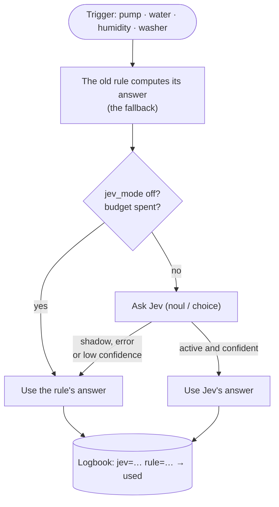

Every Home Assistant setup I know ends up with the same kind of automation: *"if the value goes over X for Y minutes, send a notification"*. It works, until it doesn't. The sump pump runs for two minutes after a stormy night: alert. Someone takes a long shower: "possible leak" alert. The washing machine pauses for a soak: "cycle finished" notification, twenty minutes too early. After a while you stop reading the notifications, which is the worst possible outcome for an alert.

The problem is not the threshold. The problem is that the rule has no idea of the **context**: it rained 14 mm last night, it's 7 am on a weekday, the machine used only 0.3 kWh so far. A human would look at those facts and say "that's normal". A threshold can't.

In my [previous post](/system-one-router-picking-the-right-llm-for-every-prompt/) I used **Jev**, a "System One" decision model, to route prompts between LLMs. While building it, I kept thinking: *this is exactly the question my house asks all day long*. So I spent an evening with Claude Code on my Home Assistant configuration, and gave the judgement calls to Jev. This post is what came out of it.

## Jev in two minutes

[Jev](https://typesafe.ai/blog/introducing-system-one-models-and-jev) is a model from **TypeSafe** that does not write text. You give it a *state* (a few lines describing the situation) and a *typed* question, and it answers with a probability:

*   **`noul`**: yes or no, with the probability of "yes";
*   **`choice`**: one of N options you describe, with the whole distribution;
*   **`score`**: a level on a scale you describe level by level.

Version 1.13 is the current one. It is available directly from TypeSafe or [through OpenRouter](https://openrouter.ai/typesafe/jev-1.13) at **$0.042 per million input tokens, output free**, with a 32k-token window. The [OpenRouter guide](https://openrouter.ai/docs/guides/community/jev) and the [TypeSafe docs](https://docs.typesafe.ai) (they even have a [smart home demo](https://docs.typesafe.ai/demos/smart-home)) are the official references.

Why it matters for a house: in the [router benchmark](/system-one-router-picking-the-right-llm-for-every-prompt/), Jev was confident on 82% of its answers, and 95% of those were right. **The confidence is real.** That's the property that makes it safe to put in an automation: when it's not sure, it says so, and you can fall back to something else.

## Which Home Assistant integration?

Jev is only a few weeks old and the ecosystem moves every day, so I looked at everything that exists today (end of September 2026). The short version: **everything is community-made, nothing is official, and nothing is in the HACS default list yet.** You install through a HACS custom repository.

| Project | What you get | Notes |
| --- | --- | --- |
| [**AboveColin/HA-Jev**](https://github.com/AboveColin/HA-Jev) | Actions `jev.noul`, `jev.choice`, `jev.score`, `jev.ask`, `jev.calibrate`; question sensors from the UI; an `ai_task` and a conversation agent; token, cost and daily-budget sensors | **The one I use** (1.16 on my server). The most complete and very active: new releases come out almost every week. Domain `jev`. |
| [AtHeartEngineer/HA-SystemOne](https://github.com/AtHeartEngineer/HA-SystemOne) | Same actions, YAML sensors, an Assist router, usage sensors; documents self-hosted `/v1/systemone` servers | **Also uses the `jev` domain**: install one or the other, never both. |
| [JanOstrowka/typesafe-assist](https://github.com/JanOstrowka/typesafe-assist) | A conversation agent only, with a fallback agent | English only. |
| [minuteman3](https://github.com/minuteman3/home-assistant-typesafe) / [allenporter](https://github.com/allenporter/home-assistant-typesafe) home-assistant-typesafe | A conversation agent with confidence thresholds, can point to a local server | Early (0.1). |
| [ayali/node-red-contrib-jev](https://github.com/ayali/node-red-contrib-jev) | A Node-RED `jev` node | If your automations live in Node-RED. |

A note on "OpenRouter integrations": the generic OpenRouter integrations for Home Assistant speak *chat completions*. Jev speaks its own decisions API (`/v1/systemone`), so they can't use it. You need one of the projects above.

### Installing HA-Jev

1.  **HACS → ⋮ → Custom repositories**, add `https://github.com/AboveColin/HA-Jev` as an **Integration**.
2.  Search for **Jev**, download it, restart Home Assistant.
3.  **Settings → Devices & services → Add integration → Jev (TypeSafe)**.
4.  Paste an API key. With a TypeSafe key you're done. I already had an **OpenRouter** key from the router project, so I opened the *Advanced* section and set:
    *   API address: `https://openrouter.ai/api` (not `/api/v1`: the integration adds `/v1/systemone` itself);
    *   Model: `~typesafe/jev-latest` (the `~` is part of the id).

The key is checked with a real request before the entry is created. Then, in the options, set a **daily input-token budget**. It's 0 (no limit) by default. When the budget is reached, the integration stops calling Jev and `binary_sensor.jev_daily_budget_exceeded` turns on. I use that sensor below.

You can create "questions" from the UI (a sensor that re-asks Jev every few minutes), but I didn't. **I wanted Jev inside my existing automations, not next to them.**

## The pattern: Jev advises, the rule stays

This is the part I'm the most happy with, and the part I'd copy if I were you. Jev never gets to be the only thing standing between a leak and a notification. Every automation that asks Jev something also computes **what the old rule would have answered**, and passes it as `fallback`. A single `input_select.jev_mode` then decides who wins:

*   **`shadow`** (the default): Jev is asked and its answer is logged, but the rule's answer is used. Nothing changes in the house.
*   **`active`**: Jev's answer is used, *unless* the call fails, the daily budget is spent, the integration isn't loaded, or (for choices) the confidence is below a minimum. Then the rule wins.
*   **`off`**: Jev isn't called at all.



Everything goes through two shared scripts, `script.jev_yes_no` and `script.jev_choice`, in a `packages/jev.yaml` file. Each decision writes a line in the logbook like `jev=True (p=0.93) rule=False -> False [rule, shadow]`. That logbook is what I read before switching `jev_mode` to `active` (it's one switch for the whole house): the lines where Jev and the rule disagree are exactly the cases worth looking at. Everything went live in `shadow` mode, and that's where it still is as I write this. The plan: one or two weeks of shadow, a review of the disagreements, and only then `active`.

Here is the heart of the yes/no script (trimmed):

```yaml
script:
  jev_yes_no:
    mode: parallel
    fields:
      decision: {required: true}      # short name for the logbook
      facts: {required: true}         # the situation, one fact per line
      instructions: {required: true}  # the yes/no question
      background: {}                  # standing facts about the house
      threshold: {default: 0.5}
      fallback: {required: true}      # what the old rule answers
    sequence:
    - variables:
        mode: "{{ states('input_select.jev_mode') }}"
        rule_result: {answer: "{{ fallback | bool }}", source: rule}
    # Jev off, not loaded or over budget: the rule answers, full stop.
    - if: "{{ mode not in ['shadow', 'active'] or not is_state('binary_sensor.jev_daily_budget_exceeded', 'off') }}"
      then:
      - stop: Jev not available
        response_variable: rule_result
    - action: jev.noul
      continue_on_error: true         # a Jev error must never break the automation
      response_variable: jev
      data:
        state: "{{ facts }}"
        instructions: "{{ instructions }}"
        background: "{{ background }}"
        threshold: "{{ threshold }}"
    - variables:
        ok: "{{ jev is defined and jev.noul is defined }}"
        use_jev: "{{ ok and mode == 'active' }}"
        result:
          answer: "{{ jev.is_true if use_jev else fallback | bool }}"
          source: "{{ 'jev' if use_jev else 'rule' }}"
    - action: logbook.log
      data:
        name: "Jev · {{ decision }}"
        entity_id: input_select.jev_mode
        message: >-
          jev={{ jev.is_true }} (p={{ jev.noul | round(2) }})jev=error
          rule={{ fallback }} -> {{ result.answer }} [{{ result.source }}, {{ mode }}]
    - stop: Decision taken
      response_variable: result
```

Two small details that matter:

*   `continue_on_error: true` on the Jev call, and `verdict is not defined or not verdict.answer` in the automations: **any failure ends up on the side of the notification.** Jev can only *remove* an alert when it is confident, never add silence by accident.
*   The questions are always phrased as **"is this normal?"**, with a high threshold (0.8, or 0.9 for a possible leak). Jev must be *sure* it's normal to stay quiet.

On top of the two generic scripts, there is one small script per *kind* of decision (pump, water, temperature drop, covers, laundry). Each one holds the prompt and gathers the facts, so the automations only say *what just happened*.

### What Jev actually receives

The "state" is plain text. Here is what the VMC decision sent on a Friday evening, rendered from my live sensors (I removed the two lines about who's home and who's sleeping):

```text
Now: Friday 19:38
Current speed: Vitesse 1 (changed 33 minutes ago)
Upstairs bathroom humidity: 63.47 %
Parents' bathroom humidity: 65.16 %
Kitchen humidity: 75.49 %
Highest living-room humidity: 0.0 %
House average humidity: 69.5 %
Wet-room humidity trend: Falling Fast
Usual shower time: yes
Outdoor: unavailable °C, humidity 81 %
```

Along with it go the question, the three options with their descriptions, and the background. The `jev.choice` action answers with the pick, its confidence, the whole distribution, and some bookkeeping:

```yaml
choice: Vitesse 1          # one of the options, never free text
confidence: …              # 0 to 1
probabilities:             # the whole distribution
  "Off": …
  Vitesse 1: …
  Vitesse 2: …
model: …                   # the version that answered
latency_ms: …
usage: {input_tokens: …, output_tokens: …}
```

`jev.noul` is even simpler: `noul` (the probability of "yes"), `is_true` (that probability compared with *your* threshold) and the threshold itself. The integration's authors are explicit that a value around 0.5 means *"I can't tell"*, not *"half true"*. That's why the threshold belongs to the automation, not to the model.

Now look at that state again. **The living-room humidity at 0 % and the outdoor temperature `unavailable` are real.** When I pulled these values for this post, the two template sensors that compute the highest humidity per zone were stuck at 0, although every room reads between 55 and 75 %. The Netatmo outdoor module was offline too. The old VMC rule reads the same sensors, so it had quietly fallen back to *"keep the current speed"*. Jev at least also gets the raw per-room values and can see that the kitchen is at 75 %.

That's the second reason I like shadow mode. **Writing the facts down for Jev made me read them, and some were wrong.** A model can't be better than its inputs, and neither can a threshold. You just never look at a threshold's inputs until something goes wrong. Next on my list: log the facts next to each decision, not only the two answers.

## Six automations that got smarter

All of them already existed and most have their own post on this blog. What follows is what Jev adds. (Entity names are simplified, and I left out anything about who lives here or when the house is empty.)

### 1. The sump pump: "is it raining, or is the float stuck?"

The [sump pump monitoring](/monitoring-the-sump-pump-with-home-assistant/) sends a warning when the pump runs for 2 minutes, an alert at 10 minutes, and another one when it hasn't started for 48 hours. All three are correct *on a dry day*, and all three are noise after a heavy rain (long runs) or during a dry summer week (no runs at all).

Now each alert first asks Jev:

```yaml
- action: script.jev_pompe_cave_normale
  continue_on_error: true
  response_variable: verdict
  data:
    situation: The pump has been running for 2 minutes without stopping
- condition: template
  value_template: "{{ verdict is not defined or not verdict.answer }}"
- action: notify.persistent_notification
  # ... unchanged
```

The script sends the current run time, today's and this week's running time, the last start and stop, the restart attempts, the rain gauge, the weather, the outdoor temperature and the cellar humidity. The background tells Jev how this pump behaves ("a normal cycle lasts less than 2 minutes; after heavy rain it can start many times a day; in dry periods it can stay off for days; the rain gauge is sometimes unavailable, then rely on the weather"). The question: *"Is this sump pump behaviour explained by normal operation rather than a fault?"*, threshold 0.8.

That last hint about the rain gauge is the kind of thing you can't put in a threshold, and it's exactly what I would tell a person watching the house for me. And it's not theoretical: the day I deployed this, the rain gauge battery was at 6% and the sensor was unavailable.

### 2. Water: a long shower is not a leak

The water monitor on the main supply reports the flow in L/min, and feeds five alerts: high flow (above 10 L/min for 2 minutes), possible leak (continuous flow for 2 hours), excessive daily consumption, and two for water flowing while we're on holiday. Each one now asks *"Is this water use explained by normal household activity rather than a leak or a tap left open?"* with the flow, today's consumption against a usual day, the washing machine state, the **highest humidity in the bathrooms and the kitchen** (a shower shows up there within minutes!), the weather and the rain (garden watering) and whether the house is in holiday mode.

The humidity trick is my favourite: the water meter doesn't know *where* the water goes, but the humidity sensors in the wet rooms do. (As you saw above, it only works if that humidity sensor is not lying.)

### 3. Temperature drops: window or heat pump cycle?

A "fast temperature drop" alert per bedroom (−3.6 °C in 30 minutes while it's below 15 °C outside) is the classic *someone left the window open* detector. Jev gets the room temperature, the drop, the outdoor temperature, the state and target of the room's thermostats, the window sensors *when the room has one*, and the ventilation speed.

Wiring this one gave me an unexpected bonus. To pass the trend sensors to Jev, the agent had to read them, and found that **four of the five pointed to entities that don't exist** (a missing `_2` suffix). Four of my five temperature-drop alerts were stuck on `unknown` and could simply never fire. Now that they're fixed they will fire again, and Jev is what should keep them from turning into noise. Same story for the pump: the 24 h re-enable after a forced shutdown subtracted a number from a date, errored every time, and never ran. Asking an agent to wire a new model into old automations is also a great way to have them re-read.

### 4. Covers against the heat

The [cover automation](/homeassistant-close-cover-to-control-the-home-temperature-v2/) lowers the shutters to 40% when the sun heats the rooms. The rule compares façade temperature and indoor temperature, and the façade sensors sit in the sun, so they read several degrees too high on a cold sunny morning.

Jev now gets the indoor temperature, the *shaded* weather-station temperature, the sunny façade sensors (with the warning that they read high), today's forecast maximum, the cloud cover, the UV index, the sun's elevation and azimuth and the current positions. The question: *"Should these shutters be lowered now to keep the sun's heat out?"* with the background: *"In the warm season keeping the heat out matters more than daylight; in the cold season solar heat is welcome."*

A side fix: the "once a day" lock used the automation's `last_triggered`, which now changes every 10 minutes, even when Jev says "keep them open". It moved to an `input_datetime` written only when the covers actually move, so the evening reopening keeps working.

### 5. VMC: a `choice` instead of four automations

The [smart VMC](/smart-vmc-mechanical-ventilation-system/) was four rule-based automations with thresholds and hysteresis. It is now also one `vmc_jev_decision` automation that asks a **`choice`** every 5 minutes (and immediately when humidity rises fast):

```yaml
- action: script.jev_choice
  data:
    decision: VMC
    fallback: "{{ rule_speed }}"     # the four old automations, condensed in one template
    instructions: Which ventilation speed should the VMC run at right now?
    options:
      "Off": The air is dry enough everywhere, no ventilation needed
      Vitesse 1: Background ventilation for moderate humidity or stale air
      Vitesse 2: Extract steam fast after a shower, a bath or cooking (noisy)
    background: >-
      A wet room above about 70 % humidity usually means a shower or cooking.
      Speed 2 is noisy: avoid it at night or when the house is empty unless
      humidity is really high.
```

"Speed 2 is noisy, avoid it at night unless it's really needed" is one sentence for Jev. As rules, it was a condition in each automation. In `active` mode the four old automations stand down, their thresholds become the fallback, and a choice below 0.6 confidence is ignored.

### 6. Laundry: pause or end of the programme?

My [washing machine detection](/homeassistant-detect-washing-machine-cycle-completion/) is power based: below 10 W for 2 minutes means finished. Except that some programmes soak, hold the rinse or run anti-crease tumbles at a few watts for 5 to 30 minutes.

Now, when the power drops, Jev gets the elapsed time, the energy used since the start, the current power and how long it has been idle, and a background describing how a washer and a dryer draw power. If Jev is **at least 75% sure it's a pause**, the automation waits up to 30 minutes for the machine to restart. If it restarts, no notification, and the cycle is not reset (so the start time and the energy keep counting from the real start). If Jev errors or times out: notification, as before.

## What does it cost?

This is the part I was curious about. Here is my OpenRouter activity log for Jev, on an evening:

, $0.0000237 per call.")

Every row is the VMC `choice`, one every 5 minutes: **565 input tokens, 50 output tokens, $0.0000237 per call**. The math is easy:

| | Calls | Cost |
| --- | --- | --- |
| VMC decision, every 5 minutes | 288 / day | ~$0.0068 / day |
| Covers, every 10 minutes in their time window, until they close | up to ~110 / day | ~$0.003 / day |
| Pump, water, temperature, laundry (only on events) | a few / day | noise |
| **Total** | | **< $0.01 / day, about $3 / year** |

HA-Jev keeps its own count, so I don't have to trust my math. On the first full day in production, at 19:40, the integration's sensors read:

*   `sensor.jev_calls_today`: **133**
*   `sensor.jev_input_tokens_today`: **75,201** (exactly 565 per call)
*   `sensor.jev_estimated_cost_today`: **$0.0032**

That's on track for about half a cent for the day, which matches the table.

And the month view, all models together on my account:


Two cents for the month, *including* the 80-prompt benchmark of the previous post and the tests of the integration. Jev has only been running for the house for a few days, so a full month of house decisions should land around 20 cents.

Some honest considerations:

*   **The VMC is 90% of the calls, and that's my fault, not Jev's.** Asking every 5 minutes when nothing has changed is lazy. A trigger on humidity changes, or skipping the call when the facts are identical to the last ones, would divide the bill by five. At $3 a year I haven't bothered yet, but it's the first thing I'd fix on a bigger house.
*   **About half of each call is fixed overhead.** HA-Jev measured roughly 250 tokens billed per request whatever its size. Sending 10 facts or 15 barely changes the price, so don't starve Jev of context to save tokens.
*   **Could a cheap LLM do it for the same price?** On paper, yes: Qwen 3.7 flash costs about the same per call *if* it doesn't think. In the router post, it spent 1,800 reasoning tokens to say "hi", which makes it ten times more expensive. Sonnet 5 would be about $0.0016 per call, or ~$14 a month for the VMC alone. But price is not the argument. The argument is that Jev returns a **typed answer with a calibrated probability**: no JSON to parse, no "Sure! Here is my answer", and a number that I can compare with a threshold.
*   **Set the budget anyway.** A flapping trigger in `mode: parallel` could loop. The daily token budget in HA-Jev turns that into a `binary_sensor` that the scripts check before every call. With ~170k tokens a day, a budget of 500k gives plenty of margin.

### And privacy?

This is the part to think about before copying. The facts I send include whether the house is in "away" or "holiday" mode and whether we're sleeping. It's useful context ("water flowing while nobody is home" is suspicious), but it means that a third party receives, every 5 minutes, a small description of my home's occupancy. TypeSafe and OpenRouter have their own data policies; read them, and decide which facts are worth sending. Which brings me to Laya.

## Could Laya do this locally?

In the router post, I compared Jev with [**Laya**](https://huggingface.co/convaiinnovations/laya), an open-weights model from Convai Innovations that answers the same `choice` / `score` / `noul` questions and runs on a laptop. For a house, "local" is not a detail: it removes both the privacy question and the dependency on the internet.

**How to plug it in.** HA-Jev and HA-SystemOne accept a custom API address with no key, and call `<address>/v1/systemone`. So any local server that speaks Jev's API can replace it:

*   the [Laya sidecar of system-one-router](https://github.com/mmornati/system-one-router/tree/main/sidecar) already speaks Jev's request format. Today it answers on `/decisions`, so it needs one extra route (`/v1/systemone`) to be used from Home Assistant: a one-line change;
*   community servers like [stuntd](https://github.com/bladedevoff/stuntd) (Laya first, Jev when unsure) exist, but I haven't tried them;
*   [allenporter/home-assistant-laya](https://github.com/allenporter/home-assistant-laya) runs Laya *inside* Home Assistant, but only as a conversation agent, not for the `noul` / `choice` actions my scripts use.

**What to expect, based on the benchmark.** Be careful: the benchmark measured *routing prompts*, not house sensors, so this is an extrapolation.

| | Jev 1.13 | Laya English (zero-shot) |
| --- | --- | --- |
| Accuracy | 89% | 59% |
| Confident answers (≥ 0.8) | 82%, 95% of them right | **12%**, but 10 out of 10 right |
| Calibration error (lower is better) | 0.080 | 0.171 |
| Context window | 32k tokens | 512 tokens (1,024 multilingual) |
| Latency | ~300–500 ms (network; 0.46 s for the first call from my house) | 30–70 ms on an M4 GPU, ~0.5 s on CPU |
| Cost | ~$3 / year here | $0 |

What this means with *my* scripts:

*   **Laya would be safe, but not very useful out of the box.** Its low confidence falls into my fallbacks: below 0.8 no alert is suppressed, and below 0.6 the VMC keeps the rule's speed. So Laya zero-shot would give you… roughly your old rules, plus a few confident corrections. No harm, not much gain. It's the same lesson as in the router: *an unsure decision model is a fallback machine.*
*   **When it's confident, it's right.** That's the property that matters before fine-tuning, and the shadow logbook is the start of a dataset: every line has Jev's answer and the rule's answer, and with the facts logged next to them, it becomes training data for the house.
*   **Watch the window.** My requests are around 300 tokens of real text, which fits in 512, but the pump and cover prompts are the longest. I'd use the multilingual checkpoint (1,024 tokens), which also reads the French names of my entities better.
*   **Watch the hardware.** On an Apple GPU, Laya answers faster than Jev. On a Raspberry-class CPU, expect seconds (the home-assistant-laya README estimates 1.5–3 s per command). For alerts that already wait 2 minutes, that's fine. For the VMC every 5 minutes, also fine. It just shouldn't run on the same small box as Home Assistant.

The plan I'd follow: run Laya **in shadow next to Jev** (a third column in the logbook), collect a few weeks of decisions, and fine-tune it on the house's own data. Then the privacy-sensitive facts (away, holidays, sleeping) could go to Laya only, and the rest to Jev. That's exactly the `provider: auto` idea from the router, applied to a house.

## How it was built

As in my recent posts: this was one Claude Code session on my Home Assistant configuration repository. I asked which automations were "judgement calls" rather than rules, the agent proposed the shadow/active pattern and the shared scripts, wrote the domain prompts, and wired them in. My job was to decide which decisions deserve Jev (not everything does: a light following a motion sensor doesn't need a model), check the prompts against what I know of the house, and review the diff. The two bugs it found on the way were a nice bonus.

Before anything reached the house, the agent booted Home Assistant 2026.9.3 in Docker with a stub `jev` integration and ran the scripts through every path: shadow, active and off modes, budget exceeded, Jev raising an error, low confidence, an invalid choice, and for the laundry a pause, a resume and a real end. The work came as two pull requests on my config repository (the decision layer, then the laundry), both merged in shadow mode.

### "Merged" is not "deployed"

Then came the part no test had covered. My configuration reaches the server through a GitOps add-on that pulls `main` every few hours. After the merge, I asked the agent to check that Jev was running, and it found… nothing: no `input_select.jev_mode`, zero Jev calls that day.

It turned out the add-on hadn't pulled anything **since 18 August**. That day, a change made on the server and a merged PR had both touched `automations.yaml`, the `git pull --rebase` stopped on a conflict, and every run since then had failed without a word. Home Assistant kept running happily on the old files, so nothing looked broken. Five weeks of merged PRs had simply never reached the house.

Fixing it took more care than the Jev work itself. Over SSH, read-only at first, the agent compared the server with `main` file by file. Some changes existed only on the server and would have been lost by a plain `git reset --hard`: a few sensors I had rewired for the car, the live Zigbee2MQTT configuration with four re-paired devices, and weeks of HACS updates. It also found a copy of `secrets.yaml` with a name that `.gitignore` didn't cover, which the add-on would have happily pushed to GitHub on its next backup. So, in order:

1.  a full Supervisor backup (5.2 GB, checked by opening it);
2.  one PR bringing everything that existed only on the server back into `main`, plus a `.gitignore` rule for any `secrets.yaml*` file;
3.  once that was merged, a reset of the server to `main`, a config check with the production container, a restart, and the add-on restarted.

A few minutes later, the first VMC decision went out and came back in **0.46 s**. Jev agreed with the rule, so nothing was written to the logbook. The shadow period really started that day, 25 September. If you use a GitOps add-on, go and check when it last pulled. Mine had been quietly failing for five weeks.

## Lessons learned

1.  **Use a model for the "is this normal?" question, keep rules for the rest.** Thresholds are great at detecting *that* something happens; a decision model is good at judging *whether it matters*.
2.  **Never let the model be the last line of defence.** The rule's answer is always computed, always the fallback, and every failure ends on the side of the notification.
3.  **Start in shadow mode and read the disagreements.** They are the only interesting lines of the logbook.
4.  **Write the background like you'd brief a house-sitter.** "The rain gauge is sometimes unavailable, then rely on the weather" is worth more than any threshold tuning.
5.  **Your trigger decides your bill.** A decision every 5 minutes costs $3 a year; it's still the only line worth optimising.
6.  **Think about what leaves the house.** Occupancy is personal data. Local models like Laya are the way to keep it home, once they are confident enough.
7.  **Read the facts you send.** A living-room humidity of 0 % fools a threshold as easily as a model. Writing the prompt is a free audit of your sensors.
8.  **Check that "merged" means "running".** Look for the new entity in production, not the green checkmark on the PR.

If you've wired Jev (or Laya) into your own house, I'd love to hear which decisions you gave it, and which ones you took back. Tell me in the comments!
