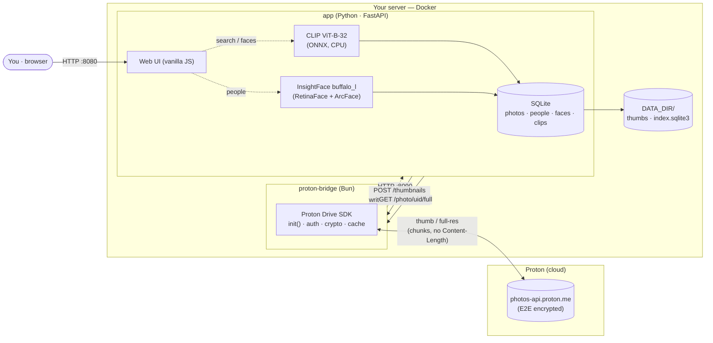
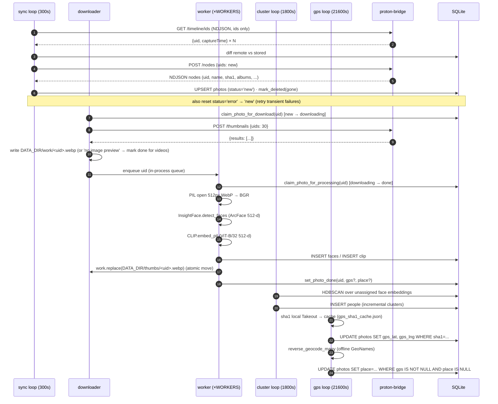

A few weeks ago I wrote about [migrating 354GB of Google Photos to Proton](/how-i-built-gphoto2proton-to-migrate-354gb-of-google-photos-to-proton/). The migration worked, my library is safe, albums are intact. But as I settled into Proton Photos, one quiet absence kept nagging me: **search**.

Not the "sort by date" kind. The Google kind. Type "dog" and get every photo with a dog. Type "beach" and relive every beach you've ever been to. Tap a face and watch all the photos of that person line up. That magic isn't a Proton feature, and it never will be — for a very good reason.

So I built it myself. Meet [proton-faces](https://github.com/mmornati/proton-faces): a private, self-hosted search engine for Proton Photos. People, objects and places, running entirely on my own hardware, read-only against Proton, with zero telemetry.

## The Pain Point

Proton Photos is end-to-end encrypted. Every photo you upload is encrypted client-side with a key that Proton does not hold. That is the entire point of the service — but it has a consequence most people don't think about:

> **Proton literally cannot search your photos, because Proton cannot see your photos.**

Google Photos' search bar works because your "free" service is built on scanning every pixel of every photo on Google's servers. The instant you migrate to an E2E-encrypted provider, that feature has to move somewhere else. The only place it can live is your own hardware.

So the requirement was clear: a self-hosted reverse photo search over my Proton library. With hard constraints:

*   **Read-only against Proton.** Nothing ever uploaded, modified or deleted. My encrypted library stays untouched.
*   **No full-library download.** I'm not going to pull 354GB locally just to index it.
*   **Private.** No cloud APIs, no telemetry. The only network calls should go to Proton's servers.
*   **A real search UI.** Not a script that prints filenames.

## The Architecture: two containers, one rule

The design was forced by Proton's encryption and by its SDK. The rule that shapes everything:

> **Only one component ever talks to Proton.**

I split the system in two containers. `proton-bridge` is the only thing that knows your Proton credentials and talks to Proton's API. `app` does all the machine learning, indexing, search and web UI — and it only ever talks to the bridge, over HTTP on a private Docker network called `internal`.



| Container       | Runtime                         | Role                                                              |
|-----------------|---------------------------------|-------------------------------------------------------------------|
| `proton-bridge` | Bun + Proton Drive SDK (in-repo)| The **only** component that talks to Proton (auth, thumbnails)    |
| `app`           | Python 3.11 + FastAPI           | All ML, indexing, search API, web UI                              |

The bridge is deliberately dumb. It authenticates with your existing Proton session, diffs your photo timeline, downloads 512px thumbnails, and streams full-resolution photos on demand. Nothing else. All the intelligence lives in the Python side, which never sees a Proton credential.

## Approach: why the bridge is compiled inside Proton's own repo

Here's the first rabbit hole. The published npm package `@protontech/drive-sdk` wraps Proton's encrypted API — but it **cannot run standalone**, because its authentication module isn't published to npm. You get the crypto, not the login.

The Proton Drive CLI (from the [ProtonDriveApps/sdk](https://github.com/ProtonDriveApps/sdk) monorepo) has that machinery. So the bridge does something slightly unusual: instead of depending on the npm package, it is **built inside the SDK monorepo at image build time**, pinned to the `cli/v0.8.0` git tag, and compiled to a standalone binary with `bun build --compile`. The only file I author is `bridge/src/bridge.ts` — 278 lines of HTTP endpoints that reuse the CLI's own `init()`, auth and crypto code. The comment at the top of the file spells out the intent:

> *"Compiled as the entry point of the Proton Drive CLI repository, so it reuses the CLI's own `init()` machinery (auth, crypto, cache, feature flags)."*

Concretely, the bridge calls `init({ clientUidPrefix: 'sdk-js-cli', appVersion: 'cli-drive@0.8.0', sdkVersion: 'js@0.21.0', enablePersistedEvents: false, enableMetrics: false, flags: { DriveCryptoEncryptBlocksWithPgpAead: true, DriveSmallFileUpload: true } })`. Notice `enableMetrics: false`: even Proton's own SDK telemetry is disabled. Your session is loaded from `data/auth-session.json` via the env `PROTON_DRIVE_CREDENTIALS_STORE=unsafe_file` (the CLI normally keeps it in your OS keyring / `pass` store; we mount the file in instead). At startup the bridge calls `ctx.auth.isLoggedIn()` and exposes it as the `/health` body.

The result: a single static binary that authenticates, decrypts and streams — built from Proton's own code, so I'm not reimplementing their encryption, and stable against API drift. It exposes a tiny, deliberate HTTP API:

*   `GET /health` — `{ ok, loggedIn }`
*   `GET /timeline` — NDJSON stream of **full photo nodes** (uid, name, captureTime, sha1, mediaType, albums)
*   `GET /timeline/ids` — NDJSON stream of **uid + captureTime only** (the cheap diff the indexer uses)
*   `POST /nodes` — NDJSON stream of full metadata for a batch of uids
*   `POST /thumbnails` — body `{"uids": [...]}` → batch-downloads 512px `Type1` WebP thumbnails into `DATA_DIR/work/<uid>.webp`
*   `GET /photo/{uid}/full` — streams the **full-resolution, decrypted** photo on demand

### The NDJSON trick

The timeline of a 100k-photo library can take a long time to paginate — and a long time to decrypt node keys. Bun's HTTP server kills idle connections at 255 seconds; if I buffered the whole library before responding, clients would see "server disconnected" long before the first byte. So the bridge streams the timeline as **NDJSON (newline-delimited JSON)**, one photo per line. To keep the connection alive while the next page is being fetched, it emits `#` comment lines every 15 seconds with a progress counter — the client treats `#` lines as progress, not data. Long paginations stream indefinitely, and the Python side starts diffing before the bridge has even finished listing.

### The full-resolution streaming quirk

Streaming the full photo is harder than it looks. The SDK's `getSeekableStream()` returns a `BufferedSeekableStream` whose constructor immediately locks itself (it grabs the reader in the constructor), so it cannot be handed to `Response`/`Bun.serve()`. I mirror the CLI's `downloadToPath` pattern instead: `downloader.downloadToStream(writable)` into a `WritableStream` adapter that pushes chunks into a fresh `ReadableStream`, then `await dlController.completion()` and close the controller.

A second subtle decision: **the response deliberately omits `Content-Length`**. The SDK exposes `getClaimedSizeInBytes()` — but that value can differ from the actually-decrypted byte count (because of the crypto envelope), and a mismatched `Content-Length` makes clients think the stream was truncated. Chunked transfer encoding sidesteps the whole question. The response headers are simply `Content-Type: application/octet-stream`, `Cache-Control: no-store` and `X-Photo-Uid: <uid>`.

### Resumability on the bridge too

The thumbnails endpoint skips any uid whose `DATA_DIR/work/<uid>.webp` already exists (a `Bun.file(dest).exists()` check). So if the indexer restarts mid-batch, the bridge doesn't re-download what the previous run already wrote.

## The pipeline: five loops and a state machine

Everything runs as background loops inside the FastAPI process, each on its own timer. The state machine lives in SQLite (WAL mode, `foreign_keys=ON`), one row per photo, with persisted statuses `new`, `downloading`, `done`, `error`, `deleted`. The recognition step itself is *transient* — a Python `threading.Lock` guards the `downloading → done` transition; nothing in the DB ever says `processing`. Because progress is persisted in SQLite, the whole thing is **fully resumable** — restart the container and it picks up exactly where it stopped, including any photo whose `downloading` row has no work file (the worker will simply re-download it).



The five loops:

1.  **Sync loop** (every 300s): hits `/timeline/ids` (the cheap uid listing), diffs against `SELECT uid FROM photos`, marks gone photos `deleted`, then fetches full metadata only for the new uids via `POST /nodes`. As a self-heal for transient errors, it also resets every `status='error'` row back to `status='new'` each cycle.
2.  **Downloader loop**: claims photos in `new` (atomic `UPDATE … WHERE status='new'`), asks the bridge for thumbnails in **batches of 30** — that's the Proton API page-size limit — and writes them as WebP into `DATA_DIR/work/`. If the bridge returns `"no image preview"` (videos have no preview), the photo is marked `done` with an empty thumbnail; we did our best, and there's nothing to index on a video.
3.  **Recognition workers** (`WORKERS=2` by default): each pulls a uid from an in-process `queue.Queue`. On startup, or when the queue is empty, a worker also picks up any leftover `'downloading'` photo from a previous run — that's how resume works without a queue persistence layer. For each photo: open the work file with PIL, convert to RGB (InsightFace wants BGR, hence `arr[:, :, ::-1]`), run `embed_pil(rgb)` for CLIP and `detect_faces(bgr)` for InsightFace, insert the faces and the CLIP vector, then **`work.replace(final)`** — an atomic rename into the permanent `DATA_DIR/thumbs/` cache — and `set_photo_done`. The original photo is never kept.
4.  **Cluster loop** (every 1800s): HDBSCAN (`sklearn.cluster`, cosine metric, `min_cluster_size=2`) over unassigned face embeddings, creating `people` rows incrementally.
5.  **GPS loop** (every 21600s): `backfill_gps()` builds a `sha1 → (lat,lng)` map from your local Google Takeout sidecars (cached in `DATA_DIR/gps_sha1_cache.json` — expensive to build once, cheap after) and applies it to indexed photos; then `enrich_places()` reverse-geocodes any photo with GPS but no place yet.

A second, inline geocode also happens inside the worker: if the photo already has `gps_lat/gps_lng` (because a prior gps loop populated them), the worker calls `reverse_geocode(lat, lng)` and stores the place alongside the face/clip results, so the Places tab fills in as photos are processed — not only on the 6-hour loop.

The crucial design point: **every photo is processed once**. Thumbnail downloaded → recognized → cached → work file deleted. After that, browsing your results never touches Proton again.

## The SQLite schema

The whole index is a single `index.sqlite3` (with WAL and SHM sidecars). Four tables, no ORM:

```sql
photos (uid PK, name, media_type, capture_time, sha1,
        albums JSON, status, thumb_path,
        gps_lat, gps_lng, place, processed_at, error)
people (id PK, name, cover_uid, cover_face_id, created)
faces  (id PK, photo_uid FK→photos ON DELETE CASCADE,
        person_id FK→people ON DELETE SET NULL,
        confidence, bbox JSON [x,y,w,h] normalized,
        embedding BLOB float32[512])
clips  (photo_uid PK FK→photos ON DELETE CASCADE,
        embedding BLOB float32[512])
```

Face and CLIP embeddings are stored as raw `float32[512]` BLOBs (~2 KB each). `bbox` is `[x, y, w, h]` normalized to `[0..1]` of the 512px thumbnail — the API uses it both to draw overlays on the detail view and to crop face-only covers (with a `pad = 0.25` padding factor for context, JPEG quality 90). Indexes on `photos(status)`, `photos(place)`, `photos(capture_time)`, `faces(person_id)`, `faces(photo_uid)` keep the loops cheap.

## The models: CLIP and InsightFace, on CPU, in Docker

For object and scene search I use **CLIP ViT-B-32** (OpenAI weights, `openai/clip-vit-base-patch32`). CLIP embeds images and text into the same vector space, so a plain English query like "dog" can be turned into a vector and matched against image vectors — zero-shot, no training needed.

The interesting decision was how to run it. I started with PyTorch, then **dropped PyTorch entirely for ONNX** running on `onnxruntime`'s CPU execution provider. The model weights are identical (a Xenova ONNX export of the OpenAI checkpoint), but the ONNX runtime is dramatically lighter: no `torch` dependency tree, smaller image, faster startup, and honestly faster on CPU. The vision and text encoders (`vision_model.onnx`, `text_model.onnx`) and the tokenizer (`tokenizer.json`) are all **baked into the container image at build time**, so the container has **no runtime download step** — it comes up fully offline.

For faces I use **InsightFace** `buffalo_l`: RetinaFace for detection, ArcFace for recognition, producing a 512-dimension L2-normalized embedding per face. InsightFace 0.7.3 has a fun constraint that pinned my whole stack: it relies on `np.bool` / `np.float` aliases that were removed in numpy 1.24+, so the app runs on **Python 3.11 with `numpy<1.24`** — not the newest versions, but a perfectly stable combination.


Search is plain **brute-force cosine similarity over numpy arrays**: stack every CLIP embedding into a matrix `X`, compute `X @ query_vec` (a single matmul — embeddings are L2-normalized so dot product equals cosine), `np.argsort(-sims)[:limit]`. No vector database. For tens of thousands of photos, that's a few hundred milliseconds — a vector DB would be pure ceremony at this scale, and one less service to run.

For people, **HDBSCAN** (cosine metric, `min_cluster_size=2`) clusters the unassigned face embeddings incrementally into people. Once a person is named, a similarity-propagation pass scans all unassigned faces whose cosine similarity to any face of that person is `>= FACE_SIM_THRESHOLD` (default `0.45`) and auto-tags them — capped at 500 look-alikes per manual assignment so a click can't quietly re-assign your entire library.


## Search capabilities

| What you type / do        | Backed by                          | Notes                                          |
|---------------------------|------------------------------------|------------------------------------------------|
| "Lille", "Paris"          | GPS reverse-geocoding              | Only for photos carrying GPS metadata          |
| "dog", "car", "beach"     | CLIP text–image similarity         | Zero-shot, no training needed                  |
| A face photo (upload)     | ArcFace face embeddings            | Returns photos of the same person              |
| Person name (People tab)  | HDBSCAN clusters + your labels     | Clusters built incrementally                   |

The web UI is a vanilla-JS dark-themed single page: a search bar, tabs for **Photos / People / Places / Unassigned**, an upload box for face search, a lightbox for viewing, and face-box overlays on the detail view. Click any result and the full-resolution photo is streamed from Proton **at that moment only** — it is never stored locally.


## The GPS problem: Proton doesn't expose location

Here's a hard limitation of the Proton API: **it does not expose GPS or location data at all.** So how does place search work?

From your Google Takeout export. Every photo in a Takeout export has a `*.supplemental-metadata.json` sidecar containing the original GPS coordinates. If you still have that export on disk (you do — it's your only copy of the metadata), point `PHOTOS_MOUNT` at it. The app then:

1.  **sha1-hashes your local Takeout photo files** and matches them against the Proton timeline **by content hash** — so no full-resolution download is ever needed to find them.
2.  **Reverse-geocodes** every photo that has GPS but no place name yet, using the `reverse_geocoder` package — which bundles the GeoNames `cities1000` database, so geocoding is **fully offline**, no network calls.

The first hashing pass over ~136k files is expensive (a single-process Python SHA-1 reads at disk speed), so the hash → GPS map lives in `DATA_DIR/gps_sha1_cache.json`; later runs are cheap. You can trigger it manually too:

```bash
docker compose exec app python main.py --backfill-gps
docker compose exec app python main.py --backfill-gps --rebuild-cache
```

One honest caveat: photos added directly to Proton after the migration (no Takeout export behind them) have no sidecar and no API-exposed GPS, so they stay without a place label. That's a Proton API limitation, not a design choice.

A second honest caveat from my live run: the gps loop sleeps `GPS_INTERVAL` seconds (default **6 hours**) before its first run, and the inline geocode only fires for photos that already have `gps_lat/gps_lng`. Until that first loop completes, the Places tab is empty even if your Takeout is mounted — patience.

## Disk, RAM, and CPU: real numbers from my install

I run proton-faces on a small N100 mini-PC with an 11 TB disk, 16 GB RAM and 4 cores. Here's what a roughly 79k-photo library looks like in steady state and during indexing. Numbers below come from the live installation on this machine — `du`, `docker stats`, and the `sqlite3` index.

| Component                         | Size on disk (live)     | Notes                                                                                           |
|-----------------------------------|-------------------------|------------------------------------------------------------------------------------------------|
| `DATA_DIR` total                  | **~3.8 GB**             | during indexing (lots of `work/`); shrinks once the queue drains                                |
| `DATA_DIR/thumbs/` (permanent)    | 114 MB / 2,876 files    | avg **~38 KB / photo** (WebP 512px),  matches the README's 30–60 KB estimate                    |
| `DATA_DIR/work/` (transient queue)| **2.7 GB** / 70,700 files | recognition workers are the bottleneck (`WORKERS=2`), so the downloader fills this faster than workers drain it |
| `DATA_DIR/index.sqlite3`          | **~95 MB**              | `journal_mode=WAL`, 4 tables, BLOBs for both 512-d face and CLIP embeddings (~2 KB each)        |
| `DATA_DIR/index.sqlite3-wal`      | ~4.5 MB                 | WAL file                                                                                       |
| Bridge SDK caches (in bridge `/data`) | **~910 MB** total  | `cache-crypto.sqlite` (~344 MB, node/share keys) + `cache-entities.sqlite` (~565 MB, volume/share/photo metadata) — these are Proton's own SDK caches and are regenerated on first decrypt |
| Bridge auth-session.json          | 292 B                   | tiny; just your session tokens |
| Docker images (pulled, on disk)   | **app 2.59 GB · bridge 190 MB** | app is large because InsightFace `buffalo_l` + both CLIP ONNX models are baked in at build time |

Memory and CPU at runtime (live `docker stats` while the indexer is mid-run):

| Container                  | CPU              | RAM (RSS)  | Notes                                                                            |
|----------------------------|------------------|------------|----------------------------------------------------------------------------------|
| `proton-faces-app-1`       | ~340% (≈3.4 cores) | **~2.2 GB** | peaks at ~5.3 GB during first load (ONNX warm-up); container limit 15.4 GB         |
| `proton-faces-proton-bridge-1` | ~0% (idle)   | **~1.4 GB** | mostly the two SDK cache SQLite files mapped into memory                          |

A simple rule of thumb for sizing:

*   **Steady-state disk** (post-indexing): `~38 KB × your photo count` for thumbnails + a fixed ~100 MB for the SQLite index + ~1 GB for the bridge's SDK caches. My **79k-photo library will land at roughly 3–4 GB total** once indexing finishes.
*   **Steady-state RAM**: ~2.5 GB for the app + ~1.5 GB for the bridge = **~4 GB minimum**, comfortably under my 16 GB.
*   **Indexing CPU**: recognition is the bottleneck; with `WORKERS=2` I see ~3.4 cores busy. More `WORKERS` = faster indexing, no change at steady state. The README's **1–2 s/photo** and **~1 day for 100k photos** holds; my 79k is on track to finish within ~24 h of cold start.
*   **The downloader is rarely the bottleneck** — it fills `work/` much faster than the workers drain it. Plan for `work/` to grow to roughly **2× your thumbs cache** during a cold indexing run and shrink back as workers catch up.

## Performance and deployment

Deployment is a plain `docker compose`:

```bash
docker compose pull && docker compose up -d
```

Prebuilt images are published to GitHub Container Registry (`ghcr.io/mmornati/proton-faces-{bridge,app}`) by a GitHub Actions workflow, so the server never builds anything. The one-time setup is exporting your existing Proton CLI session from your `pass` store into `data/auth-session.json` (`scripts/export-session.sh` does this). Backing up is equally boring: `scripts/backup.sh` copies the SQLite index; the thumbnails can always be re-derived from Proton.

## Privacy

The privacy story is the whole point, so let me be explicit:

*   **No telemetry, no cloud APIs.** The only network calls go to Proton's servers — and the only component that talks to Proton is the bridge, which is strictly read-only. Proton's own SDK metrics are disabled (`enableMetrics: false`) on top of that.
*   **Nothing is ever written back.** No uploads, no writes, no deletions. Proton sees a couple of reads per photo, once.
*   **All ML runs locally.** CPU, ONNX + InsightFace, models baked into the image.
*   **The only files kept** are the tiny thumbnails and the SQLite index in `DATA_DIR`. The originals stay encrypted on Proton.

You get the Google Photos search bar — "find mom", "beach in Corsica", "every photo of that dog" — with the guarantee that none of it ever leaves your house.

## Lessons Learned

1.  **E2E encryption has a price, and it's search.** Proton can't index your photos because Proton can't see them. Any encrypted photo service will push that feature to your hardware. Plan for it.
2.  **Proton's SDK is not a drop-in dependency.** The published npm package can't authenticate on its own. Building the bridge inside Proton's own SDK monorepo — reusing their CLI's auth and crypto — was more future-proof than reimplementing their encryption.
3.  **Stream NDJSON + comment-line keep-alives** are the simplest way to ship a long-running pagination over an HTTP server with an idle timeout. It's five lines of code and it works.
4.  **Watch out for `Content-Length` on decrypted streams.** When the claimed size can disagree with the actually-decrypted size, chunked transfer encoding saves you from "stream truncated" bugs.
5.  **ONNX beats PyTorch for self-hosted CPU inference.** Same weights, a fraction of the footprint, no runtime downloads. If your model exports to ONNX, it's usually the right call for a Docker workload.
6.  **Don't add a vector database until you need it.** Brute-force numpy cosine similarity over 512-dim vectors is fast enough at library scale, and it's one less service to operate.
7.  **State machines beat scripts.** Persisting photo status in SQLite makes the whole pipeline resumable, restartable and observable for free.
8.  **Metadata is the real migration asset.** Your Takeout export isn't just photos — it's the only place your GPS data lives. Keep it.

The code is at [github.com/mmornati/proton-faces](https://github.com/mmornati/proton-faces), MIT-licensed. If you did the [migration](/how-i-built-gphoto2proton-to-migrate-354gb-of-google-photos-to-proton/) and have been missing the search bar, this closes the gap. Your photos stay encrypted, your search stays local, and "where was that photo of the dog" has an answer again.