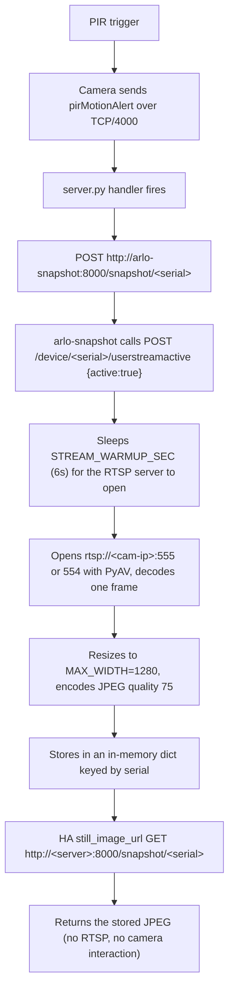

This is Post 2 of a three-part series on replacing the proprietary Arlo base station with a self-hosted stack. In [Post 1 of this series](/replacing-arlo-base-station-with-a-netgear-orbi-router/) I covered the networking layer — how to make a Netgear Orbi RBR760 impersonate the Arlo base station well enough that the cameras connect, register, and stream. In this post I cover the *server* layer: the Docker stack that actually runs on the mini PC, the custom Flask sidecar service that captures motion-triggered snapshots, the on-demand RTSP relay that makes live streaming battery-friendly, and the three upstream pull requests I contributed to fix bugs I hit on the way.

The third and final post will cover Home Assistant — REST sensors, picture-glance cards, arm/disarm, motion webhooks — once the rest of the stack is solid. The companion repository at [github.com/mmornati/arlo-base-station](https://github.com/mmornati/arlo-base-station) holds every config file mentioned here.

> **A note on redaction.** Throughout this post, real camera serial numbers, MAC addresses, and the production LAN IP of the server have been replaced with `XXXXXXXXXXXX` and `192.168.1.X`-style placeholders. The well-known `172.14.1.1` Arlo gateway value is kept because it is part of the wire protocol. The guest subnet `192.168.2.x` (where the cameras live on the Orbi) is left as-is because it is the standard Orbi default and reveals nothing specific.

## Why `arlo-cam-api` (and Not the Official Arlo Cloud)

Arlo's own cloud works. The Arlo app works. Arlo's subscription unlocks CVR, smart alerts, activity zones, and a polished mobile UI that took a real product team years to build. There is, in fact, very little wrong with buying an Arlo subscription and being done with it.

The reason I ended up self-hosting is a much narrower set of constraints:

- **No subscription.** The cameras are VMC4040P (Arlo Pro 3), so they keep working without a subscription — but the free tier is limited: activity zones (restricting motion detection to part of the field of view) are subscription-only, so when you arm a camera, motion is detected across the whole frame. Recordings are local-only (you need a USB key in the base station), and you can't easily check what happened while you were away. And the day Arlo decides to retire the free tier, the cameras turn into expensive paperweights. Local-only removes that risk.
- **Full RTSP.** Arlo's RTSP support is opt-in and per-camera. Local emulation gives you an RTSP URL for every camera unconditionally.
- **No remote-disable risk.** Arlo can, at the cloud level, deprecate a model or block a serial. If you've ever had a printer brick itself because HP decided it was obsolete, you understand.
- **It is, frankly, fun.** Running your own basestation emulator on a Raspberry Pi and watching four cameras register against it is one of those projects that makes you remember why you got into this in the first place.

The original reverse-engineering work is [Meatballs1/arlo-cam-api](https://github.com/Meatballs1/arlo-cam-api). It has not been actively maintained for a while. The actively maintained fork is [brianschrameck/arlo-cam-api](https://github.com/brianschrameck/arlo-cam-api), which publishes a Docker image (`bschrameck/arlo-cam-api:latest`) that I use as the base for everything in this post. All the production patches I describe below were contributed as PRs to that fork.

## The `arlo-cam-api` Docker Stack

The whole server side lives in three containers, plus a couple of bind-mounted config files. Here is the production `docker-compose.yaml` from the companion repo:

```yaml
services:
  arlo-cam-api:
    image: bschrameck/arlo-cam-api:latest
    container_name: arlo-cam-api
    restart: unless-stopped
    ports:
      - "4000:4000"   # Camera registration protocol (RBR760 DNAT -> here)
      - "5000:5000"   # REST API (used by Home Assistant)
    volumes:
      - arlo-recordings:/recordings
      - ./server.py:/opt/arlo-cam-api/server.py:ro
      - ./api/api.py:/opt/arlo-cam-api/api/api.py:ro
      - ./config.yaml:/opt/arlo-cam-api/config.yaml:ro
    environment:
      - HOST=0.0.0.0
      - PORT=4000
      - API_PORT=5000
      - RECORDINGS_PATH=/recordings

  arlo-snapshot:
    build: ./arlo-snapshot
    image: arlo-snapshot:local
    container_name: arlo-snapshot
    restart: unless-stopped
    depends_on:
      - arlo-cam-api
    ports:
      - "8000:8000"
    environment:
      - ARLO_API=http://arlo-cam-api:5000
      - USERSTREAM_TTL=60
      - STREAM_WARMUP_SEC=6
      - RTSP_RETRIES=3
      - RTSP_RETRY_DELAY=2
      - MAX_WIDTH=1280
      - JPEG_QUALITY=75

  mediamtx:
    image: bluenviron/mediamtx:latest
    container_name: mediamtx
    restart: unless-stopped
    ports:
      - "8554:8554"
    volumes:
      - ./mediamtx.yml:/mediamtx.yml:ro

volumes:
  arlo-recordings:
```

Three services, three different jobs:

- **`arlo-cam-api`** — the basestation emulator. Listens on `4000` (the registration protocol that the cameras speak) and on `5000` (a small Flask REST API that Home Assistant and the snapshot service consume). This is the only container that the cameras talk to.
- **`arlo-snapshot`** — the on-demand still-image proxy. Listens on `8000`. It is a tiny Flask app whose job is to take one JPEG from a camera's RTSP stream, store it in memory, and return it on a subsequent `GET`. No polling, no cache TTL.
- **`mediamtx`** — the on-demand RTSP relay. Listens on `8554`. Translates `rtsp://192.168.1.X:8554/cam1` into `rtsp://192.168.2.x:554/live` for Home Assistant. Only connects to a camera when a client is actually watching.

Note the bind-mount lines on `arlo-cam-api` that load `./server.py`, `./api/api.py`, and `./config.yaml` over the upstream image's copies — plus the `device_db_patched.py` module and the `arlo.db` database file. The sqlite `DeviceDB` lives *inside* the container by default and is wiped every time the container is recreated, which resets registrations and drops every camera out of `known_devices`. Bind-mounting `arlo.db` makes the device list survive restarts. This is the production-patch workaround that lets me ship the fixes from PRs #29, #30, and #31 without forking the image. I will come back to this in the "Production patches" section below.

Networking-wise, the cameras live on the Orbi guest WiFi (`192.168.2.x`, isolated from the LAN) and the server is on the LAN (`192.168.1.x`). The RBR760 DNATs camera-to-server traffic on TCP/4000 across. MediaMTX lives on the server because the server can reach *both* networks; HA on `192.168.1.Y` cannot reach the cameras directly.

## `arlo-snapshot` — The On-Demand Still-Image Proxy

Out of the box, `arlo-cam-api` exposes `GET /snapshot/<serial>`, but with a fatal caveat: the endpoint only returns 200 if a snapshot has been *pushed* to it from the camera — and the VMC4040P cameras **never push**. Calling the camera's `snapshot_request()` URL over the basestation protocol returns an ACK from the camera, then closes the connection gracefully without uploading a single byte. So `SnapshotCount` stays at 0 forever and Home Assistant shows an empty camera card.

The fix is to grab the JPEG from the RTSP stream instead. That is exactly what `arlo-snapshot` does.

### The flow



The two-endpoint split is deliberate. `POST /snapshot/<serial>` does the expensive work (waking the camera, opening a TCP socket to its RTSP port, decoding an H.264 frame). `GET /snapshot/<serial>` is a dict lookup plus a Flask `Response`. HA can hammer `GET` from a Lovelace card without ever waking the camera.

### The interesting bits

Environment variables (all set in `docker-compose.yaml`):

```python
ARLO_API          = os.environ.get("ARLO_API", "http://arlo-cam-api:5000")
SNAPSHOT_PORT     = int(os.environ.get("SNAPSHOT_PORT", "8000"))
RTSP_TIMEOUT_US   = int(os.environ.get("RTSP_TIMEOUT_US", "8000000"))  # 8s
DEVICE_CACHE_TTL  = int(os.environ.get("DEVICE_CACHE_TTL", "60"))      # cache /device list for 60s
MAX_WIDTH         = int(os.environ.get("MAX_WIDTH", "1280"))
JPEG_QUALITY      = int(os.environ.get("JPEG_QUALITY", "75"))
USERSTREAM_TTL    = int(os.environ.get("USERSTREAM_TTL", "30"))        # re-wake every 30s
STREAM_WARMUP_SEC = float(os.environ.get("STREAM_WARMUP_SEC", "6"))    # wait for RTSP port
RTSP_RETRIES      = int(os.environ.get("RTSP_RETRIES", "3"))
RTSP_RETRY_DELAY  = float(os.environ.get("RTSP_RETRY_DELAY", "2"))
```

The `activate_stream` helper is what calls into the basestation emulator to wake the camera:

```python
def activate_stream(serial):
    try:
        r = requests.post(
            f"{ARLO_API}/device/{serial}/userstreamactive",
            json={"active": True},
            timeout=5,
        )
        return r.json().get("result", False)
    except Exception as e:
        log.error(f"Failed to activate stream for {serial}: {e}")
        return False
```

This is why PR #31's "restore `userstreamactive`" fix matters: stock `arlo-cam-api` accepts the POST but its handler body is commented out and it always returns `{"result": true}` without doing anything. The RTSP port never opens, the snapshot grab times out, and the snapshot is never stored. PR #31 makes `userstreamactive` actually call `device.set_user_stream_active(int(active))`. Without it, this whole service does not work.

The `grab_frame` helper is the only piece of RTSP code in the project:

```python
def grab_frame(ip):
    last_err = None
    for port in (555, 554):
        try:
            container = av.open(
                f"rtsp://{ip}:{port}/live",
                options={"rtsp_transport": "tcp", "stimeout": str(RTSP_TIMEOUT_US)},
            )
            for stream in container.streams:
                if stream.type != "video":
                    continue
                for frame in container.decode(stream):
                    container.close()
                    return frame.to_image()
            container.close()
        except Exception as e:
            last_err = e
            log.warning(f"[{ip}] RTSP :{port} failed: {e}")
            continue
    raise last_err or RuntimeError("no RTSP port worked")
```

Note the try-555-then-554 fallback. Older Arlo models expose RTSP on TCP/555. The VMC4040P exposes it on TCP/554. Community docs contradict each other on which is which, so the service tries both with an 8-second per-port timeout.

The `make_jpeg` resizer caps the image to `MAX_WIDTH=1280` (VMC4040P's native RTSP stream is 2560x1440 — way more pixels than Home Assistant needs for a 200x150 card thumbnail) and uses `JPEG_QUALITY=75` which is the sweet spot between file size and crispness for a security camera thumbnail.

The Flask routes are tiny:

```python
@app.route("/snapshot/<serial>", methods=["POST"])
def trigger_snapshot(serial):
    ok, result = grab_and_store(serial)
    if not ok:
        return jsonify({"ok": False, "error": result}), 502
    return jsonify({"ok": True, "serial": serial, "bytes": len(result)})

@app.route("/snapshot/<serial>", methods=["GET"])
def get_snapshot(serial):
    with store_lock:
        data = store.get(serial)
    if data is None:
        abort(404, description=f"No snapshot available for {serial}")
    return Response(data["data"], mimetype="image/jpeg")
```

`POST` does the work; `GET` serves the stored frame. Lock contention is one dict under a single `threading.Lock()` — the whole service is single-process Flask with `threaded=True`, so you do not need anything fancier for four cameras.

### The Dockerfile

Twelve lines, no frills:

```dockerfile
FROM python:3.12-slim

WORKDIR /app

COPY requirements.txt .
RUN pip install --no-cache-dir -r requirements.txt

COPY app.py .

EXPOSE 8000

CMD ["python", "app.py"]
```

`requirements.txt`:

```text
flask==3.0.3
av==18.0.0
pillow==12.3.0
requests==2.32.3
```

That is the whole sidecar. Total image size on disk is about 200 MB (PyAV pulls in a bundled libav). Cold start is under a second.

## MediaMTX — On-Demand RTSP Relay

Cameras sit on `192.168.2.x` (guest network, isolated from LAN). Home Assistant sits on `192.168.1.Y` (LAN). HA cannot reach the cameras directly. The server sits on both and runs MediaMTX as an on-demand RTSP relay: when HA opens `rtsp://192.168.1.X:8554/cam1`, MediaMTX opens `rtsp://192.168.2.x:554/live` upstream. When HA closes the connection, MediaMTX closes the upstream after a 1-second grace period.

This is the single most important piece for battery life. With on-demand relaying, the RTSP stream only runs when someone is actually looking at the camera.

### `mediamtx.yml`

```yaml
logLevel: info
api: yes
apiAddress: 0.0.0.0:9997

rtspAddress: :8554
rtspTransports: [tcp]

paths:
  cam1:
    source: rtsp://192.168.2.3:554/live
    sourceOnDemand: yes
    sourceOnDemandStartTimeout: 30s
    sourceOnDemandCloseAfter: 1s
    maxReaders: 5

  cam2:
    source: rtsp://192.168.2.2:554/live
    sourceOnDemand: yes
    sourceOnDemandStartTimeout: 30s
    sourceOnDemandCloseAfter: 1s
    maxReaders: 5

  cam3:
    source: rtsp://192.168.2.103:554/live
    sourceOnDemand: yes
    sourceOnDemandStartTimeout: 30s
    sourceOnDemandCloseAfter: 1s
    maxReaders: 5

  cam4:
    source: rtsp://192.168.2.4:554/live
    sourceOnDemand: yes
    sourceOnDemandStartTimeout: 30s
    sourceOnDemandCloseAfter: 1s
    maxReaders: 5
```

A few choices worth explaining:

- **`rtspTransports: [tcp]`** — UDP is unreliable on WiFi, especially 2.4 GHz guest networks behind a mesh. TCP trades a tiny bit of latency for not having to deal with constant jitter buffering. Security cameras are not twitch games.
- **`sourceOnDemand: yes`** — the camera's RTSP port only opens when a client connects. After `sourceOnDemandCloseAfter: 1s` of no clients, MediaMTX closes the upstream and the camera goes back to sleep.
- **`sourceOnDemandStartTimeout: 30s`** — gives the camera up to 30 seconds to wake up and open its RTSP port. VMC4040P takes 10-14 seconds to come up after a `userstreamactive` call, plus there is the cost of re-establishing WiFi from deep sleep, so 30s is the right ceiling.
- **`maxReaders: 5`** — Home Assistant opens multiple RTSP connections per camera (preview + main stream + Frigate detector if you happen to use it). The MediaMTX default of 2 is too low and you get `maximum reader count reached` errors. Five is comfortable for HA + one or two external viewers.

Do **not** set `runOnInit` or `runOnDemand` hooks. The `bluenviron/mediamtx` image is scratch-based with no shell, no `curl`, no `wget`. The hooks are documented as runnable but in practice they cannot execute anything on this image. Wake-up of the camera is handled entirely by `arlo-snapshot` via its `userstreamactive` POST.

## The Three Upstream PRs

This is the centerpiece of the post. After deploying `arlo-cam-api` against the real cameras, three distinct bugs showed up within a week. All three are now upstream pull requests against [brianschrameck/arlo-cam-api](https://github.com/brianschrameck/arlo-cam-api):

> If you just want a working copy with all three patches applied, the full patched code is in my fork at [github.com/mmornati/arlo-cam-api](https://github.com/mmornati/arlo-cam-api) — build your image from that repository instead of assembling the patches by hand. The fork also carries the production configuration that is the subject of the rest of this series — most notably `DefaultPIRTargetState`, the switch that sets a camera's *response policy* when its PIR detects motion (armed = wake up and stream ~10 seconds of video; disarmed = ignore the event). The PIR element itself is an always-on, passive IR detector in both states — so it is more than just the three upstream PRs.

- [PR #29](https://github.com/brianschrameck/arlo-cam-api/pull/29) — `fix(api): do not evaluate app.run eagerly when constructing Flask thread`
- [PR #30](https://github.com/brianschrameck/arlo-cam-api/pull/30) — `feat(server): add periodic keepalive beacon to prevent camera WiFi drops`
- [PR #31](https://github.com/brianschrameck/arlo-cam-api/pull/31) — `feat: auto-register cameras on status, restore userstreamactive, snapshot-on-motion`

The patches for all three are also in the companion repo under `server/patches/`:
- [pr-29-api-thread-fix.patch](https://github.com/mmornati/arlo-base-station/blob/main/server/patches/pr-29-api-thread-fix.patch)
- [pr-30-beacon-keepalive.patch](https://github.com/mmornati/arlo-base-station/blob/main/server/patches/pr-30-beacon-keepalive.patch)
- [pr-31-auto-register-snapshot.patch](https://github.com/mmornati/arlo-base-station/blob/main/server/patches/pr-31-auto-register-snapshot.patch)

Treat them in order. PR #29 is a prerequisite for #30. PR #31 is independent but solves three problems you almost certainly hit on day one.

### PR #29: Don't Evaluate `app.run` Eagerly in `Thread(target=…)`

#### Problem

`api.api.get_thread()` returned:

```python
return threading.Thread(target=app.run(host='0.0.0.0'))
```

In Python, the `target=` argument is evaluated before being passed to `Thread`. So `app.run(host='0.0.0.0')` runs on the **calling thread** (the main thread of `server.py`) — Flask's werkzeug starts, binds to port 5000, and blocks in its `select()` loop. Anything after the call to `get_thread()` is unreachable, including any future `flask_thread.start()` or `beacon_thread.start()`.

Why did this not break for anyone until now? Because nothing in the existing main block starts a second thread after `flask_thread = api.api.get_thread()`. The bug was *latent* — present in the code, harmless in practice, and would have remained so forever if not for PR #30, which adds a second thread.

#### Fix

One line:

```diff
--- a/api/api.py
+++ b/api/api.py
@@ -224,4 +224,4 @@ def register_set(serial, req_body, device: Device):
-    return threading.Thread(target=app.run(host='0.0.0.0'))
+    return threading.Thread(target=app.run, kwargs={'host': '0.0.0.0'})
```

Pass `app.run` itself (a callable) plus `kwargs={'host': '0.0.0.0'}`. The thread only starts the server when `.start()` is called.

#### Production evidence

I hit this immediately after rebasing PR #30 onto stock `arlo-cam-api`. The container came up, port 5000 was reachable, and the main block hung before reaching `beacon_thread.start()`. With the fix, the main block falls through cleanly, Flask runs on its own thread, the beacon thread starts on a third thread, and you can verify with `docker exec arlo-cam-api ps -eLf` that you have three Python threads alive (main, Flask, beacon) plus one thread per active camera connection.

The one-line diff is misleading — without it, you cannot stack any new thread alongside Flask, which is exactly the structural change PR #30 introduces.

### PR #30: Periodic `BeaconThread` to Prevent Camera WiFi Drops

#### Problem

Arlo cameras count the number of beacons they have missed from the basestation. The threshold is the `MaxMissedBeaconTime` value sent in the initial `registerSet` response (default 30). When the count exceeds the threshold, the camera assumes the basestation is gone and drops off WiFi entirely — full hibernation. The camera then sits in hibernation until its own firmware cycle decides to retry, which can be hours or days.

`arlo-cam-api` sends nothing periodic. After the initial handshake, the connection goes silent from the basestation side until either the camera sends something (a status update, a motion alert) or the basestation tries to push something. For long periods of camera inactivity, nothing flows.

The user-visible symptom:

> *Cameras work fine for 1–2 hours after a manual wake. Then they drop off WiFi. The only thing that brings them back is the camera's own firmware reconnect cycle, which is unpredictable — sometimes 30 minutes, sometimes the next morning.*

This is a really nasty bug to debug because the cameras *appear* to work, the basestation emulator has no error in its logs, and there is no event on either side to indicate what happened. You just notice at some point that `curl http://192.168.1.X:5000/device` returns three cameras instead of four.

#### Fix

A new `BeaconThread` that, every `BeaconIntervalSeconds` (default 60s), sends a lightweight `statusRequest` to every camera seen via inbound traffic. The `statusRequest` returns an ACK + status reply, which doubles as a liveness probe.

`config.yaml`:

```yaml
# Interval (seconds) between keepalive statusRequest beacons sent to each
# known camera. Mimics the Arlo base station beacon so cameras do not
# assume the basestation is gone (MaxMissedBeaconTime) and drop WiFi.
BeaconIntervalSeconds: 60
```

`server.py` — the new thread class:

```python
class BeaconThread(threading.Thread):
    """Periodically sends a keepalive statusRequest to every known camera.

    Arlo cameras tolerate only a limited number of missed beacons from the
    basestation (MaxMissedBeaconTime in the initial registerSet) before
    assuming the basestation is gone and dropping off WiFi (hibernation).
    """

    def __init__(self):
        threading.Thread.__init__(self)
        self.daemon = True

    def run(self):
        s_print(f'[beacon] Started (interval={BEACON_INTERVAL_SECONDS}s)')
        while True:
            time.sleep(BEACON_INTERVAL_SECONDS)
            with devices_lock:
                devices = list(known_devices.values())
            for device in devices:
                try:
                    if device.status_request():
                        s_print(f'[beacon] {device.serial_number} OK')
                    else:
                        s_print(f'[beacon] {device.serial_number} no response (offline)')
                except Exception as e:
                    s_print(f'[beacon] {device.serial_number} error: {e}')
```

Plus a `known_devices` dict populated from the inbound `registerSet` and `status` handlers, and a guard in the status handler so an unknown serial no longer crashes the `ConnectionThread` with `AttributeError` on `device.ip = ...`.

There is one more source for `known_devices`, and it matters more than it looks. After a container restart the dict is empty until each camera happens to send an inbound message — which a sleeping camera will not do for hours. The beacon thread therefore probes *nothing* in that window, the cameras keep dropping off WiFi, and you are back to square one. The fork seeds `known_devices` at startup from the persisted `DeviceDB` via a new `DeviceDB.get_all_devices()`, skipping rows with `ip = 'UNKNOWN'` (devices persisted at registration before their real address is known). The beacon can then resume probing every known camera immediately after a restart, without waiting for inbound traffic.

The guard is worth calling out separately because it is the kind of bug that only surfaces under specific race conditions:

```python
elif (msg['Type'] == "status"):
    s_print(f"<[{self.ip}][{msg['ID']}] Status from {msg['SystemSerialNumber']}")
    device = DeviceDB.from_db_serial(msg['SystemSerialNumber'])
    if device is None:
        s_print(f"<[{self.ip}][{msg['ID']}] Status from unknown device {msg['SystemSerialNumber']}, ignoring")
        self.connection.close()
        break
    device.ip = self.ip
    ...
```

Before this guard, a status message from an unknown serial crashed the entire `ConnectionThread` with `AttributeError: 'NoneType' object has no attribute 'ip'`. After a container restart, when cameras reconnect over a surviving TCP socket, they sometimes send a `status` before a fresh `registerSet`. The crash killed the thread, the connection was never reaped, and the camera stayed registered in `DeviceDB` but unreachable on the wire. You only noticed when `curl /device` showed the camera and `curl /device/<serial>` returned empty.

#### Production evidence

Before the patch, my four VMC4040P cameras dropped off WiFi every 1–2 hours. After the patch:

```
[beacon] Started (interval=60s)
[beacon] XXXXXXXXXXXX OK
[beacon] XXXXXXXXXXXX OK
[beacon] XXXXXXXXXXXX OK
[beacon] XXXXXXXXXXXX OK
```

`CameraOnline` increments steadily. `CameraOffline` does not move. I left the cameras running for a week straight and they have not disconnected once.

The 60-second default is a good starting point, but it is **not free**. A TCP `statusRequest` is not the same as a real base-station WiFi beacon: the actual Arlo basestation keeps the camera's CPU asleep in 802.11 PS-Poll power-save, whereas our beacon forces a full CPU wake plus JSON processing on every camera, every tick — 60 times an hour. What surprised me, though, is that the battery cost is **not** a function of the beacon interval. I measured it in production: with a 60 s beacon and the cameras *disarmed*, the drain was **~2%/h**; with a 100 s beacon and the cameras *armed but with zero motion in view*, it was **0%**; and with a 100 s beacon and the cameras *armed with active motion*, it was **~5.8%/h** (Jardin 1, 30 motion events in under 3 hours). In other words, the drain tracks the **motion frequency in each camera's field of view** — every PIR event wakes the camera and streams ~10 seconds of video — not the beacon interval. The interval does matter for one thing: **reachability**. Taking it up to 200 s pushed the cameras into deep sleep (radio off, port 4000 closed) and only a firmware cycle or a physical sync button brought them back. So `BeaconIntervalSeconds` is a reachability dial, not a battery dial: keep it at 60–100 s and never push it to 200 s. The full measurement methodology and tables are in the Battery Drain chapter of [Post 3](/integrating-self-hosted-arlo-with-home-assistant/#measured-battery-drain--the-real-numbers).

### PR #31: Auto-Register on Status, Restore `userstreamactive`, SnapshotOnMotion

Three small features bundled together because they all touch the same area of the code (the inbound message handler and a couple of REST endpoints). Each is independent; they happened to make sense in a single PR.

#### 6.3.1 — Auto-register on status

The same race condition from the PR #30 status-handler guard, but in a different direction: VMC4040P cameras *sometimes* send a status message before sending a full `registerSet`. The stock handler called `DeviceDB.from_db_serial(msg['SystemSerialNumber'])`, which returned `None`, then tried `device.ip = self.ip` and crashed.

PR #31 adds an auto-register path: if the device is not in `DeviceDB`, create a new `Camera` instance on the spot, default `SystemModelNumber` to `'VMC4040P'` (the most common case) when the status message lacks it, and continue with the original persist + notify flow:

```python
if device is None:
    from arlo.camera import Camera
    cam_msg = dict(msg.dictionary)
    if 'SystemModelNumber' not in cam_msg:
        cam_msg['SystemModelNumber'] = 'VMC4040P'
    device = Camera(self.ip, Message(cam_msg))
    device.status = {}
    device.friendly_name = msg['SystemSerialNumber']
    s_print(f"<[{self.ip}][{msg['ID']}] Auto-registered {device.serial_number} on status (forced Camera)")
device.ip = self.ip
device.status = msg
DeviceDB.persist(device)
```

The result: cameras that wake from deep sleep and immediately send a status message (which VMC4040Ps do) now register cleanly and end up in `known_devices` so the beacon loop sees them on the very next cycle. Previously they would crash the thread and disappear from the basestation until manually rebooted.

#### 6.3.2 — Restore `POST /device/{serial}/userstreamactive`

The stock endpoint body:

```python
@app.route('/device/<serial>/userstreamactive', methods=['POST'])
def userstream_active(serial, req_body, device: Device):
    # active = req_body["active"]
    # if active is None:
    #     flask.abort(400)
    #
    # result = device.set_user_stream_active(int(active))
    return flask.jsonify({"result": True})
```

All commented out. Always returns `{"result": true}`. The camera's RTSP port never opens.

The fix:

```python
@app.route('/device/<serial>/userstreamactive', methods=['POST'])
def userstream_active(serial, req_body, device: Device):
    active = req_body.get("active")
    if active is None:
        flask.abort(400)
    result = device.set_user_stream_active(int(active))
    return flask.jsonify({"result": result})
```

This is the fix that makes the entire `arlo-snapshot` service work. Without it, the sidecar's `activate_stream()` call returns `true` (a lie), the camera's RTSP server stays closed, the snapshot grab times out 8 seconds later, and Home Assistant shows an empty camera card on every motion event. With it, the camera actually opens its RTSP port within ~10 seconds, the sidecar grabs a frame, and Home Assistant sees a fresh thumbnail.

#### 6.3.3 — New `SnapshotOnMotion` config option

The original idea was to give `arlo-cam-api` a way to push motion-triggered snapshots out of the box, without requiring the operator to wire up the `arlo-snapshot` sidecar. PR #31 adds a config flag:

```yaml
# When true, PIR motion alerts POST to the arlo-snapshot sidecar to trigger
# a one-frame snapshot grab. Battery-friendly: no polling, no continuous RTSP.
# Disabled by default for deployments without the sidecar service.
SnapshotOnMotion: false
```

When enabled, the `pirMotionAlert` handler in `ConnectionThread.run()` posts to the sidecar:

```python
if alert_type == "pirMotionAlert":
    if NOTIFY_ON_MOTION_ALERT:
        # ... existing webhook fanout
    if SNAPSHOT_ON_MOTION:
        import requests
        try:
            snap_url = f"http://arlo-snapshot:8000/snapshot/{device.serial_number}"
            requests.post(snap_url, timeout=35)
            s_print(f"<[{self.ip}][{msg['ID']}] Triggered snapshot for {device.serial_number}")
        except Exception as e:
            s_print(f"<[{self.ip}][{msg['ID']}] Snapshot trigger failed: {e}")
```

Default is `false` so that deployments without `arlo-snapshot` running are unaffected. On my production deployment it is `true`, and PIR triggers result in a fresh `<serial>` JPEG landing in `arlo-snapshot`'s in-memory store within ~10 seconds.

Battery-friendly is the key property. The alternative — Home Assistant polling RTSP every few seconds to keep the still image fresh — would drain the cameras in days. `SnapshotOnMotion` is push-based: the camera wakes on motion, fires the alert, the basestation triggers the snapshot grab, the camera goes back to sleep. The whole pipeline uses zero RTSP bandwidth except for the single frame grab.

## Production Patches: Shipping Fixes Before They Merge

I deployed this stack in production in early August 2026. None of the three PRs are merged upstream at the time of writing. I needed the fixes *now*, not whenever upstream gets around to reviewing them.

The workaround is bind-mounting. The `arlo-cam-api` container exposes `/opt/arlo-cam-api/` with the source files. A handful of lines in `docker-compose.yaml` overlay my patched copies over the upstream image — including the `device_db.py` module and the `arlo.db` database file, so the device list survives container recreations:

```yaml
volumes:
  - arlo-recordings:/recordings
  - ./server.py:/opt/arlo-cam-api/server.py:ro
  - ./api/api.py:/opt/arlo-cam-api/api/api.py:ro
  - ./config.yaml:/opt/arlo-cam-api/config.yaml:ro
  - ./device_db_patched.py:/opt/arlo-cam-api/arlo/device_db.py:ro
  - ./arlo.db:/opt/arlo-cam-api/arlo.db
```

The companion repo at [github.com/mmornati/arlo-base-station](https://github.com/mmornati/arlo-base-station) has the production copies under `server/server.py`, `server/api/api.py`, and `server/config.yaml`, plus the standalone diff files under `server/patches/`:

```
server/
  patches/
    pr-29-api-thread-fix.patch
    pr-30-beacon-keepalive.patch
    pr-31-auto-register-snapshot.patch
  api/
    api.py            # patched (PRs #29 + #31)
  server.py           # patched (PRs #30 + #31)
  config.yaml         # patched (BeaconIntervalSeconds, SnapshotOnMotion, DefaultPIRTargetState, webhook suppression)
  mediamtx.yml
  arlo-snapshot/
    Dockerfile
    app.py
    requirements.txt
```

Once all three PRs are merged upstream, the bind mounts go away and `bschrameck/arlo-cam-api:latest` Just Works. Until then, the bind mounts are the deploy.

The `.patch` files are real `git format-patch` output against the upstream `brianschrameck/arlo-cam-api` HEAD at the time I started the work. To regenerate them:

```bash
git clone https://github.com/brianschrameck/arlo-cam-api.git
cd arlo-cam-api
git checkout <commit-at-PR-time>
git am /path/to/server/patches/pr-*.patch
```

To apply them to the standalone copies in `server/server.py` and `server/api/api.py`:

```bash
cd server
for p in patches/pr-*.patch; do patch -p1 < "$p"; done
```

## Diagnostics & Field Reference

Once the stack is up, every camera exposes a rich status document at `GET /device/<serial>` on port 5000. The field names are *not* what you would guess — they come straight from the Arlo wire protocol, with original-case camel case preserved. Here is the canonical field table that I keep pinned next to my Home Assistant template editor:

| Field | Meaning |
|---|---|
| `BatPercent` | Battery percentage (0–100) |
| `Bat1Volt` | Battery voltage (V) |
| `ChargingState` | `"Off"` / `"On"` / `"Critical"` / `"Full"` |
| `ChargingMode` | `"Charging"` / `"NotCharging"` |
| `SignalStrengthIndicator` | WiFi bars (0–5) |
| `WifiRSSI` | WiFi RSSI (dBm, negative; e.g. `-46`) |
| `Temperature` | Camera temperature (°C) |
| `ActiveState` | `"Active"` / `"Idle"` / `"Offline"` |
| `PIRTargetState` | `"Armed"` / `"Disarmed"` / `"NotSupported"` |
| `PIRLEDState` | `{ "enabled": bool, "sensitivity": 0–4 }` |
| `Uptime` | Seconds since last registration |
| `PIREvents` | Total PIR events seen |
| `PIRTriggers` | PIR triggers that woke the camera |
| `MotionStreamed` | Motion-triggered RTSP streams |
| `UserStreamed` | User-requested RTSP streams |
| `Streamed` | Total RTSP streams |
| `FailedStreams` | Failed RTSP stream attempts |
| `CameraOnline` | Total time online (s) |
| `CameraOffline` | Total time offline (s) |
| `IRLEDsOn` | Time IR LEDs were on (s) |
| `SpotlightEnabled` | Spotlight state (`true` / `false`) |
| `WifiConnectionCount` | WiFi reconnections |
| `WifiChannel` | Current 2.4 GHz channel |
| `SystemFirmwareVersion` | Camera firmware version (string) |
| `HardwareRevision` | Hardware revision string (e.g. `"VMC4040P-XXXXX"`) |
| `PoweredOn` | Time powered on (s) |
| `CriticalBatStatus` | `0` = OK, `>0` = critical |
| `ChargerTech` | `"None"` / `"Solar"` / `"AC"` |
| `BatTech` | `"Rechargeable"` / `"NonRechargeable"` |
| `SMState` | State machine state (vendor-internal) |
| `PirMode` | PIR mode |
| `PirLedMode` | PIR LED mode |

A few of these are non-obvious:

- `BatPercent` (not `battery_level`), `SignalStrengthIndicator` (not `signal_strength`), `WifiRSSI` is in dBm. The case is significant — the API returns these as-is.
- `CameraOnline` and `CameraOffline` are running totals in seconds, *not* current-state booleans. To get the current online/offline state, use `ActiveState`.
- `Streamed` = `MotionStreamed` + `UserStreamed`. `FailedStreams` is the count of `userstreamactive` calls that did not result in an RTSP session — useful for diagnosing `arlo-snapshot` failures.
- `HardwareRevision` for VMC4040P looks like `"VMC4040P-XXXXX"` where the `XXXXX` is a per-unit suffix; it is *not* a redacted serial.

For ad-hoc inspection, the `arlo-snapshot` repo ships a `status.py` helper that prints the canonical fields for every camera:

```python
import sys
import json
import urllib.request

for serial, ip in [("SERIAL_1", "192.168.2.x"), ("SERIAL_2", "192.168.2.x")]:
    print(f"=== {serial} @ {ip} ===")
    try:
        with urllib.request.urlopen(f"http://localhost:5000/device/{serial}", timeout=3) as r:
            d = json.loads(r.read())
            if not d:
                print("  (no status data)")
                continue
            keys = ["BatPercent", "Bat1Volt", "ChargingState", "ChargingMode",
                    "SignalStrengthIndicator", "WifiRSSI", "Temperature",
                    "PirMode", "PirLedMode", "SystemFirmwareVersion",
                    "HardwareRevision", "WifiChannel", "SMState"]
            for k in keys:
                if k in d:
                    v = d[k]
                    print(f"  {k}: {v}")
    except Exception as e:
        print(f"  ERROR: {e}")
    print()
```

I run this once a week to spot-check battery and WiFi health. If `BatPercent` starts dropping on a camera that should be stable, I know the solar panel is failing or the camera is waking up too often. If `WifiRSSI` jumps from `-46` to `-78`, I know the Orbi mesh is unhappy.

## What I Would Build Next

A few rough edges remain that I would like to tackle but have not had time to:

- **`userstreamactive` does not persist between basestation restarts.** When `arlo-cam-api` restarts, the in-memory state of which cameras had a user stream active is lost. The cameras recover on their own (they detect the TCP disconnect and re-register), but the first `userstreamactive` call after a restart is slower because the RTSP server has to come up from scratch.
- **No built-in thumbnail proxy for recordings.** Recordings are saved to `/recordings` as raw video segments; there is no API to fetch a thumbnail at `t=10s` for a given recording. For now I just take a fresh snapshot via `arlo-snapshot` when I want a still.
- **No motion-zone configuration via API.** Activity zones are a cloud-only feature on the official Arlo firmware. Configuring them requires the Arlo app, which defeats the purpose of self-hosting. A custom basestation implementation could in principle push zone definitions to the camera, but the protocol is undocumented.
- **No `device.snapshot_request()` POST support on VMC4040P.** This is a firmware limitation — the camera accepts the command and ACKs but never uploads. PR #31 works around it via the sidecar grab. A future PR could expose a `/camera/<serial>/snapshot` endpoint on `arlo-cam-api` that wraps the sidecar and returns the JPEG synchronously, simplifying the integration.

None of these are blockers. They are nice-to-haves that I will get to when I get to them.

## What's Next

This post covered the server layer: the Docker stack, the custom snapshot sidecar, the on-demand RTSP relay, and the three upstream patches. The next — and final — post in the series covers the Home Assistant side: REST sensors for battery and signal, picture-glance cards for the dashboard, arm/disarm controls, motion webhooks, and the Lovelace layout. It is covered in [Post 3 of this series](/integrating-self-hosted-arlo-with-home-assistant/) (the Home Assistant integration).

Continue reading → [Post 3 (Home Assistant integration)](/integrating-self-hosted-arlo-with-home-assistant/). For the networking side, see [Post 1 of this series](/replacing-arlo-base-station-with-a-netgear-orbi-router/).

The companion repository is [github.com/mmornati/arlo-base-station](https://github.com/mmornati/arlo-base-station). The upstream PRs are [PR #29](https://github.com/brianschrameck/arlo-cam-api/pull/29), [PR #30](https://github.com/brianschrameck/arlo-cam-api/pull/30), and [PR #31](https://github.com/brianschrameck/arlo-cam-api/pull/31).