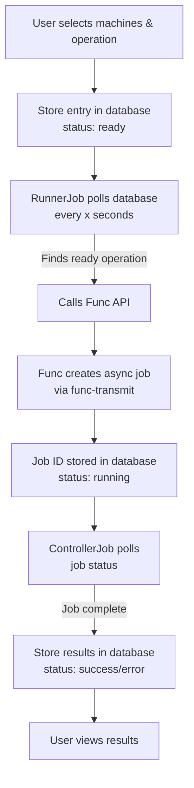

# Symbolic Operations Runner

The Symbolic engine, or OperationRunner, follows a similar pattern to the script execution system. It uses polling jobs that continuously monitor the database for operations that are ready to run or have completed (either successfully or with failures). All these operations execute completely asynchronously, both from the user's perspective and within the Symbolic application itself. A ControllerJob periodically checks the status of running operations.

## Workflow

1. User selects machine(s), chooses which operation they want, and provides any required parameters for execution
2. An entry is stored in the database and set to "ready" state
3. RunnerJob (note: this is different from the job used to run scripts) checks, every "x" seconds, for any operations ready to run
4. When it finds a ready operation, it uses the Func API to call Func and updates the operation status in the database to "running"
5. Func, through the func-transmit script, calls the required minion to create an "async job" (the job ID is returned to RunnerJob and stored in the database)
6. Another job, the ControllerJob, verifies if there are any running operations (by querying the database) and, using the stored job ID, asks Func for the current state of that job
7. When it receives a "job complete" response (which could indicate success or failure), it stores the information in the database and sets the status to the appropriate value (success or error)
8. User can view the results for the operation they initiated