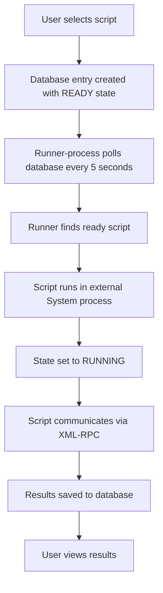

In this article we will see how Symbolic runs a pre-configured user script in asynchronous mode.

## Why "pre-configured"?

In Symbolic application, the administrator can upload to the server a specific well-formed script, written in Python, Groovy, Bash, or Perl. After this procedure, Symbolic recognizes the list of installed scripts and makes them available to enabled users (as we have seen in a previous article).

## Execution Workflow

The following diagram illustrates the main steps to execute a script and present the result to the user.

The workflow can also be represented as:

## Step-by-Step Process

1. **Script Selection**: A logged-in user selects a script from the available list

2. **Database Entry**: This selection creates an entry in the Symbolic Database containing script information with state set to **READY** (similar to a microprocessor state, where ready means the operation is waiting for execution)

3. **Runner-Process Polling**: A runner-process (implemented as a Quartz Job for Java developers), launched at application startup, queries the database in polling mode looking for new scripts with ready state. By default, it wakes up every 5 seconds, but the administrator can change this polling interval through a simple modification to the Symbolic configuration file

4. **Script Execution**: When the runner-process finds a new ready-state script, it runs the script using a new System process (external to the Symbolic application) and sets the state to **RUNNING**. Since the script runs in async mode, the runner-process job completes immediately

5. **XML-RPC Communication**: The script can communicate with the Symbolic application through a provided XML-RPC Server (embedded in Symbolic and reachable at the `symbolic/api/xmlrpc` address).
   
   The access to the XML-RPC server is protected with username and password authentication. This provides an additional security layer, ensuring only well-formed scripts can communicate with Symbolic.
   
   By default, a user named `externalscript` is created during Symbolic installation (with default password `externalscript`). The administrator can change these credentials so that only certified scripts can communicate with that Symbolic instance.
   
   Currently, the XML-RPC server exposes only two methods:
   - `getAllMachines`: Returns the list of Symbolic certified and controlled machines
   - `postInformation`: Used to communicate the script execution result back to Symbolic

6. **Result Storage**: When `postInformation` is invoked, the XML-RPC server receives the result and saves the correct status in the database. Each executed script knows the database ID that must be posted with the result information. This is the only way Symbolic can recognize and associate the posted information

7. **User Access**: If a user tries to get the status of a ran script at this point, they will find the script result information (with associated error or success result)
