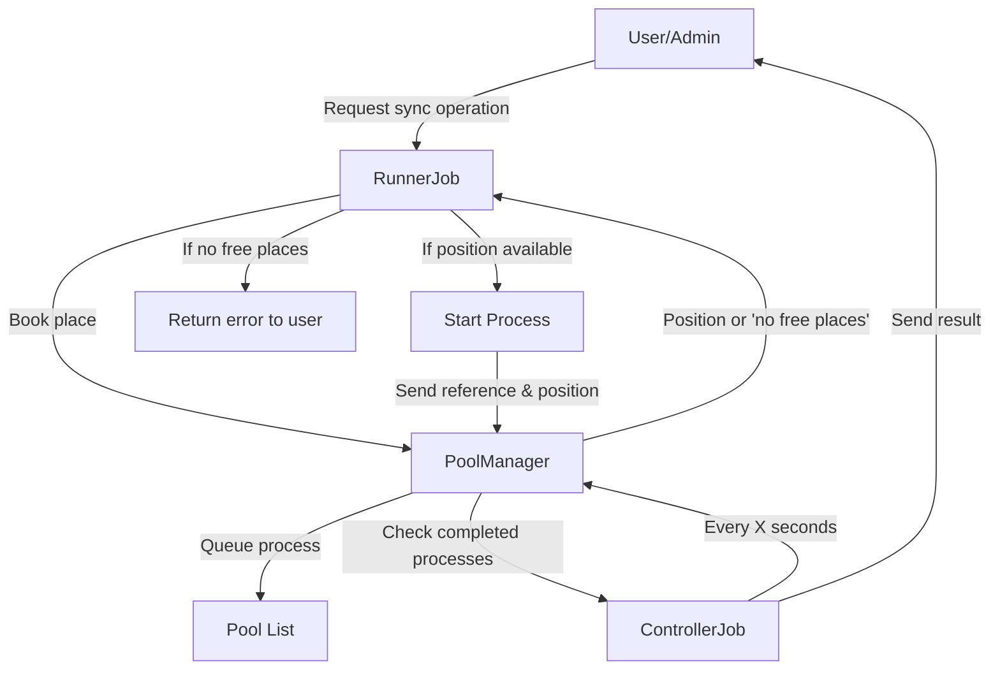

## Introduction

Most processes, scripts, or operations you can run using Symbolic are asynchronous, meaning that multiprocess/thread control is delegated to the Func framework. However, there are situations where you may need to run processes in synchronous mode: some admin procedures should run directly while waiting for the response (i.e., when you need to proceed or complete Symbolic configuration).

Following the standard "running channel" used to run async scripts can generate a bottleneck: the RunnerJob must wait for the end of the running process, making it impossible to run any other operation until the async one completes.

## The Pool Manager Solution

To solve this problem, Symbolic has a Pool Manager that is used and called from RunnerJob. It is more than a simple synchronized list of processes: you can decide how many concurrent synchronous processes you want, and it exposes methods to "book" your process execution, send the process, and check process status.

The following diagram illustrates how Symbolic manages synchronous operations:

## Workflow Steps

1. User or administrator attempts to run a sync operation
2. User calls reach the RunnerJob, which calls PoolManager to try to book a place for sync job execution
3. If there is a place to process the user request, PoolManager responds with the position assigned in the pool list. This is similar to booking a hotel room or a theater seat: you call, and if there is what you asked for, you receive a booking number; otherwise, you have to wait.
4. If JobRunner receives a useful position in the pool list, it starts the process requested by the user and then sends the reference to the running process and the provided position to PoolManager. If JobRunner receives a "no free places found" response, it returns an error message to the user.
5. The process is queued in the pool list and proceeds with execution
6. Every "X" seconds, another job, ControllerJob, calls PoolManager to check if any process has finished execution
7. If a completed process is found, ControllerJob sends a message to the user with the execution result

## Implementation Details

This kind of implementation is essentially an asynchronous call for the Symbolic engine because there is no internal process that waits for the execution to end. It is only a sync call for the user, who can do nothing more on the application until the process they ran completes.
