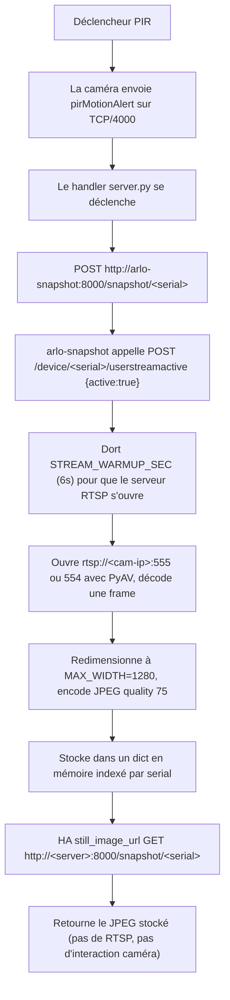

Ceci est le Post 2 d'une série de trois sur le remplacement de la station de base Arlo propriétaire par une stack auto-hébergée. Dans le [Post 1 de cette série](/fr/remplacer-la-station-de-base-arlo-par-un-routeur-netgear-orbi/) j'ai couvert la couche réseau — comment faire en sorte qu'un Netgear Orbi RBR760 se fasse passer pour la station de base Arlo suffisamment bien pour que les caméras se connectent, s'enregistrent et streament. Dans ce post, je couvre la couche *serveur* : la stack Docker qui tourne réellement sur le mini PC, le sidecar Flask personnalisé qui capture des snapshots déclenchés par le mouvement, le relais RTSP à la demande qui rend le streaming en direct économe en batterie, et les trois pull requests upstream que j'ai soumises pour corriger les bugs que j'ai rencontrés en chemin.

Le troisième et dernier post couvrira Home Assistant — capteurs REST, cartes picture-glance, armement/désarmement, webhooks de mouvement — une fois que le reste de la stack sera solide. Le dépôt compagnon sur [github.com/mmornati/arlo-base-station](https://github.com/mmornati/arlo-base-station) contient tous les fichiers de configuration mentionnés ici.

> **Une note sur la rédaction.** Tout au long de ce post, les vrais numéros de série des caméras, les adresses MAC, et l'IP LAN de production du serveur ont été remplacés par des placeholders de style `XXXXXXXXXXXX` et `192.168.1.X`. La valeur bien connue `172.14.1.1` de la passerelle Arlo est conservée car elle fait partie du protocole wire. Le sous-réseau invité `192.168.2.x` (où vivent les caméras sur l'Orbi) est laissé tel quel car c'est la valeur par défaut standard d'Orbi et ne révèle rien de spécifique.

## Pourquoi `arlo-cam-api` (et pas le cloud Arlo officiel)

Le cloud Arlo fonctionne. L'app Arlo fonctionne. L'abonnement Arlo débloque le CVR, les alertes intelligentes, les zones d'activité, et une UI mobile polie qui a pris des années à une vraie équipe produit. Il y a en fait très peu de problèmes à acheter un abonnement Arlo et s'arrêter là.

La raison pour laquelle j'ai fini par auto-héberger est un ensemble de contraintes beaucoup plus étroites :

- **Pas d'abonnement.** Les caméras sont des VMC4040P (Arlo Pro 3), elles continuent donc à fonctionner sans abonnement — mais le niveau gratuit est limité : les zones d'activité (restreindre la détection de mouvement à une partie du champ de vision) sont réservées à l'abonnement, donc quand vous armez une caméra, le mouvement est détecté sur tout le cadre. L'enregistrement est local uniquement (il faut une clé USB dans la station de base), et vous ne pouvez pas facilement vérifier ce qui s'est passé en votre absence. Et le jour où Arlo décidera de retirer le niveau gratuit, les caméras deviendront de coûteux presse-papiers. Le mode local-only supprime ce risque.
- **RTSP complet.** Le support RTSP d'Arlo est opt-in et par caméra. L'émulation locale vous donne une URL RTSP pour chaque caméra sans condition.
- **Pas de risque de désactivation à distance.** Arlo peut, au niveau du cloud, déprécier un modèle ou bloquer un numéro de série. Si vous avez déjà eu une imprimante qui se brique parce que HP a décidé qu'elle était obsolète, vous comprenez.
- **C'est, franchement, amusant.** Faire tourner votre propre émulateur de station de base sur un Raspberry Pi et regarder quatre caméras s'enregistrer dessus est un de ces projets qui vous rappelle pourquoi vous vous êtes lancé là-dedans à l'origine.

Le travail initial de rétro-ingénierie est [Meatballs1/arlo-cam-api](https://github.com/Meatballs1/arlo-cam-api). Il n'a pas été activement maintenu depuis un moment. Le fork activement maintenu est [brianschrameck/arlo-cam-api](https://github.com/brianschrameck/arlo-cam-api), qui publie une image Docker (`bschrameck/arlo-cam-api:latest`) que j'utilise comme base pour tout dans ce post. Tous les correctifs de production que je décris ci-dessous ont été soumis comme PRs à ce fork.

## La stack Docker `arlo-cam-api`

Tout le côté serveur vit dans trois conteneurs, plus quelques fichiers de configuration bind-mountés. Voici le `docker-compose.yaml` de production du dépôt compagnon :

```yaml
services:
  arlo-cam-api:
    image: bschrameck/arlo-cam-api:latest
    container_name: arlo-cam-api
    restart: unless-stopped
    ports:
      - "4000:4000"   # Protocole d'enregistrement des caméras (DNAT RBR760 -> ici)
      - "5000:5000"   # API REST (utilisée par Home Assistant)
    volumes:
      - arlo-recordings:/recordings
      - ./server.py:/opt/arlo-cam-api/server.py:ro
      - ./api/api.py:/opt/arlo-cam-api/api/api.py:ro
      - ./config.yaml:/opt/arlo-cam-api/config.yaml:ro
    environment:
      - HOST=0.0.0.0
      - PORT=4000
      - API_PORT=5000
      - RECORDINGS_PATH=/recordings

  arlo-snapshot:
    build: ./arlo-snapshot
    image: arlo-snapshot:local
    container_name: arlo-snapshot
    restart: unless-stopped
    depends_on:
      - arlo-cam-api
    ports:
      - "8000:8000"
    environment:
      - ARLO_API=http://arlo-cam-api:5000
      - USERSTREAM_TTL=60
      - STREAM_WARMUP_SEC=6
      - RTSP_RETRIES=3
      - RTSP_RETRY_DELAY=2
      - MAX_WIDTH=1280
      - JPEG_QUALITY=75

  mediamtx:
    image: bluenviron/mediamtx:latest
    container_name: mediamtx
    restart: unless-stopped
    ports:
      - "8554:8554"
    volumes:
      - ./mediamtx.yml:/mediamtx.yml:ro

volumes:
  arlo-recordings:
```

Trois services, trois jobs différents :

- **`arlo-cam-api`** — l'émulateur de station de base. Écoute sur `4000` (le protocole d'enregistrement que les caméras parlent) et sur `5000` (une petite API REST Flask que Home Assistant et le service snapshot consomment). C'est le seul conteneur auquel les caméras parlent.
- **`arlo-snapshot`** — le proxy d'image fixe à la demande. Écoute sur `8000`. C'est une minuscule app Flask dont le job est de prendre un JPEG du flux RTSP d'une caméra, le stocker en mémoire, et le retourner lors d'un `GET` ultérieur. Pas de polling, pas de TTL de cache.
- **`mediamtx`** — le relais RTSP à la demande. Écoute sur `8554`. Traduit `rtsp://192.168.1.X:8554/cam1` en `rtsp://192.168.2.x:554/live` pour Home Assistant. Ne se connecte à une caméra que lorsqu'un client regarde réellement.

Notez les lignes de bind-mount sur `arlo-cam-api` qui chargent `./server.py`, `./api/api.py`, et `./config.yaml` par-dessus les copies de l'image upstream — plus le module `device_db_patched.py` et le fichier de base de données `arlo.db`. La base sqlite `DeviceDB` vit *à l'intérieur* du conteneur par défaut et est effacée à chaque recréation du conteneur, ce qui réinitialise les enregistrements et retire toutes les caméras de `known_devices`. Le bind-mount de `arlo.db` fait survivre la liste des appareils aux redémarrages. C'est le workaround de correctif de production qui me permet de livrer les fixes des PRs #29, #30, et #31 sans forker l'image. J'y reviendrai dans la section « Correctifs de production » plus bas.

Côté réseau, les caméras sont sur le WiFi invité Orbi (`192.168.2.x`, isolé du LAN) et le serveur est sur le LAN (`192.168.1.x`). Le RBR760 fait du DNAT du trafic caméra-vers-serveur sur TCP/4000 à travers. MediaMTX vit sur le serveur parce que le serveur peut atteindre les *deux* réseaux ; HA sur `192.168.1.Y` ne peut pas atteindre les caméras directement.

## `arlo-snapshot` — Le proxy d'image fixe à la demande

Out of the box, `arlo-cam-api` expose `GET /snapshot/<serial>`, mais avec un caveat fatal : l'endpoint ne retourne 200 que si un snapshot a été *poussé* dessus par la caméra — et les caméras VMC4040P **ne poussent jamais**. Appeler l'URL `snapshot_request()` de la caméra via le protocole de la station de base retourne un ACK de la caméra, puis ferme la connexion proprement sans uploader un seul octet. Donc `SnapshotCount` reste à 0 pour toujours et Home Assistant affiche une carte caméra vide.

Le fix est de prendre le JPEG depuis le flux RTSP à la place. C'est exactement ce que fait `arlo-snapshot`.

### Le flux



Le split en deux endpoints est délibéré. `POST /snapshot/<serial>` fait le travail coûteux (réveiller la caméra, ouvrir un socket TCP vers son port RTSP, décoder une frame H.264). `GET /snapshot/<serial>` est un lookup de dict plus un Flask `Response`. HA peut marteler `GET` depuis une carte Lovelace sans jamais réveiller la caméra.

### Les bits intéressants

Variables d'environnement (toutes définies dans `docker-compose.yaml`) :

```python
ARLO_API          = os.environ.get("ARLO_API", "http://arlo-cam-api:5000")
SNAPSHOT_PORT     = int(os.environ.get("SNAPSHOT_PORT", "8000"))
RTSP_TIMEOUT_US   = int(os.environ.get("RTSP_TIMEOUT_US", "8000000"))  # 8s
DEVICE_CACHE_TTL  = int(os.environ.get("DEVICE_CACHE_TTL", "60"))      # cache la liste /device 60s
MAX_WIDTH         = int(os.environ.get("MAX_WIDTH", "1280"))
JPEG_QUALITY      = int(os.environ.get("JPEG_QUALITY", "75"))
USERSTREAM_TTL    = int(os.environ.get("USERSTREAM_TTL", "30"))        # réveiller toutes les 30s
STREAM_WARMUP_SEC = float(os.environ.get("STREAM_WARMUP_SEC", "6"))    # attente du port RTSP
RTSP_RETRIES      = int(os.environ.get("RTSP_RETRIES", "3"))
RTSP_RETRY_DELAY  = float(os.environ.get("RTSP_RETRY_DELAY", "2"))
```

Le helper `activate_stream` est ce qui appelle l'émulateur de station de base pour réveiller la caméra :

```python
def activate_stream(serial):
    try:
        r = requests.post(
            f"{ARLO_API}/device/{serial}/userstreamactive",
            json={"active": True},
            timeout=5,
        )
        return r.json().get("result", False)
    except Exception as e:
        log.error(f"Failed to activate stream for {serial}: {e}")
        return False
```

C'est pourquoi le fix « restore `userstreamactive` » du PR #31 compte : le `arlo-cam-api` stock accepte le POST mais le corps de son handler est commenté et il retourne toujours `{"result": true}` sans rien faire. Le port RTSP ne s'ouvre jamais, la capture de snapshot timeout, et le snapshot n'est jamais stocké. PR #31 fait que `userstreamactive` appelle réellement `device.set_user_stream_active(int(active))`. Sans cela, tout ce service ne fonctionne pas.

Le helper `grab_frame` est le seul morceau de code RTSP du projet :

```python
def grab_frame(ip):
    last_err = None
    for port in (555, 554):
        try:
            container = av.open(
                f"rtsp://{ip}:{port}/live",
                options={"rtsp_transport": "tcp", "stimeout": str(RTSP_TIMEOUT_US)},
            )
            for stream in container.streams:
                if stream.type != "video":
                    continue
                for frame in container.decode(stream):
                    container.close()
                    return frame.to_image()
            container.close()
        except Exception as e:
            last_err = e
            log.warning(f"[{ip}] RTSP :{port} failed: {e}")
            continue
    raise last_err or RuntimeError("no RTSP port worked")
```

Notez le fallback essaie-555-puis-554. Les anciens modèles Arlo exposent RTSP sur TCP/555. Le VMC4040P l'expose sur TCP/554. La doc communautaire se contredit sur lequel est lequel, donc le service essaie les deux avec un timeout de 8 secondes par port.

Le resizer `make_jpeg` plafonne l'image à `MAX_WIDTH=1280` (le flux RTSP natif du VMC4040P est en 2560x1440 — bien plus de pixels que ce dont Home Assistant a besoin pour une carte thumbnail de 200x150) et utilise `JPEG_QUALITY=75` qui est le sweet spot entre taille de fichier et netteté pour un thumbnail de caméra de sécurité.

Les routes Flask sont minuscules :

```python
@app.route("/snapshot/<serial>", methods=["POST"])
def trigger_snapshot(serial):
    ok, result = grab_and_store(serial)
    if not ok:
        return jsonify({"ok": False, "error": result}), 502
    return jsonify({"ok": True, "serial": serial, "bytes": len(result)})

@app.route("/snapshot/<serial>", methods=["GET"])
def get_snapshot(serial):
    with store_lock:
        data = store.get(serial)
    if data is None:
        abort(404, description=f"No snapshot available for {serial}")
    return Response(data["data"], mimetype="image/jpeg")
```

`POST` fait le travail ; `GET` sert la frame stockée. La contention de lock est un dict sous un seul `threading.Lock()` — tout le service est du Flask single-process avec `threaded=True`, donc vous n'avez besoin de rien de plus sophistiqué pour quatre caméras.

### Le Dockerfile

Douze lignes, sans fioritures :

```dockerfile
FROM python:3.12-slim

WORKDIR /app

COPY requirements.txt .
RUN pip install --no-cache-dir -r requirements.txt

COPY app.py .

EXPOSE 8000

CMD ["python", "app.py"]
```

`requirements.txt` :

```text
flask==3.0.3
av==18.0.0
pillow==12.3.0
requests==2.32.3
```

Voilà tout le sidecar. La taille totale de l'image sur disque est d'environ 200 Mo (PyAV embarque une libav). Le cold start est sous une seconde.

## MediaMTX — Relais RTSP à la demande

Les caméras sont sur `192.168.2.x` (réseau invité, isolé du LAN). Home Assistant est sur `192.168.1.Y` (LAN). HA ne peut pas atteindre les caméras directement. Le serveur est sur les deux et fait tourner MediaMTX comme relais RTSP à la demande : quand HA ouvre `rtsp://192.168.1.X:8554/cam1`, MediaMTX ouvre `rtsp://192.168.2.x:554/live` en amont. Quand HA ferme la connexion, MediaMTX ferme l'amont après une grâce de 1 seconde.

C'est la pièce la plus importante pour la durée de batterie. Avec du relais à la demande, le flux RTSP ne tourne que quand quelqu'un regarde réellement la caméra.

### `mediamtx.yml`

```yaml
logLevel: info
api: yes
apiAddress: 0.0.0.0:9997

rtspAddress: :8554
rtspTransports: [tcp]

paths:
  cam1:
    source: rtsp://192.168.2.3:554/live
    sourceOnDemand: yes
    sourceOnDemandStartTimeout: 30s
    sourceOnDemandCloseAfter: 1s
    maxReaders: 5

  cam2:
    source: rtsp://192.168.2.2:554/live
    sourceOnDemand: yes
    sourceOnDemandStartTimeout: 30s
    sourceOnDemandCloseAfter: 1s
    maxReaders: 5

  cam3:
    source: rtsp://192.168.2.103:554/live
    sourceOnDemand: yes
    sourceOnDemandStartTimeout: 30s
    sourceOnDemandCloseAfter: 1s
    maxReaders: 5

  cam4:
    source: rtsp://192.168.2.4:554/live
    sourceOnDemand: yes
    sourceOnDemandStartTimeout: 30s
    sourceOnDemandCloseAfter: 1s
    maxReaders: 5
```

Quelques choix qui méritent explication :

- **`rtspTransports: [tcp]`** — UDP n'est pas fiable en WiFi, surtout sur des réseaux invités 2.4 GHz derrière un mesh. TCP échange un tout petit peu de latence contre l'absence de jitter buffering constant. Les caméras de sécurité ne sont pas des jeux twitch.
- **`sourceOnDemand: yes`** — le port RTSP de la caméra ne s'ouvre que quand un client se connecte. Après `sourceOnDemandCloseAfter: 1s` sans client, MediaMTX ferme l'amont et la caméra se rendort.
- **`sourceOnDemandStartTimeout: 30s`** — donne à la caméra jusqu'à 30 secondes pour se réveiller et ouvrir son port RTSP. Le VMC4040P prend 10-14 secondes pour monter après un appel `userstreamactive`, plus il y a le coût de rétablissement du WiFi depuis le deep sleep, donc 30s est le bon plafond.
- **`maxReaders: 5`** — Home Assistant ouvre plusieurs connexions RTSP par caméra (preview + flux principal + détecteur Frigate si vous l'utilisez). La valeur par défaut de MediaMTX est 2, trop basse et vous obtenez des erreurs `maximum reader count reached`. Cinq est confortable pour HA + un ou deux viewers externes.

Ne configurez **pas** de hooks `runOnInit` ou `runOnDemand`. L'image `bluenviron/mediamtx` est basée sur scratch, sans shell, sans `curl`, sans `wget`. Les hooks sont documentés comme exécutables mais en pratique ils ne peuvent rien exécuter sur cette image. Le réveil de la caméra est entièrement géré par `arlo-snapshot` via son POST `userstreamactive`.

## Les trois PRs upstream

C'est la pièce maîtresse de ce post. Après avoir déployé `arlo-cam-api` contre les vraies caméras, trois bugs distincts sont apparus en moins d'une semaine. Les trois sont maintenant des pull requests upstream contre [brianschrameck/arlo-cam-api](https://github.com/brianschrameck/arlo-cam-api) :

> Si vous voulez simplement une copie fonctionnelle avec les trois correctifs appliqués, le code complet corrigé est dans mon fork [github.com/mmornati/arlo-cam-api](https://github.com/mmornati/arlo-cam-api) — construisez votre image à partir de ce dépôt au lieu d'assembler les correctifs à la main. Le fork porte aussi la configuration de production qui fait l'objet du reste de cette série — surtout `DefaultPIRTargetState`, l'interrupteur qui fixe la *politique de réponse* d'une caméra quand son PIR détecte un mouvement (armée = se réveiller et diffuser environ 10 secondes de vidéo ; désarmée = ignorer l'événement). L'élément PIR lui-même est un détecteur IR passif, allumé en permanence dans les deux états — il est donc bien plus que les trois PRs upstream.

- [PR #29](https://github.com/brianschrameck/arlo-cam-api/pull/29) — `fix(api): do not evaluate app.run eagerly when constructing Flask thread`
- [PR #30](https://github.com/brianschrameck/arlo-cam-api/pull/30) — `feat(server): add periodic keepalive beacon to prevent camera WiFi drops`
- [PR #31](https://github.com/brianschrameck/arlo-cam-api/pull/31) — `feat: auto-register cameras on status, restore userstreamactive, snapshot-on-motion`

Les patches pour les trois sont aussi dans le dépôt compagnon sous `server/patches/` :
- [pr-29-api-thread-fix.patch](https://github.com/mmornati/arlo-base-station/blob/main/server/patches/pr-29-api-thread-fix.patch)
- [pr-30-beacon-keepalive.patch](https://github.com/mmornati/arlo-base-station/blob/main/server/patches/pr-30-beacon-keepalive.patch)
- [pr-31-auto-register-snapshot.patch](https://github.com/mmornati/arlo-base-station/blob/main/server/patches/pr-31-auto-register-snapshot.patch)

Traitez-les dans l'ordre. PR #29 est un prérequis pour #30. PR #31 est indépendant mais résout trois problèmes que vous allez quasi certainement rencontrer dès le premier jour.

### PR #29 : Ne pas évaluer `app.run` eagerly dans `Thread(target=…)`

#### Problème

`api.api.get_thread()` retournait :

```python
return threading.Thread(target=app.run(host='0.0.0.0'))
```

En Python, l'argument `target=` est évalué avant d'être passé à `Thread`. Donc `app.run(host='0.0.0.0')` s'exécute sur le **thread appelant** (le thread principal de `server.py`) — le werkzeug de Flask démarre, se lie au port 5000, et bloque dans sa boucle `select()`. Tout ce qui suit l'appel à `get_thread()` est inaccessible, y compris tout futur `flask_thread.start()` ou `beacon_thread.start()`.

Pourquoi cela n'a-t-il cassé pour personne jusqu'ici ? Parce que rien dans le bloc principal existant ne démarre un deuxième thread après `flask_thread = api.api.get_thread()`. Le bug était *latent* — présent dans le code, inoffensif en pratique, et le serait resté pour toujours sans PR #30, qui ajoute un deuxième thread.

#### Fix

Une ligne :

```diff
--- a/api/api.py
+++ b/api/api.py
@@ -224,4 +224,4 @@ def register_set(serial, req_body, device: Device):
-    return threading.Thread(target=app.run(host='0.0.0.0'))
+    return threading.Thread(target=app.run, kwargs={'host': '0.0.0.0'})
```

Passez `app.run` lui-même (un callable) plus `kwargs={'host': '0.0.0.0'}`. Le thread ne démarre le serveur que quand `.start()` est appelé.

#### Preuve en production

J'ai rencontré ça immédiatement après avoir rebasé PR #30 sur le `arlo-cam-api` stock. Le conteneur montait, le port 5000 était joignable, et le bloc principal se bloquait avant d'atteindre `beacon_thread.start()`. Avec le fix, le bloc principal passe proprement, Flask tourne sur son propre thread, le thread beacon démarre sur un troisième thread, et vous pouvez vérifier avec `docker exec arlo-cam-api ps -eLf` que vous avez trois threads Python actifs (main, Flask, beacon) plus un thread par connexion caméra active.

Le diff d'une ligne est trompeur — sans lui, vous ne pouvez empiler aucun nouveau thread aux côtés de Flask, ce qui est exactement le changement structurel que PR #30 introduit.

### PR #30 : `BeaconThread` périodique pour éviter les drops WiFi des caméras

#### Problème

Les caméras Arlo comptent le nombre de beacons qu'elles ont ratés de la station de base. Le seuil est la valeur `MaxMissedBeaconTime` envoyée dans la réponse `registerSet` initiale (par défaut 30). Quand le compte dépasse le seuil, la caméra suppose que la station de base a disparu et se déconnecte complètement du WiFi — hibernation complète. La caméra reste alors en hibernation jusqu'à ce que son propre cycle de firmware décide de réessayer, ce qui peut prendre des heures ou des jours.

`arlo-cam-api` n'envoie rien de périodique. Après le handshake initial, la connexion devient silencieuse côté station de base jusqu'à ce que la caméra envoie quelque chose (une mise à jour de statut, une alerte de mouvement) ou que la station de base essaie de pousser quelque chose. Pendant les longues périodes d'inactivité de la caméra, rien ne circule.

Le symptôme visible côté utilisateur :

> *Les caméras fonctionnent bien pendant 1 à 2 heures après un réveil manuel. Puis elles se déconnectent du WiFi. La seule chose qui les ramène est le cycle de reconnexion du firmware de la caméra lui-même, qui est imprévisible — parfois 30 minutes, parfois le lendemain matin.*

C'est un bug vraiment pénible à débugger parce que les caméras *semblent* fonctionner, l'émulateur de station de base n'a aucune erreur dans ses logs, et il n'y a aucun événement d'un côté ou de l'autre pour indiquer ce qui s'est passé. Vous remarquez juste à un moment que `curl http://192.168.1.X:5000/device` retourne trois caméras au lieu de quatre.

#### Fix

Un nouveau `BeaconThread` qui, toutes les `BeaconIntervalSeconds` (par défaut 60s), envoie une `statusRequest` légère à chaque caméra vue via le trafic entrant. La `statusRequest` retourne un ACK + une réponse de statut, ce qui sert également de sonde de liveness.

`config.yaml` :

```yaml
# Intervalle (secondes) entre les beacons statusRequest de keepalive envoyés à
# chaque caméra connue. Imite le beacon de la station de base Arlo pour que
# les caméras ne supposent pas que la station de base a disparu
# (MaxMissedBeaconTime) et lâchent le WiFi.
BeaconIntervalSeconds: 60
```

`server.py` — la nouvelle classe de thread :

```python
class BeaconThread(threading.Thread):
    """Envoie périodiquement une statusRequest de keepalive à chaque caméra connue.

    Les caméras Arlo ne tolèrent qu'un nombre limité de beacons ratés de la
    station de base (MaxMissedBeaconTime dans le registerSet initial) avant
    de supposer que la station de base a disparu et de lâcher le WiFi
    (hibernation).
    """

    def __init__(self):
        threading.Thread.__init__(self)
        self.daemon = True

    def run(self):
        s_print(f'[beacon] Started (interval={BEACON_INTERVAL_SECONDS}s)')
        while True:
            time.sleep(BEACON_INTERVAL_SECONDS)
            with devices_lock:
                devices = list(known_devices.values())
            for device in devices:
                try:
                    if device.status_request():
                        s_print(f'[beacon] {device.serial_number} OK')
                    else:
                        s_print(f'[beacon] {device.serial_number} no response (offline)')
                except Exception as e:
                    s_print(f'[beacon] {device.serial_number} error: {e}')
```

Plus un dict `known_devices` peuplé depuis les handlers entrants `registerSet` et `status`, et une garde dans le handler de statut pour qu'un serial inconnu ne crash plus le `ConnectionThread` avec `AttributeError` sur `device.ip = ...`.

Il y a une autre source pour `known_devices`, et elle compte plus qu'elle n'en a l'air. Après un redémarrage du conteneur, le dict est vide jusqu'à ce que chaque caméra envoie un message entrant — ce qu'une caméra endormie ne fera pas avant des heures. La boucle de beacon ne sonde donc *rien* pendant cette fenêtre, les caméras continuent de tomber du WiFi, et on revient à la case départ. Le fork initialise `known_devices` au démarrage depuis la `DeviceDB` persistée via une nouvelle méthode `DeviceDB.get_all_devices()`, en sautant les lignes avec `ip = 'UNKNOWN'` (appareils persistés à l'enregistrement avant que leur adresse réelle soit connue). Le beacon peut alors reprendre la sonde de chaque caméra connue immédiatement après un redémarrage, sans attendre le trafic entrant.

La garde mérite d'être signalée séparément parce que c'est le genre de bug qui ne se manifeste que sous des conditions de course spécifiques :

```python
elif (msg['Type'] == "status"):
    s_print(f"<[{self.ip}][{msg['ID']}] Status from {msg['SystemSerialNumber']}")
    device = DeviceDB.from_db_serial(msg['SystemSerialNumber'])
    if device is None:
        s_print(f"<[{self.ip}][{msg['ID']}] Status from unknown device {msg['SystemSerialNumber']}, ignoring")
        self.connection.close()
        break
    device.ip = self.ip
    ...
```

Avant cette garde, un message de statut d'un serial inconnu crashait tout le `ConnectionThread` avec `AttributeError: 'NoneType' object has no attribute 'ip'`. Après un redémarrage du conteneur, quand les caméras se reconnectent sur un socket TCP survivant, elles envoient parfois un `status` avant un `registerSet` frais. Le crash tuait le thread, la connexion n'était jamais récupérée, et la caméra restait enregistrée dans `DeviceDB` mais inatteignable sur le fil. Vous ne le remarquiez que quand `curl /device` montrait la caméra et `curl /device/<serial>` retournait vide.

#### Preuve en production

Avant le patch, mes quatre caméras VMC4040P lâchaient le WiFi toutes les 1-2 heures. Après le patch :

```
[beacon] Started (interval=60s)
[beacon] XXXXXXXXXXXX OK
[beacon] XXXXXXXXXXXX OK
[beacon] XXXXXXXXXXXX OK
[beacon] XXXXXXXXXXXX OK
```

`CameraOnline` s'incrémente régulièrement. `CameraOffline` ne bouge pas. J'ai laissé les caméras tourner pendant une semaine d'affilée et elles ne se sont pas déconnectées une seule fois.

La valeur par défaut de 60 secondes est un bon point de départ, mais elle n'est **pas gratuite**. Un `statusRequest` TCP n'est pas la même chose qu'un vrai beacon WiFi de station de base : la vraie station de base Arlo garde le CPU de la caméra endormi en power-save 802.11 PS-Poll, alors que notre beacon force un réveil complet du CPU plus un traitement JSON sur chaque caméra, à chaque tick — 60 fois par heure. Ce qui m'a surpris, c'est que le coût en batterie **n'est pas** une fonction de l'intervalle du beacon. Je l'ai mesuré en production : avec un beacon à 60 s et les caméras *désarmées*, la consommation était de **~2 %/h** ; avec un beacon à 100 s et les caméras *armées mais sans mouvement dans le champ de vision*, elle était de **0 %** ; et avec un beacon à 100 s et les caméras *armées avec du mouvement actif*, elle atteignait **~5,8 %/h** (Jardin 1, 30 événements de mouvement en moins de 3 heures). Autrement dit, la consommation suit la **fréquence des mouvements dans le champ de vision de chaque caméra** — chaque événement PIR réveille la caméra et diffuse environ 10 secondes de vidéo — et non l'intervalle du beacon. L'intervalle compte pour une seule chose : la **joignabilité**. En le montant à 200 s, les caméras sont entrées en deep sleep (radio éteinte, port 4000 fermé) et seuls un cycle firmware ou un appui physique sur le bouton de synchro les ont réveillées. `BeaconIntervalSeconds` est donc un cadran de joignabilité, pas un cadran de batterie : gardez-le à 60–100 s et ne le poussez jamais à 200 s. La méthodologie complète et les tableaux de mesure sont dans le chapitre sur l'autonomie du [Post 3](/fr/integrer-arlo-auto-heberge-avec-home-assistant/#autonomie-mesurée--les-vrais-chiffres).

### PR #31 : Auto-register sur statut, restore `userstreamactive`, SnapshotOnMotion

Trois petites fonctionnalités regroupées parce qu'elles touchent toutes la même zone du code (le handler de messages entrants et quelques endpoints REST). Chacune est indépendante ; elles avaient juste du sens dans une seule PR.

#### 6.3.1 — Auto-register sur statut

La même condition de course que la garde du handler de statut du PR #30, mais dans une direction différente : les caméras VMC4040P *parfois* envoient un message de statut avant d'envoyer un `registerSet` complet. Le handler stock appelait `DeviceDB.from_db_serial(msg['SystemSerialNumber'])`, qui retournait `None`, puis essayait `device.ip = self.ip` et crashait.

PR #31 ajoute un chemin d'auto-register : si le device n'est pas dans `DeviceDB`, créer une nouvelle instance `Camera` sur le coup, défaut `SystemModelNumber` à `'VMC4040P'` (le cas le plus courant) quand le message de statut ne l'a pas, et continuer avec le flux original persist + notify :

```python
if device is None:
    from arlo.camera import Camera
    cam_msg = dict(msg.dictionary)
    if 'SystemModelNumber' not in cam_msg:
        cam_msg['SystemModelNumber'] = 'VMC4040P'
    device = Camera(self.ip, Message(cam_msg))
    device.status = {}
    device.friendly_name = msg['SystemSerialNumber']
    s_print(f"<[{self.ip}][{msg['ID']}] Auto-registered {device.serial_number} on status (forced Camera)")
device.ip = self.ip
device.status = msg
DeviceDB.persist(device)
```

Le résultat : les caméras qui se réveillent du deep sleep et envoient immédiatement un message de statut (ce que font les VMC4040P) s'enregistrent maintenant proprement et finissent dans `known_devices` pour que la boucle de beacon les voie au cycle suivant. Auparavant elles crashaient le thread et disparaissaient de la station de base jusqu'à un reboot manuel.

#### 6.3.2 — Restore `POST /device/{serial}/userstreamactive`

Le corps de l'endpoint stock :

```python
@app.route('/device/<serial>/userstreamactive', methods=['POST'])
def userstream_active(serial, req_body, device: Device):
    # active = req_body["active"]
    # if active is None:
    #     flask.abort(400)
    #
    # result = device.set_user_stream_active(int(active))
    return flask.jsonify({"result": True})
```

Tout commenté. Retourne toujours `{"result": true}`. Le port RTSP de la caméra ne s'ouvre jamais.

Le fix :

```python
@app.route('/device/<serial>/userstreamactive', methods=['POST'])
def userstream_active(serial, req_body, device: Device):
    active = req_body.get("active")
    if active is None:
        flask.abort(400)
    result = device.set_user_stream_active(int(active))
    return flask.jsonify({"result": result})
```

C'est le fix qui fait fonctionner tout le service `arlo-snapshot`. Sans lui, l'appel `activate_stream()` du sidecar retourne `true` (un mensonge), le serveur RTSP de la caméra reste fermé, la capture de snapshot timeout 8 secondes plus tard, et Home Assistant affiche une carte caméra vide à chaque événement de mouvement. Avec lui, la caméra ouvre réellement son port RTSP en ~10 secondes, le sidecar capture une frame, et Home Assistant voit un thumbnail frais.

#### 6.3.3 — Nouvelle option de config `SnapshotOnMotion`

L'idée originale était de donner à `arlo-cam-api` un moyen de pousser des snapshots déclenchés par le mouvement out of the box, sans nécessiter que l'opérateur câble le sidecar `arlo-snapshot`. PR #31 ajoute un flag de config :

```yaml
# Quand true, les alertes de mouvement PIR POST vers le sidecar arlo-snapshot
# pour déclencher une capture d'une frame. Économe en batterie : pas de polling,
# pas de RTSP continu.
# Désactivé par défaut pour les déploiements sans le service sidecar.
SnapshotOnMotion: false
```

Quand activé, le handler `pirMotionAlert` dans `ConnectionThread.run()` POST vers le sidecar :

```python
if alert_type == "pirMotionAlert":
    if NOTIFY_ON_MOTION_ALERT:
        # ... fanout webhook existant
    if SNAPSHOT_ON_MOTION:
        import requests
        try:
            snap_url = f"http://arlo-snapshot:8000/snapshot/{device.serial_number}"
            requests.post(snap_url, timeout=35)
            s_print(f"<[{self.ip}][{msg['ID']}] Triggered snapshot for {device.serial_number}")
        except Exception as e:
            s_print(f"<[{self.ip}][{msg['ID']}] Snapshot trigger failed: {e}")
```

La valeur par défaut est `false` pour que les déploiements sans `arlo-snapshot` qui tourne ne soient pas affectés. Sur mon déploiement de production c'est `true`, et les déclencheurs PIR résultent en un JPEG `<serial>` frais qui arrive dans le store en mémoire d'`arlo-snapshot` en ~10 secondes.

Économe en batterie est la propriété clé. L'alternative — Home Assistant qui poll le RTSP toutes les quelques secondes pour garder l'image fixe fraîche — viderait les caméras en quelques jours. `SnapshotOnMotion` est push-based : la caméra se réveille sur le mouvement, tire l'alerte, la station de base déclenche la capture de snapshot, la caméra se rendort. Tout le pipeline utilise zéro bande passante RTSP sauf pour la capture d'une seule frame.

## Correctifs de production : livrer les fixes avant qu'ils ne mergeent

J'ai déployé cette stack en production début août 2026. Aucune des trois PRs n'est mergée upstream au moment où j'écris ces lignes. J'avais besoin des fixes *maintenant*, pas quand upstream aura le temps de les reviewer.

Le workaround c'est le bind-mount. Le conteneur `arlo-cam-api` expose `/opt/arlo-cam-api/` avec les fichiers source. Quelques lignes dans `docker-compose.yaml` superposent mes copies patchées par-dessus l'image upstream — y compris le module `device_db.py` et le fichier de base de données `arlo.db`, pour que la liste des appareils survive aux recréations du conteneur :

```yaml
volumes:
  - arlo-recordings:/recordings
  - ./server.py:/opt/arlo-cam-api/server.py:ro
  - ./api/api.py:/opt/arlo-cam-api/api/api.py:ro
  - ./config.yaml:/opt/arlo-cam-api/config.yaml:ro
  - ./device_db_patched.py:/opt/arlo-cam-api/arlo/device_db.py:ro
  - ./arlo.db:/opt/arlo-cam-api/arlo.db
```

Le dépôt compagnon sur [github.com/mmornati/arlo-base-station](https://github.com/mmornati/arlo-base-station) a les copies de production sous `server/server.py`, `server/api/api.py`, et `server/config.yaml`, plus les fichiers de diff standalone sous `server/patches/` :

```
server/
  patches/
    pr-29-api-thread-fix.patch
    pr-30-beacon-keepalive.patch
    pr-31-auto-register-snapshot.patch
  api/
    api.py            # patché (PRs #29 + #31)
  server.py           # patché (PRs #30 + #31)
  config.yaml         # patché (BeaconIntervalSeconds, SnapshotOnMotion, DefaultPIRTargetState, suppression de webhook)
  mediamtx.yml
  arlo-snapshot/
    Dockerfile
    app.py
    requirements.txt
```

Une fois que les trois PRs sont mergées upstream, les bind mounts disparaissent et `bschrameck/arlo-cam-api:latest` fonctionne tel quel. En attendant, les bind mounts sont le déploiement.

Les fichiers `.patch` sont de vraies sorties `git format-patch` contre le HEAD upstream `brianschrameck/arlo-cam-api` au moment où j'ai commencé le travail. Pour les régénérer :

```bash
git clone https://github.com/brianschrameck/arlo-cam-api.git
cd arlo-cam-api
git checkout <commit-au-moment-de-la-PR>
git am /chemin/vers/server/patches/pr-*.patch
```

Pour les appliquer aux copies standalone dans `server/server.py` et `server/api/api.py` :

```bash
cd server
for p in patches/pr-*.patch; do patch -p1 < "$p"; done
```

## Diagnostics & référence des champs

Une fois la stack en place, chaque caméra expose un document de statut riche sur `GET /device/<serial>` sur le port 5000. Les noms de champs ne sont *pas* ce que vous devineriez — ils viennent directement du protocole wire Arlo, avec la casse camel case d'origine préservée. Voici la table de champs canonique que je garde épinglée à côté de mon éditeur de template Home Assistant :

| Champ | Signification |
|---|---|
| `BatPercent` | Pourcentage de batterie (0–100) |
| `Bat1Volt` | Tension batterie (V) |
| `ChargingState` | `"Off"` / `"On"` / `"Critical"` / `"Full"` |
| `ChargingMode` | `"Charging"` / `"NotCharging"` |
| `SignalStrengthIndicator` | Barres WiFi (0–5) |
| `WifiRSSI` | RSSI WiFi (dBm, négatif ; ex. `-46`) |
| `Temperature` | Température caméra (°C) |
| `ActiveState` | `"Active"` / `"Idle"` / `"Offline"` |
| `PIRTargetState` | `"Armed"` / `"Disarmed"` / `"NotSupported"` |
| `PIRLEDState` | `{ "enabled": bool, "sensitivity": 0–4 }` |
| `Uptime` | Secondes depuis le dernier enregistrement |
| `PIREvents` | Total événements PIR vus |
| `PIRTriggers` | Déclencheurs PIR qui ont réveillé la caméra |
| `MotionStreamed` | Streams RTSP déclenchés par mouvement |
| `UserStreamed` | Streams RTSP demandés par l'utilisateur |
| `Streamed` | Total streams RTSP |
| `FailedStreams` | Tentatives de stream RTSP échouées |
| `CameraOnline` | Temps total en ligne (s) |
| `CameraOffline` | Temps total hors ligne (s) |
| `IRLEDsOn` | Temps où les LEDs IR étaient allumées (s) |
| `SpotlightEnabled` | État du projecteur (`true` / `false`) |
| `WifiConnectionCount` | Reconnexions WiFi |
| `WifiChannel` | Canal 2.4 GHz actuel |
| `SystemFirmwareVersion` | Version firmware caméra (string) |
| `HardwareRevision` | Chaîne de révision hardware (ex. `"VMC4040P-XXXXX"`) |
| `PoweredOn` | Temps allumée (s) |
| `CriticalBatStatus` | `0` = OK, `>0` = critique |
| `ChargerTech` | `"None"` / `"Solar"` / `"AC"` |
| `BatTech` | `"Rechargeable"` / `"NonRechargeable"` |
| `SMState` | État de la machine à états (interne au vendeur) |
| `PirMode` | Mode PIR |
| `PirLedMode` | Mode LED PIR |

Quelques-uns ne sont pas évidents :

- `BatPercent` (pas `battery_level`), `SignalStrengthIndicator` (pas `signal_strength`), `WifiRSSI` est en dBm. La casse est significative — l'API les retourne tels quels.
- `CameraOnline` et `CameraOffline` sont des totaux courants en secondes, *pas* des booléens d'état actuel. Pour obtenir l'état actuel en ligne/hors ligne, utilisez `ActiveState`.
- `Streamed` = `MotionStreamed` + `UserStreamed`. `FailedStreams` est le compte des appels `userstreamactive` qui n'ont pas résulté en une session RTSP — utile pour diagnostiquer les échecs d'`arlo-snapshot`.
- `HardwareRevision` pour VMC4040P ressemble à `"VMC4040P-XXXXX"` où `XXXXX` est un suffixe par unité ; ce n'est *pas* un numéro de série redacté.

Pour de l'inspection ad-hoc, le dépôt `arlo-snapshot` livre un helper `status.py` qui imprime les champs canoniques pour chaque caméra :

```python
import sys
import json
import urllib.request

for serial, ip in [("SERIAL_1", "192.168.2.x"), ("SERIAL_2", "192.168.2.x")]:
    print(f"=== {serial} @ {ip} ===")
    try:
        with urllib.request.urlopen(f"http://localhost:5000/device/{serial}", timeout=3) as r:
            d = json.loads(r.read())
            if not d:
                print("  (no status data)")
                continue
            keys = ["BatPercent", "Bat1Volt", "ChargingState", "ChargingMode",
                    "SignalStrengthIndicator", "WifiRSSI", "Temperature",
                    "PirMode", "PirLedMode", "SystemFirmwareVersion",
                    "HardwareRevision", "WifiChannel", "SMState"]
            for k in keys:
                if k in d:
                    v = d[k]
                    print(f"  {k}: {v}")
    except Exception as e:
        print(f"  ERROR: {e}")
    print()
```

Je lance ça une fois par semaine pour spot-check la santé batterie et WiFi. Si `BatPercent` commence à chuter sur une caméra qui devrait être stable, je sais que le panneau solaire défaille ou que la caméra se réveille trop souvent. Si `WifiRSSI` saute de `-46` à `-78`, je sais que le mesh Orbi est mécontent.

## Ce que je construirais ensuite

Quelques aspérités restent que j'aimerais traiter mais pour lesquelles je n'ai pas eu le temps :

- **`userstreamactive` ne persiste pas entre les redémarrages de la station de base.** Quand `arlo-cam-api` redémarre, l'état en mémoire de quelles caméras avaient un user stream actif est perdu. Les caméras récupèrent toutes seules (elles détectent la déconnexion TCP et se réenregistrent), mais le premier appel `userstreamactive` après un redémarrage est plus lent parce que le serveur RTSP doit repartir de zéro.
- **Pas de proxy de thumbnail intégré pour les enregistrements.** Les enregistrements sont sauvés dans `/recordings` comme segments vidéo bruts ; il n'y a pas d'API pour fetcher un thumbnail à `t=10s` pour un enregistrement donné. Pour l'instant je prends juste un snapshot frais via `arlo-snapshot` quand je veux une image fixe.
- **Pas de configuration de zone de mouvement via API.** Les zones d'activité sont une feature cloud-only sur le firmware Arlo officiel. Les configurer nécessite l'app Arlo, ce qui défait le but de l'auto-hébergement. Une implémentation custom de station de base pourrait en principe pousser des définitions de zones vers la caméra, mais le protocole n'est pas documenté.
- **Pas de support POST `device.snapshot_request()` sur VMC4040P.** C'est une limitation firmware — la caméra accepte la commande et ACK mais n'uploade jamais. PR #31 le contourne via le grab du sidecar. Une PR future pourrait exposer un endpoint `/camera/<serial>/snapshot` sur `arlo-cam-api` qui enveloppe le sidecar et retourne le JPEG de façon synchrone, simplifiant l'intégration.

Aucun de ceux-ci n'est bloquant. Ce sont des nice-to-haves sur lesquels je reviendrai quand j'y reviendrai.

## Et ensuite

Ce post a couvert la couche serveur : la stack Docker, le sidecar snapshot personnalisé, le relais RTSP à la demande, et les trois correctifs upstream. Le prochain — et dernier — post de la série couvre le côté Home Assistant : capteurs REST pour batterie et signal, cartes picture-glance pour le dashboard, contrôles d'armement/désarmement, webhooks de mouvement, et le layout Lovelace. Ce sera dans le [Post 3 de cette série](/fr/integrer-arlo-auto-heberge-avec-home-assistant/).

Pour le côté réseau, voir le [Post 1 de cette série](/fr/remplacer-la-station-de-base-arlo-par-un-routeur-netgear-orbi/).

Le dépôt compagnon est [github.com/mmornati/arlo-base-station](https://github.com/mmornati/arlo-base-station). Les PRs upstream sont [PR #29](https://github.com/brianschrameck/arlo-cam-api/pull/29), [PR #30](https://github.com/brianschrameck/arlo-cam-api/pull/30), et [PR #31](https://github.com/brianschrameck/arlo-cam-api/pull/31).