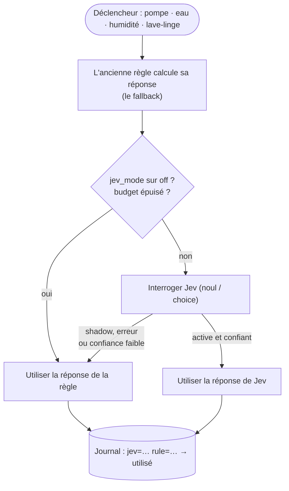

Toutes les installations Home Assistant que je connais finissent avec le même genre d'automatisation : *« si la valeur dépasse X pendant Y minutes, envoie une notification »*. Ça marche, jusqu'au jour où ça ne marche plus. La pompe de relevage tourne deux minutes après une nuit d'orage : alerte. Quelqu'un prend une longue douche : alerte « fuite possible ». Le lave-linge fait une pause de trempage : notification « cycle terminé », vingt minutes trop tôt. Au bout d'un moment, on ne lit plus les notifications, ce qui est la pire chose qui puisse arriver à une alerte.

Le problème, ce n'est pas le seuil. Le problème, c'est que la règle n'a aucune idée du **contexte** : il est tombé 14 mm de pluie cette nuit, il est 7 h un jour de semaine, la machine n'a consommé que 0,3 kWh jusqu'ici. Un humain regarderait ces faits et dirait « c'est normal ». Un seuil, non.

Dans mon [article précédent](/fr/system-one-router-choisir-le-bon-llm-pour-chaque-prompt/), j'ai utilisé **Jev**, un modèle de décision « System One », pour router des prompts entre différents LLM. En le construisant, une idée ne me quittait pas : *c'est exactement la question que ma maison se pose toute la journée*. J'ai donc passé une soirée avec Claude Code sur ma configuration Home Assistant, et j'ai confié les décisions délicates à Jev. Voici ce qui en est sorti.

## Jev en deux minutes

[Jev](https://typesafe.ai/blog/introducing-system-one-models-and-jev) est un modèle de **TypeSafe** qui n'écrit pas de texte. On lui donne un *state* (quelques lignes qui décrivent la situation) et une question *typée*, et il répond avec une probabilité :

*   **`noul`** : oui ou non, avec la probabilité du « oui » ;
*   **`choice`** : une option parmi N que l'on décrit, avec toute la distribution ;
*   **`score`** : un niveau sur une échelle dont on décrit chaque niveau.

La version actuelle est la 1.13. Elle est disponible directement chez TypeSafe ou [via OpenRouter](https://openrouter.ai/typesafe/jev-1.13) à **0,042 $ par million de tokens en entrée, sortie gratuite**, avec une fenêtre de 32k tokens. Le [guide OpenRouter](https://openrouter.ai/docs/guides/community/jev) et la [documentation TypeSafe](https://docs.typesafe.ai) (il y a même une [démo maison connectée](https://docs.typesafe.ai/demos/smart-home)) sont les références officielles.

Pourquoi c'est important pour une maison : dans le [benchmark du routeur](/fr/system-one-router-choisir-le-bon-llm-pour-chaque-prompt/), Jev était confiant sur 82 % de ses réponses, et 95 % d'entre elles étaient justes. **La confiance est réelle.** C'est cette propriété qui permet de le mettre sans risque dans une automatisation : quand il n'est pas sûr, il le dit, et on peut se rabattre sur autre chose.

## Quelle intégration Home Assistant ?

Jev n'a que quelques semaines et l'écosystème bouge tous les jours, j'ai donc regardé tout ce qui existe aujourd'hui (fin septembre 2026). En résumé : **tout est communautaire, rien n'est officiel, et rien n'est encore dans la liste par défaut de HACS.** L'installation passe par un dépôt personnalisé HACS.

| Projet | Ce qu'on obtient | Remarques |
| --- | --- | --- |
| [**AboveColin/HA-Jev**](https://github.com/AboveColin/HA-Jev) | Actions `jev.noul`, `jev.choice`, `jev.score`, `jev.ask`, `jev.calibrate` ; capteurs de questions depuis l'interface ; une `ai_task` et un agent de conversation ; capteurs de tokens, de coût et de budget journalier | **Celle que j'utilise.** La plus complète, très active (1.18 au moment où j'écris). Domaine `jev`. |
| [AtHeartEngineer/HA-SystemOne](https://github.com/AtHeartEngineer/HA-SystemOne) | Les mêmes actions, des capteurs YAML, un routeur Assist, des capteurs d'usage ; documente les serveurs `/v1/systemone` auto-hébergés | **Utilise aussi le domaine `jev`** : installez l'une ou l'autre, jamais les deux. |
| [JanOstrowka/typesafe-assist](https://github.com/JanOstrowka/typesafe-assist) | Uniquement un agent de conversation, avec un agent de repli | Anglais uniquement. |
| [minuteman3](https://github.com/minuteman3/home-assistant-typesafe) / [allenporter](https://github.com/allenporter/home-assistant-typesafe) home-assistant-typesafe | Un agent de conversation avec des seuils de confiance, peut pointer vers un serveur local | Encore jeune (0.1). |
| [ayali/node-red-contrib-jev](https://github.com/ayali/node-red-contrib-jev) | Un nœud Node-RED `jev` | Si vos automatisations vivent dans Node-RED. |

Un mot sur les « intégrations OpenRouter » : les intégrations OpenRouter génériques pour Home Assistant parlent *chat completions*. Jev parle sa propre API de décisions (`/v1/systemone`), elles ne peuvent donc pas l'utiliser. Il faut l'un des projets ci-dessus.

### Installer HA-Jev

1.  **HACS → ⋮ → Dépôts personnalisés**, ajoutez `https://github.com/AboveColin/HA-Jev` en tant qu'**Intégration**.
2.  Cherchez **Jev**, téléchargez-la, redémarrez Home Assistant.
3.  **Paramètres → Appareils et services → Ajouter une intégration → Jev (TypeSafe)**.
4.  Collez une clé d'API. Avec une clé TypeSafe, c'est terminé. J'avais déjà une clé **OpenRouter** du projet de routeur, j'ai donc ouvert la section *Avancé* et renseigné :
    *   Adresse de l'API : `https://openrouter.ai/api` (pas `/api/v1` : l'intégration ajoute elle-même `/v1/systemone`) ;
    *   Modèle : `~typesafe/jev-latest` (le `~` fait partie de l'identifiant).

La clé est vérifiée par une vraie requête avant la création de l'entrée. Ensuite, dans les options, définissez un **budget journalier de tokens en entrée**. Il vaut 0 (pas de limite) par défaut. Quand le budget est atteint, l'intégration arrête d'appeler Jev et `binary_sensor.jev_daily_budget_exceeded` passe à on. J'utilise ce capteur plus bas.

On peut créer des « questions » depuis l'interface (un capteur qui réinterroge Jev toutes les quelques minutes), mais je ne l'ai pas fait. **Je voulais Jev dans mes automatisations existantes, pas à côté.**

## Le principe : Jev conseille, la règle reste

C'est la partie dont je suis le plus content, et celle que je copierais à votre place. Jev n'est jamais la seule chose qui se trouve entre une fuite et une notification. Chaque automatisation qui interroge Jev calcule aussi **ce que l'ancienne règle aurait répondu**, et le passe en `fallback`. Un unique `input_select.jev_mode` décide ensuite qui l'emporte :

*   **`shadow`** (par défaut) : Jev est interrogé et sa réponse est journalisée, mais c'est la réponse de la règle qui est utilisée. Rien ne change dans la maison.
*   **`active`** : la réponse de Jev est utilisée, *sauf* si l'appel échoue, si le budget journalier est épuisé, si l'intégration n'est pas chargée, ou (pour les choix) si la confiance est sous un minimum. Dans ces cas, la règle l'emporte.
*   **`off`** : Jev n'est pas appelé du tout.



Tout passe par deux scripts partagés, `script.jev_yes_no` et `script.jev_choice`, dans un fichier `packages/jev.yaml`. Chaque décision écrit une ligne dans le journal du type `jev=True (p=0.93) rule=False -> False [rule, shadow]`. C'est ce journal que je lis avant de passer `jev_mode` en `active` (c'est un seul interrupteur pour toute la maison) : les lignes où Jev et la règle ne sont pas d'accord sont exactement les cas qui méritent qu'on s'y arrête. Tout a été mis en service en mode `shadow`, et c'est toujours le cas au moment où j'écris ces lignes. Le plan : une ou deux semaines en shadow, une revue des désaccords, et seulement ensuite `active`.

Voici le cœur du script oui/non (raccourci) :

```yaml
script:
  jev_yes_no:
    mode: parallel
    fields:
      decision: {required: true}      # short name for the logbook
      facts: {required: true}         # the situation, one fact per line
      instructions: {required: true}  # the yes/no question
      background: {}                  # standing facts about the house
      threshold: {default: 0.5}
      fallback: {required: true}      # what the old rule answers
    sequence:
    - variables:
        mode: "{{ states('input_select.jev_mode') }}"
        rule_result: {answer: "{{ fallback | bool }}", source: rule}
    # Jev off, not loaded or over budget: the rule answers, full stop.
    - if: "{{ mode not in ['shadow', 'active'] or not is_state('binary_sensor.jev_daily_budget_exceeded', 'off') }}"
      then:
      - stop: Jev not available
        response_variable: rule_result
    - action: jev.noul
      continue_on_error: true         # a Jev error must never break the automation
      response_variable: jev
      data:
        state: "{{ facts }}"
        instructions: "{{ instructions }}"
        background: "{{ background }}"
        threshold: "{{ threshold }}"
    - variables:
        ok: "{{ jev is defined and jev.noul is defined }}"
        use_jev: "{{ ok and mode == 'active' }}"
        result:
          answer: "{{ jev.is_true if use_jev else fallback | bool }}"
          source: "{{ 'jev' if use_jev else 'rule' }}"
    - action: logbook.log
      data:
        name: "Jev · {{ decision }}"
        entity_id: input_select.jev_mode
        message: >-
          jev={{ jev.is_true }} (p={{ jev.noul | round(2) }})jev=error
          rule={{ fallback }} -> {{ result.answer }} [{{ result.source }}, {{ mode }}]
    - stop: Decision taken
      response_variable: result
```

Deux petits détails qui comptent :

*   `continue_on_error: true` sur l'appel à Jev, et `verdict is not defined or not verdict.answer` dans les automatisations : **toute défaillance finit du côté de la notification.** Jev ne peut que *supprimer* une alerte quand il est confiant, jamais rendre la maison silencieuse par accident.
*   Les questions sont toujours formulées sous la forme **« est-ce normal ? »**, avec un seuil élevé (0,8, ou 0,9 pour une fuite possible). Jev doit être *sûr* que c'est normal pour se taire.

Au-dessus des deux scripts génériques, il y a un petit script par *type* de décision (pompe, eau, chute de température, volets, lessive). Chacun contient le prompt et rassemble les faits, pour que les automatisations n'aient qu'à dire *ce qui vient de se passer*.

## Six automatisations devenues plus malignes

Elles existaient toutes déjà, et la plupart ont leur propre article sur ce blog. Ce qui suit, c'est ce que Jev apporte. (Les noms d'entités sont simplifiés, et j'ai laissé de côté tout ce qui concerne qui habite ici ou quand la maison est vide.)

### 1. La pompe de relevage : « il pleut, ou le flotteur est bloqué ? »

La [surveillance de la pompe de relevage](/fr/monitoring-the-sump-pump-with-home-assistant/) envoie un avertissement quand la pompe tourne 2 minutes, une alerte à 10 minutes, et une autre quand elle n'a pas démarré depuis 48 heures. Les trois sont justes *par temps sec*, et les trois sont du bruit après une grosse pluie (longs cycles) ou pendant une semaine sèche en été (aucun cycle).

Désormais, chaque alerte interroge d'abord Jev :

```yaml
- action: script.jev_pompe_cave_normale
  continue_on_error: true
  response_variable: verdict
  data:
    situation: The pump has been running for 2 minutes without stopping
- condition: template
  value_template: "{{ verdict is not defined or not verdict.answer }}"
- action: notify.persistent_notification
  # ... unchanged
```

Le script envoie la durée du cycle en cours, le temps de fonctionnement du jour et de la semaine, le dernier démarrage et le dernier arrêt, les tentatives de redémarrage, le pluviomètre, la météo, la température extérieure et l'humidité de la cave. Le background explique à Jev comment se comporte cette pompe (« un cycle normal dure moins de 2 minutes ; après une grosse pluie, elle peut démarrer de nombreuses fois par jour ; en période sèche, elle peut rester arrêtée plusieurs jours ; le pluviomètre est parfois indisponible, fie-toi alors à la météo »). La question : *« Ce comportement de la pompe de relevage s'explique-t-il par un fonctionnement normal plutôt que par une panne ? »*, seuil 0,8.

Cette dernière indication sur le pluviomètre, c'est typiquement le genre de chose qu'on ne peut pas mettre dans un seuil, et c'est exactement ce que je dirais à quelqu'un qui surveillerait la maison pour moi. Et ce n'est pas théorique : le jour du déploiement, la pile du pluviomètre était à 6 % et le capteur indisponible.

### 2. L'eau : une longue douche n'est pas une fuite

Le compteur sur l'arrivée d'eau principale remonte le débit en L/min, et alimente cinq alertes : débit élevé (plus de 10 L/min pendant 2 minutes), fuite possible (débit continu pendant 2 heures), consommation journalière excessive, et deux pour de l'eau qui coule pendant qu'on est en vacances. Chacune demande maintenant *« Cette consommation d'eau s'explique-t-elle par une activité normale de la maison plutôt que par une fuite ou un robinet resté ouvert ? »*, avec le débit, la consommation du jour comparée à une journée habituelle, l'état du lave-linge, l'**humidité de la salle de bain** (une douche s'y voit en quelques minutes !), la météo et la pluie (arrosage du jardin), et le fait que la maison soit ou non en mode vacances.

L'astuce de l'humidité est ma préférée : le compteur d'eau ne sait pas *où* va l'eau, mais le capteur d'humidité de la salle de bain, lui, le sait.

### 3. Chutes de température : fenêtre ou cycle de la pompe à chaleur ?

Une alerte « chute rapide de température » par chambre (−3,6 °C en 30 minutes quand il fait moins de 15 °C dehors), c'est le détecteur classique de *quelqu'un a laissé la fenêtre ouverte*. Jev reçoit la température de la pièce, la chute, la température extérieure, l'état et la consigne des thermostats de la pièce, les capteurs de fenêtre *quand la pièce en a un*, et la vitesse de la ventilation.

Le branchement de celle-ci m'a apporté un bonus inattendu. Pour passer les capteurs de tendance à Jev, l'agent a dû les lire, et il a découvert que **quatre sur cinq pointaient vers des entités qui n'existent pas** (un suffixe `_2` manquant). Quatre de mes cinq alertes de chute de température restaient bloquées sur `unknown` et ne pouvaient tout simplement jamais se déclencher. Maintenant qu'elles sont corrigées, elles vont de nouveau se déclencher, et c'est Jev qui devrait les empêcher de devenir du bruit. Même histoire pour la pompe : la réactivation au bout de 24 h après un arrêt forcé soustrayait un nombre à une date, plantait à chaque fois, et ne s'exécutait jamais. Demander à un agent de brancher un nouveau modèle sur de vieilles automatisations, c'est aussi une excellente façon de les faire relire.

### 4. Les volets contre la chaleur

L'[automatisation des volets](/fr/homeassistant-close-cover-to-control-the-home-temperature-v2/) baisse les volets à 40 % quand le soleil chauffe les pièces. La règle compare la température de façade et la température intérieure, et les capteurs de façade sont en plein soleil : ils affichent plusieurs degrés de trop par un matin froid et ensoleillé.

Jev reçoit maintenant la température intérieure, la température *à l'ombre* de la station météo, les capteurs de façade ensoleillés (avec l'avertissement qu'ils surestiment), la maximale prévue du jour, la couverture nuageuse, l'indice UV, l'élévation et l'azimut du soleil, et les positions actuelles. La question : *« Faut-il baisser ces volets maintenant pour empêcher la chaleur du soleil d'entrer ? »*, avec le background : *« En saison chaude, empêcher la chaleur d'entrer compte plus que la lumière du jour ; en saison froide, la chaleur du soleil est la bienvenue. »*

Une correction au passage : le verrou « une fois par jour » utilisait le `last_triggered` de l'automatisation, qui change maintenant toutes les 10 minutes, même quand Jev dit « laisse-les ouverts ». Il est passé sur un `input_datetime` écrit uniquement quand les volets bougent vraiment, pour que la réouverture du soir continue de fonctionner.

### 5. VMC : un `choice` au lieu de quatre automatisations

La [VMC intelligente](/smart-vmc-mechanical-ventilation-system/) (en anglais) reposait sur quatre automatisations à base de règles, avec seuils et hystérésis. Elle a désormais aussi une automatisation `vmc_jev_decision` qui pose un **`choice`** toutes les 5 minutes (et immédiatement quand l'humidité monte vite) :

```yaml
- action: script.jev_choice
  data:
    decision: VMC
    fallback: "{{ rule_speed }}"     # the four old automations, condensed in one template
    instructions: Which ventilation speed should the VMC run at right now?
    options:
      "Off": The air is dry enough everywhere, no ventilation needed
      Vitesse 1: Background ventilation for moderate humidity or stale air
      Vitesse 2: Extract steam fast after a shower, a bath or cooking (noisy)
    background: >-
      A wet room above about 70 % humidity usually means a shower or cooking.
      Speed 2 is noisy: avoid it at night or when the house is empty unless
      humidity is really high.
```

« La vitesse 2 est bruyante, évite-la la nuit sauf si c'est vraiment nécessaire » : pour Jev, c'est une phrase. En règles, c'était une condition dans chaque automatisation. En mode `active`, les quatre anciennes automatisations se mettent en retrait, leurs seuils deviennent le fallback, et un choix dont la confiance est inférieure à 0,6 est ignoré.

### 6. La lessive : pause ou fin du programme ?

Ma [détection de fin de cycle du lave-linge](/homeassistant-detect-washing-machine-cycle-completion/) (en anglais) repose sur la puissance : moins de 10 W pendant 2 minutes veut dire terminé. Sauf que certains programmes font tremper, maintiennent le rinçage ou lancent des rotations anti-froissage à quelques watts pendant 5 à 30 minutes.

Maintenant, quand la puissance chute, Jev reçoit le temps écoulé, l'énergie consommée depuis le début, la puissance actuelle et la durée d'inactivité, ainsi qu'un background qui décrit comment un lave-linge et un sèche-linge consomment. Si Jev est **sûr à au moins 75 % qu'il s'agit d'une pause**, l'automatisation attend jusqu'à 30 minutes que la machine redémarre. Si elle redémarre : pas de notification, et le cycle n'est pas réinitialisé (l'heure de début et l'énergie continuent donc de compter depuis le vrai début). Si Jev renvoie une erreur ou ne répond pas à temps : notification, comme avant.

## Combien ça coûte ?

C'est la partie qui me rendait curieux. Voici mon journal d'activité OpenRouter pour Jev, un soir :

, 0,0000237 $ par appel.")

Chaque ligne est le `choice` de la VMC, un toutes les 5 minutes : **565 tokens en entrée, 50 en sortie, 0,0000237 $ par appel**. Le calcul est simple :

| | Appels | Coût |
| --- | --- | --- |
| Décision de la VMC, toutes les 5 minutes | 288 / jour | ~0,0068 $ / jour |
| Volets, toutes les 10 minutes dans leur plage horaire, jusqu'à leur fermeture | jusqu'à ~110 / jour | ~0,003 $ / jour |
| Pompe, eau, température, lessive (uniquement sur événement) | quelques-uns / jour | négligeable |
| **Total** | | **< 0,01 $ / jour, environ 3 $ / an** |

Et la vue du mois, tous modèles confondus sur mon compte :


Deux centimes pour le mois, *y compris* le benchmark de 80 prompts de l'article précédent et les tests de l'intégration. Jev ne tourne pour la maison que depuis quelques jours : un mois complet de décisions domestiques devrait tourner autour de 20 centimes.

Quelques remarques honnêtes :

*   **La VMC représente 90 % des appels, et c'est ma faute, pas celle de Jev.** Demander toutes les 5 minutes alors que rien n'a changé, c'est de la paresse. Un déclencheur sur les variations d'humidité, ou sauter l'appel quand les faits sont identiques aux précédents, diviserait la facture par cinq. À 3 $ par an, je ne m'en suis pas encore occupé, mais c'est la première chose que je corrigerais sur une maison plus grande.
*   **Environ la moitié de chaque appel est un coût fixe.** HA-Jev a mesuré à peu près 250 tokens facturés par requête, quelle que soit sa taille. Envoyer 10 faits ou 15 ne change presque rien au prix, alors ne privez pas Jev de contexte pour économiser des tokens.
*   **Un LLM bon marché ferait-il la même chose pour le même prix ?** Sur le papier, oui : Qwen 3.7 flash coûte à peu près pareil par appel, *à condition* qu'il ne réfléchisse pas. Dans l'article sur le routeur, il avait dépensé 1 800 tokens de raisonnement pour dire « hi », ce qui le rend dix fois plus cher. Sonnet 5 coûterait environ 0,0016 $ par appel, soit ~14 $ par mois rien que pour la VMC. Mais le prix n'est pas l'argument. L'argument, c'est que Jev renvoie une **réponse typée avec une probabilité calibrée** : pas de JSON à parser, pas de « Bien sûr ! Voici ma réponse », et un nombre que je peux comparer à un seuil.
*   **Définissez quand même le budget.** Un déclencheur qui oscille en `mode: parallel` pourrait tourner en boucle. Le budget journalier de tokens de HA-Jev transforme ce risque en un `binary_sensor` que les scripts vérifient avant chaque appel. Avec ~170k tokens par jour, un budget de 500k laisse une bonne marge.

### Et la vie privée ?

C'est la partie à laquelle il faut réfléchir avant de copier. Les faits que j'envoie indiquent si la maison est en mode « absent » ou « vacances » et si nous dormons. C'est un contexte utile (« de l'eau qui coule alors que personne n'est à la maison », c'est suspect), mais cela veut dire qu'un tiers reçoit, toutes les 5 minutes, une petite description de l'occupation de ma maison. TypeSafe et OpenRouter ont leurs propres politiques de données : lisez-les, et décidez quels faits valent la peine d'être envoyés. Ce qui m'amène à Laya.

## Laya pourrait-il faire ça en local ?

Dans l'article sur le routeur, j'ai comparé Jev à [**Laya**](https://huggingface.co/convaiinnovations/laya), un modèle open weights de Convai Innovations qui répond aux mêmes questions `choice` / `score` / `noul` et tourne sur un portable. Pour une maison, le « local » n'est pas un détail : il règle à la fois la question de la vie privée et la dépendance à Internet.

**Comment le brancher.** HA-Jev et HA-SystemOne acceptent une adresse d'API personnalisée sans clé, et appellent `<adresse>/v1/systemone`. N'importe quel serveur local qui parle l'API de Jev peut donc le remplacer :

*   le [sidecar Laya de system-one-router](https://github.com/mmornati/system-one-router/tree/main/sidecar) parle déjà le format de requête de Jev. Aujourd'hui, il répond sur `/decisions` : il lui faut donc une route de plus (`/v1/systemone`) pour être utilisé depuis Home Assistant, une modification d'une ligne ;
*   des serveurs communautaires comme [stuntd](https://github.com/bladedevoff/stuntd) (Laya d'abord, Jev en cas de doute) existent, mais je ne les ai pas essayés ;
*   [allenporter/home-assistant-laya](https://github.com/allenporter/home-assistant-laya) fait tourner Laya *dans* Home Assistant, mais uniquement comme agent de conversation, pas pour les actions `noul` / `choice` qu'utilisent mes scripts.

**À quoi s'attendre, d'après le benchmark.** Attention : le benchmark mesurait du *routage de prompts*, pas des capteurs domestiques, il s'agit donc d'une extrapolation.

| | Jev 1.13 | Laya anglais (zero-shot) |
| --- | --- | --- |
| Précision (accuracy) | 89 % | 59 % |
| Réponses confiantes (≥ 0,8) | 82 %, dont 95 % justes | **12 %**, mais 10 sur 10 justes |
| Erreur de calibration (plus bas = mieux) | 0,080 | 0,171 |
| Fenêtre de contexte | 32k tokens | 512 tokens (1 024 en multilingue) |
| Latence | ~300 ms (réseau) | 30–70 ms sur GPU M4, ~0,5 s sur CPU |
| Coût | ~3 $ / an ici | 0 $ |

Ce que ça donne avec *mes* scripts :

*   **Laya serait sans danger, mais pas très utile tel quel.** Sa faible confiance fait tomber ses réponses dans mes fallbacks : sous 0,8, aucune alerte n'est supprimée, et sous 0,6, la VMC garde la vitesse de la règle. Laya en zero-shot vous donnerait donc… à peu près vos anciennes règles, plus quelques corrections confiantes. Aucun mal, pas beaucoup de gain. C'est la même leçon que pour le routeur : *un modèle de décision indécis est une machine à fallbacks.*
*   **Quand il est confiant, il a raison.** C'est la propriété qui compte avant un fine-tuning, et le journal du mode shadow est déjà un jeu de données : chaque ligne contient les faits, la réponse de Jev et celle de la règle.
*   **Attention à la fenêtre.** Mes requêtes font environ 300 tokens de texte réel, ce qui tient dans 512, mais les prompts de la pompe et des volets sont les plus longs. J'utiliserais le checkpoint multilingue (1 024 tokens), qui lit aussi mieux les noms français de mes entités.
*   **Attention au matériel.** Sur un GPU Apple, Laya répond plus vite que Jev. Sur un CPU de type Raspberry, comptez plusieurs secondes (le README de home-assistant-laya estime 1,5 à 3 s par commande). Pour des alertes qui attendent déjà 2 minutes, ça va. Pour la VMC toutes les 5 minutes, ça va aussi. Il ne faut simplement pas le faire tourner sur le même petit boîtier que Home Assistant.

Le plan que je suivrais : faire tourner Laya **en shadow à côté de Jev** (une troisième colonne dans le journal), collecter quelques semaines de décisions, et le fine-tuner sur les données de la maison. Ensuite, les faits sensibles (absence, vacances, sommeil) pourraient partir uniquement vers Laya, et le reste vers Jev. C'est exactement l'idée du `provider: auto` du routeur, appliquée à une maison.

## Comment ça a été construit

Comme dans mes derniers articles : tout s'est fait en une session Claude Code sur le dépôt de ma configuration Home Assistant. J'ai demandé quelles automatisations relevaient du « jugement » plutôt que de la règle ; l'agent a proposé le principe shadow/active et les scripts partagés, écrit les prompts de chaque domaine, et tout branché. Mon rôle a été de décider quelles décisions méritent Jev (pas toutes : une lumière qui suit un détecteur de mouvement n'a pas besoin d'un modèle), de vérifier les prompts par rapport à ce que je sais de la maison, et de relire le diff. Les deux bugs trouvés en chemin ont été un joli bonus.

Avant que quoi que ce soit n'arrive à la maison, l'agent a démarré Home Assistant 2026.9.3 dans Docker avec une intégration `jev` factice, et a fait passer les scripts par tous les chemins : modes shadow, active et off, budget dépassé, erreur de Jev, confiance faible, choix invalide, et pour le linge une pause, une reprise et une vraie fin. Le travail est arrivé sous forme de deux pull requests sur le dépôt de ma configuration (la couche de décision, puis le linge), toutes deux déployées en mode shadow.

## Leçons apprises

1.  **Utilisez un modèle pour la question « est-ce normal ? », gardez les règles pour le reste.** Les seuils sont excellents pour détecter *que* quelque chose se passe ; un modèle de décision est bon pour juger *si ça compte*.
2.  **Ne laissez jamais le modèle être la dernière ligne de défense.** La réponse de la règle est toujours calculée, elle est toujours le fallback, et chaque défaillance finit du côté de la notification.
3.  **Commencez en mode shadow et lisez les désaccords.** Ce sont les seules lignes intéressantes du journal.
4.  **Rédigez le background comme si vous briefiez quelqu'un qui garde la maison.** « Le pluviomètre est parfois indisponible, fie-toi alors à la météo » vaut plus que n'importe quel réglage de seuil.
5.  **Votre déclencheur fait votre facture.** Une décision toutes les 5 minutes coûte 3 $ par an ; c'est pourtant la seule ligne qui vaille la peine d'être optimisée.
6.  **Pensez à ce qui sort de la maison.** L'occupation est une donnée personnelle. Les modèles locaux comme Laya sont le moyen de la garder chez soi, dès qu'ils seront assez confiants.

Si vous avez branché Jev (ou Laya) sur votre propre maison, j'aimerais beaucoup savoir quelles décisions vous lui avez confiées, et lesquelles vous lui avez reprises. Dites-le-moi dans les commentaires !
