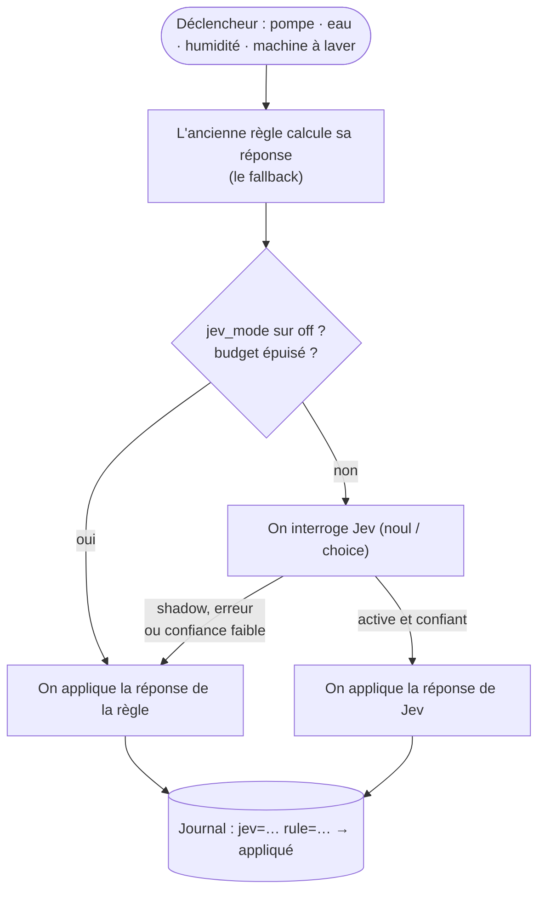

Toutes les installations Home Assistant que je connais finissent avec le même genre d'automatisation : *« si la valeur dépasse X pendant Y minutes, envoie une notif »*. Ça marche… jusqu'au jour où ça ne marche plus. La pompe de relevage tourne deux minutes après une nuit d'orage : alerte. Quelqu'un prend une longue douche : alerte « fuite possible ». La machine à laver fait une pause de trempage : notification « cycle terminé », vingt minutes trop tôt. Au bout d'un moment, on ne lit plus les notifications, et pour une alerte, c'est vraiment le pire qui puisse arriver.

Le problème, ce n'est pas le seuil. Le problème, c'est que la règle n'a aucune idée du **contexte** : il est tombé 14 mm cette nuit, il est 7 h un jour de semaine, la machine n'a consommé que 0,3 kWh pour l'instant. Un humain regarderait tout ça et dirait « c'est normal ». Un seuil, non.

Dans mon [article précédent](/fr/system-one-router-choisir-le-bon-llm-pour-chaque-prompt/), j'ai utilisé **Jev**, un modèle de décision « System One », pour router des prompts entre plusieurs LLM. Pendant que je le construisais, une idée me trottait dans la tête : *c'est exactement la question que ma maison se pose toute la journée*. J'ai donc passé une soirée avec Claude Code sur ma config Home Assistant, et j'ai confié à Jev les décisions qui demandent du jugement. Voici ce que ça a donné.

## Jev en deux minutes

[Jev](https://typesafe.ai/blog/introducing-system-one-models-and-jev) est un modèle de **TypeSafe** qui n'écrit pas de texte. On lui donne un *state* (quelques lignes qui décrivent la situation) et une question *typée*, et il répond avec une probabilité :

*   **`noul`** : oui ou non, avec la probabilité du « oui » ;
*   **`choice`** : une option parmi N que l'on décrit, avec toute la distribution ;
*   **`score`** : un niveau sur une échelle dont on décrit chaque niveau.

La version actuelle, c'est la 1.13. Elle est dispo directement chez TypeSafe ou [via OpenRouter](https://openrouter.ai/typesafe/jev-1.13) à **0,042 $ le million de tokens en entrée, la sortie étant gratuite**, avec une fenêtre de 32k tokens. Le [guide OpenRouter](https://openrouter.ai/docs/guides/community/jev) et la [doc TypeSafe](https://docs.typesafe.ai) (il y a même une [démo maison connectée](https://docs.typesafe.ai/demos/smart-home)) sont les références officielles.

Pourquoi c'est intéressant pour une maison : dans le [benchmark du routeur](/fr/system-one-router-choisir-le-bon-llm-pour-chaque-prompt/), Jev était confiant sur 82 % de ses réponses, et 95 % de celles-là étaient justes. **Sa confiance veut vraiment dire quelque chose.** C'est ce qui permet de le mettre dans une automatisation sans trembler : quand il n'est pas sûr, il le dit, et on peut se rabattre sur autre chose.

## Quelle intégration Home Assistant ?

Jev n'a que quelques semaines et l'écosystème bouge tous les jours, alors j'ai fait le tour de ce qui existe aujourd'hui (fin septembre 2026). En résumé : **tout est communautaire, rien n'est officiel, et rien n'est encore dans la liste par défaut de HACS.** L'installation passe par un dépôt personnalisé HACS.

| Projet | Ce qu'on obtient | Remarques |
| --- | --- | --- |
| [**AboveColin/HA-Jev**](https://github.com/AboveColin/HA-Jev) | Actions `jev.noul`, `jev.choice`, `jev.score`, `jev.ask`, `jev.calibrate` ; capteurs de questions créés depuis l'interface ; une `ai_task` et un agent de conversation ; capteurs de tokens, de coût et de budget journalier | **Celle que j'utilise** (1.16 sur mon serveur). La plus complète, et très active : il sort une nouvelle version quasiment chaque semaine. Domaine `jev`. |
| [AtHeartEngineer/HA-SystemOne](https://github.com/AtHeartEngineer/HA-SystemOne) | Les mêmes actions, des capteurs en YAML, un routeur Assist, des capteurs d'usage ; documente les serveurs `/v1/systemone` auto-hébergés | **Utilise aussi le domaine `jev`** : c'est l'une ou l'autre, jamais les deux. |
| [JanOstrowka/typesafe-assist](https://github.com/JanOstrowka/typesafe-assist) | Uniquement un agent de conversation, avec un agent de repli | Anglais uniquement. |
| [minuteman3](https://github.com/minuteman3/home-assistant-typesafe) / [allenporter](https://github.com/allenporter/home-assistant-typesafe) home-assistant-typesafe | Un agent de conversation avec des seuils de confiance, peut pointer vers un serveur local | Encore très jeune (0.1). |
| [ayali/node-red-contrib-jev](https://github.com/ayali/node-red-contrib-jev) | Un nœud Node-RED `jev` | Si vos automatisations vivent dans Node-RED. |

Un mot sur les « intégrations OpenRouter » : les intégrations OpenRouter génériques pour Home Assistant parlent *chat completions*. Jev, lui, a sa propre API de décisions (`/v1/systemone`), donc elles ne peuvent pas l'utiliser. Il vous faut un des projets ci-dessus.

### Installer HA-Jev

1.  **HACS → ⋮ → Dépôts personnalisés**, ajoutez `https://github.com/AboveColin/HA-Jev` en tant qu'**Intégration**.
2.  Cherchez **Jev**, téléchargez-la, redémarrez Home Assistant.
3.  **Paramètres → Appareils et services → Ajouter une intégration → Jev (TypeSafe)**.
4.  Collez une clé d'API. Avec une clé TypeSafe, c'est fini. De mon côté, j'avais déjà une clé **OpenRouter** qui traînait depuis le projet de routeur, donc j'ai ouvert la section *Avancé* et renseigné :
    *   Adresse de l'API : `https://openrouter.ai/api` (et pas `/api/v1` : l'intégration ajoute elle-même `/v1/systemone`) ;
    *   Modèle : `~typesafe/jev-latest` (le `~` fait partie de l'identifiant).

La clé est testée avec une vraie requête avant la création de l'entrée. Ensuite, dans les options, définissez un **budget journalier de tokens en entrée**. Par défaut il est à 0 (pas de limite). Une fois le budget atteint, l'intégration arrête d'appeler Jev et `binary_sensor.jev_daily_budget_exceeded` passe à `on`. Je m'en sers plus bas.

On peut créer des « questions » depuis l'interface (un capteur qui réinterroge Jev toutes les X minutes), mais je ne l'ai pas fait. **Je voulais Jev dans mes automatisations existantes, pas à côté.**

## Le principe : Jev conseille, la règle reste

C'est la partie dont je suis le plus content, et celle que je recopierais à votre place. Jev n'est jamais la seule chose entre une fuite et une notification. Chaque automatisation qui interroge Jev calcule aussi **ce que l'ancienne règle aurait répondu**, et le lui passe en `fallback`. Ensuite, un seul `input_select.jev_mode` décide qui a le dernier mot :

*   **`shadow`** (par défaut, c'est le « mode fantôme ») : on interroge Jev et on journalise sa réponse, mais c'est la réponse de la règle qui est appliquée. Rien ne change dans la maison.
*   **`active`** : c'est la réponse de Jev qui est appliquée, *sauf* si l'appel échoue, si le budget du jour est épuisé, si l'intégration n'est pas chargée ou (pour les choix) si la confiance est sous un minimum. Dans ces cas-là, la règle reprend la main.
*   **`off`** : Jev n'est pas appelé du tout.



Tout passe par deux scripts partagés, `script.jev_yes_no` et `script.jev_choice`, dans un fichier `packages/jev.yaml`. Chaque décision écrit une ligne dans le journal (le logbook), du genre `jev=True (p=0.93) rule=False -> False [rule, shadow]`. C'est ce journal que je lis avant de basculer `jev_mode` en `active` (un seul interrupteur pour toute la maison) : les lignes où Jev et la règle ne sont pas d'accord sont précisément les cas qui méritent qu'on s'y penche. Tout a été mis en service en mode `shadow`, et c'est toujours le cas au moment où j'écris. Le plan : une ou deux semaines en shadow, une revue des désaccords, et seulement après, `active`.

Voici le cœur du script oui/non (en version raccourcie) :

```yaml
script:
  jev_yes_no:
    mode: parallel
    fields:
      decision: {required: true}      # short name for the logbook
      facts: {required: true}         # the situation, one fact per line
      instructions: {required: true}  # the yes/no question
      background: {}                  # standing facts about the house
      threshold: {default: 0.5}
      fallback: {required: true}      # what the old rule answers
    sequence:
    - variables:
        mode: "{{ states('input_select.jev_mode') }}"
        rule_result: {answer: "{{ fallback | bool }}", source: rule}
    # Jev off, not loaded or over budget: the rule answers, full stop.
    - if: "{{ mode not in ['shadow', 'active'] or not is_state('binary_sensor.jev_daily_budget_exceeded', 'off') }}"
      then:
      - stop: Jev not available
        response_variable: rule_result
    - action: jev.noul
      continue_on_error: true         # a Jev error must never break the automation
      response_variable: jev
      data:
        state: "{{ facts }}"
        instructions: "{{ instructions }}"
        background: "{{ background }}"
        threshold: "{{ threshold }}"
    - variables:
        ok: "{{ jev is defined and jev.noul is defined }}"
        use_jev: "{{ ok and mode == 'active' }}"
        result:
          answer: "{{ jev.is_true if use_jev else fallback | bool }}"
          source: "{{ 'jev' if use_jev else 'rule' }}"
    - action: logbook.log
      data:
        name: "Jev · {{ decision }}"
        entity_id: input_select.jev_mode
        message: >-
          jev={{ jev.is_true }} (p={{ jev.noul | round(2) }})jev=error
          rule={{ fallback }} -> {{ result.answer }} [{{ result.source }}, {{ mode }}]
    - stop: Decision taken
      response_variable: result
```

Deux petits détails qui font toute la différence :

*   `continue_on_error: true` sur l'appel à Jev, et `verdict is not defined or not verdict.answer` dans les automatisations : **quoi qu'il plante, on retombe du côté de la notification.** Jev peut seulement *retirer* une alerte quand il est sûr de lui, jamais faire taire la maison par accident.
*   Les questions sont toujours formulées en **« est-ce que c'est normal ? »**, avec un seuil élevé (0,8, ou 0,9 pour une fuite possible). Jev doit être *sûr* que c'est normal pour se taire.

Par-dessus les deux scripts génériques, il y a un petit script par *type* de décision (pompe, eau, chute de température, volets, lessive). Chacun porte le prompt et rassemble les faits, comme ça les automatisations n'ont plus qu'à dire *ce qui vient de se passer*.

### Ce que Jev reçoit vraiment

Le « state », c'est du texte brut. Voici ce que la décision de la VMC a envoyé un vendredi soir, généré à partir de mes capteurs en live (j'ai retiré les deux lignes qui disent qui est à la maison et qui dort) :

```text
Now: Friday 19:38
Current speed: Vitesse 1 (changed 33 minutes ago)
Upstairs bathroom humidity: 63.47 %
Parents' bathroom humidity: 65.16 %
Kitchen humidity: 75.49 %
Highest living-room humidity: 0.0 %
House average humidity: 69.5 %
Wet-room humidity trend: Falling Fast
Usual shower time: yes
Outdoor: unavailable °C, humidity 81 %
```

Avec ça partent la question, les trois options et leur description, et le background. L'action `jev.choice` renvoie l'option choisie, sa confiance, toute la distribution, plus un peu d'intendance :

```yaml
choice: Vitesse 1          # one of the options, never free text
confidence: …              # 0 to 1
probabilities:             # the whole distribution
  "Off": …
  Vitesse 1: …
  Vitesse 2: …
model: …                   # the version that answered
latency_ms: …
usage: {input_tokens: …, output_tokens: …}
```

`jev.noul` est encore plus simple : `noul` (la probabilité du « oui »), `is_true` (cette probabilité comparée à *votre* seuil) et le seuil lui-même. Les auteurs de l'intégration le disent clairement : une valeur autour de 0,5 veut dire *« je ne sais pas »*, pas *« à moitié vrai »*. C'est pour ça que le seuil appartient à l'automatisation, pas au modèle.

Maintenant, relisez ce state. **L'humidité du salon à 0 % et la température extérieure `unavailable`, ce sont de vraies valeurs.** Quand je les ai récupérées pour cet article, les deux capteurs template qui calculent l'humidité max par zone étaient bloqués à 0, alors que toutes les pièces affichent entre 55 et 75 %. Et le module extérieur Netatmo était hors ligne. L'ancienne règle de la VMC lit les mêmes capteurs : elle s'était donc rabattue en douce sur *« on garde la vitesse actuelle »*. Jev, au moins, reçoit aussi les valeurs brutes pièce par pièce, et il voit bien que la cuisine est à 75 %.

C'est la deuxième raison pour laquelle j'aime le mode shadow. **Écrire les faits pour Jev m'a obligé à les lire, et certains étaient faux.** Un modèle ne peut pas faire mieux que ses entrées, un seuil non plus. Sauf que les entrées d'un seuil, on ne les regarde jamais tant que rien ne casse. Prochaine étape sur ma liste : journaliser les faits à côté de chaque décision, pas seulement les deux réponses.

## Six automatisations devenues plus malignes

Elles existaient toutes déjà, et la plupart ont droit à leur propre article sur ce blog. Ce qui suit, c'est ce que Jev y ajoute. (Les noms d'entités sont simplifiés, et j'ai laissé de côté tout ce qui dit qui habite ici ou quand la maison est vide.)

### 1. La pompe de relevage : « il pleut, ou le flotteur est coincé ? »

La [surveillance de la pompe de relevage](/fr/monitoring-the-sump-pump-with-home-assistant/) envoie un avertissement quand la pompe tourne 2 minutes, une alerte à 10 minutes, et une autre quand elle n'a pas démarré depuis 48 heures. Les trois sont pertinentes *par temps sec*, et les trois deviennent du bruit après une grosse pluie (cycles longs) ou pendant une semaine sèche en été (aucun cycle).

Désormais, chaque alerte commence par demander son avis à Jev :

```yaml
- action: script.jev_pompe_cave_normale
  continue_on_error: true
  response_variable: verdict
  data:
    situation: The pump has been running for 2 minutes without stopping
- condition: template
  value_template: "{{ verdict is not defined or not verdict.answer }}"
- action: notify.persistent_notification
  # ... unchanged
```

Le script envoie la durée du cycle en cours, le temps de fonctionnement du jour et de la semaine, le dernier démarrage et le dernier arrêt, les tentatives de redémarrage, le pluviomètre, la météo, la température extérieure et l'humidité de la cave. Le background explique à Jev comment se comporte cette pompe (« un cycle normal dure moins de 2 minutes ; après une grosse pluie, elle peut démarrer de nombreuses fois par jour ; en période sèche, elle peut rester arrêtée plusieurs jours ; le pluviomètre est parfois indisponible, fie-toi alors à la météo »). La question : *« Ce comportement de la pompe de relevage s'explique-t-il par un fonctionnement normal plutôt que par une panne ? »*, seuil 0,8.

Cette dernière précision sur le pluviomètre, c'est typiquement le genre de chose qu'on ne peut pas mettre dans un seuil, et c'est exactement ce que je dirais à quelqu'un qui garderait la maison pendant mon absence. Et ce n'est pas de la théorie : le jour où j'ai déployé tout ça, la pile du pluviomètre était à 6 % et le capteur était indisponible.

### 2. L'eau : une longue douche, ce n'est pas une fuite

Le compteur sur l'arrivée d'eau principale remonte le débit en L/min et alimente cinq alertes : débit élevé (plus de 10 L/min pendant 2 minutes), fuite possible (débit continu pendant 2 heures), consommation journalière excessive, et deux pour de l'eau qui coule alors qu'on est en vacances. Chacune pose maintenant la question *« Cette consommation d'eau s'explique-t-elle par une activité normale de la maison plutôt que par une fuite ou un robinet resté ouvert ? »*, avec le débit, la consommation du jour comparée à une journée type, l'état de la machine à laver, l'**humidité max dans les salles de bain et la cuisine** (une douche s'y voit en quelques minutes !), la météo et la pluie (pour l'arrosage du jardin), et le fait que la maison soit ou non en mode vacances.

L'astuce de l'humidité, c'est ma préférée : le compteur d'eau ne sait pas *où* part l'eau, mais les capteurs d'humidité des pièces d'eau, eux, le savent. (Enfin, ça ne marche que si ce capteur d'humidité ne raconte pas n'importe quoi : on en reparle dans les leçons, plus bas.)

### 3. Chutes de température : fenêtre ouverte ou cycle de la pompe à chaleur ?

Une alerte « chute rapide de température » par chambre (−3,6 °C en 30 minutes quand il fait moins de 15 °C dehors), c'est le détecteur classique du *quelqu'un a laissé la fenêtre ouverte*. Jev reçoit la température de la pièce, la chute, la température extérieure, l'état et la consigne des thermostats de la pièce, les capteurs d'ouverture *quand la pièce en a*, et la vitesse de la VMC.

Brancher celle-là m'a valu un bonus inattendu. Pour passer les capteurs de tendance à Jev, l'agent a dû les lire, et il s'est rendu compte que **quatre sur cinq pointaient vers des entités qui n'existent pas** (un suffixe `_2` manquant). Quatre de mes cinq alertes de chute de température étaient bloquées sur `unknown` et ne pouvaient tout simplement jamais se déclencher. Maintenant qu'elles sont corrigées, elles vont de nouveau se déclencher, et c'est Jev qui devrait les empêcher de devenir du bruit. Même histoire pour la pompe : la réactivation au bout de 24 h après un arrêt forcé soustrayait un nombre à une date, plantait à chaque fois, et ne s'est donc jamais exécutée. Demander à un agent de brancher un nouveau modèle sur de vieilles automatisations, c'est aussi un super moyen de les faire relire.

### 4. Les volets contre la chaleur

L'[automatisation des volets](/fr/homeassistant-close-cover-to-control-the-home-temperature-v2/) descend les volets à 40 % quand le soleil chauffe les pièces. La règle compare la température de façade à la température intérieure, et les capteurs de façade sont en plein soleil : par un matin froid et ensoleillé, ils affichent plusieurs degrés de trop.

Jev reçoit maintenant la température intérieure, la température *à l'ombre* de la station météo, les capteurs de façade au soleil (en précisant qu'ils surestiment), la max prévue du jour, la couverture nuageuse, l'indice UV, l'élévation et l'azimut du soleil, et les positions actuelles. La question : *« Faut-il descendre ces volets maintenant pour empêcher la chaleur du soleil d'entrer ? »*, avec comme background : *« En saison chaude, garder la chaleur dehors compte plus que la lumière du jour ; en saison froide, la chaleur du soleil est la bienvenue. »*

Petite correction au passage : le verrou « une fois par jour » s'appuyait sur le `last_triggered` de l'automatisation, qui change désormais toutes les 10 minutes, même quand Jev répond « laisse-les ouverts ». Il est passé sur un `input_datetime` qui n'est écrit que quand les volets bougent vraiment, pour que la réouverture du soir continue de fonctionner.

### 5. VMC : un `choice` au lieu de quatre automatisations

La [VMC intelligente](/smart-vmc-mechanical-ventilation-system/) (article en anglais) reposait sur quatre automatisations à base de règles, avec seuils et hystérésis. Elle a désormais aussi une automatisation `vmc_jev_decision` qui pose un **`choice`** toutes les 5 minutes (et tout de suite quand l'humidité grimpe vite) :

```yaml
- action: script.jev_choice
  data:
    decision: VMC
    fallback: "{{ rule_speed }}"     # the four old automations, condensed in one template
    instructions: Which ventilation speed should the VMC run at right now?
    options:
      "Off": The air is dry enough everywhere, no ventilation needed
      Vitesse 1: Background ventilation for moderate humidity or stale air
      Vitesse 2: Extract steam fast after a shower, a bath or cooking (noisy)
    background: >-
      A wet room above about 70 % humidity usually means a shower or cooking.
      Speed 2 is noisy: avoid it at night or when the house is empty unless
      humidity is really high.
```

« La vitesse 2 est bruyante, évite-la la nuit sauf si c'est vraiment nécessaire » : pour Jev, c'est une phrase. Avec des règles, c'était une condition à rajouter dans chaque automatisation. En mode `active`, les quatre anciennes automatisations passent la main, leurs seuils deviennent le fallback, et un choix avec une confiance inférieure à 0,6 est ignoré.

### 6. La lessive : pause ou fin du programme ?

Ma [détection de fin de cycle de la machine à laver](/homeassistant-detect-washing-machine-cycle-completion/) (article en anglais) se base sur la puissance : moins de 10 W pendant 2 minutes, c'est terminé. Sauf que certains programmes font tremper le linge, marquent un arrêt cuve pleine ou enchaînent des rotations anti-froissage à quelques watts, pendant 5 à 30 minutes.

Maintenant, quand la puissance chute, Jev reçoit le temps écoulé, l'énergie consommée depuis le début, la puissance actuelle et depuis combien de temps la machine est au repos, plus un background qui explique comment consomment un lave-linge et un sèche-linge. Si Jev est **sûr à au moins 75 % que c'est une pause**, l'automatisation attend jusqu'à 30 minutes que la machine reparte. Si elle repart : pas de notif, et le cycle n'est pas réinitialisé (l'heure de début et l'énergie continuent donc de compter depuis le vrai début). Si Jev renvoie une erreur ou ne répond pas à temps : notification, comme avant.

## Combien ça coûte ?

C'est la partie qui m'intriguait le plus. Voici mon journal d'activité OpenRouter pour Jev, un soir :

, 0,0000237 $ par appel.")

Chaque ligne, c'est le `choice` de la VMC, un toutes les 5 minutes : **565 tokens en entrée, 50 en sortie, 0,0000237 $ par appel**. Le calcul est vite fait :

| | Appels | Coût |
| --- | --- | --- |
| Décision de la VMC, toutes les 5 minutes | 288 / jour | ~0,0068 $ / jour |
| Volets, toutes les 10 minutes dans leur plage horaire, jusqu'à ce qu'ils se ferment | jusqu'à ~110 / jour | ~0,003 $ / jour |
| Pompe, eau, température, lessive (uniquement sur événement) | quelques-uns / jour | négligeable |
| **Total** | | **< 0,01 $ / jour, environ 3 $ / an** |

HA-Jev tient ses propres comptes, donc pas besoin de me croire sur parole. Le premier jour complet en production, à 19 h 40, les capteurs de l'intégration affichaient :

*   `sensor.jev_calls_today` : **133**
*   `sensor.jev_input_tokens_today` : **75 201** (pile 565 par appel)
*   `sensor.jev_estimated_cost_today` : **0,0032 $**

On est partis pour à peu près un demi-centime sur la journée, ce qui colle avec le tableau.

Et la vue du mois, tous modèles confondus sur mon compte :


Deux centimes pour le mois, *en comptant* le benchmark de 80 prompts de l'article précédent et les tests de l'intégration. Jev ne tourne pour la maison que depuis quelques jours : un mois complet de décisions domotiques devrait tourner autour de 20 centimes.

Quelques remarques honnêtes :

*   **La VMC, c'est 90 % des appels, et c'est ma faute, pas celle de Jev.** Demander toutes les 5 minutes alors que rien n'a bougé, c'est de la flemme. Un déclencheur sur les variations d'humidité, ou sauter l'appel quand les faits sont identiques aux précédents, diviserait la facture par cinq. À 3 $ par an, je ne m'en suis pas encore occupé, mais sur une maison plus grande, c'est la première chose que je corrigerais.
*   **Environ la moitié de chaque appel, c'est du coût fixe.** HA-Jev a mesuré à peu près 250 tokens facturés par requête, quelle que soit sa taille. Envoyer 10 faits ou 15 ne change quasiment rien au prix, alors ne privez pas Jev de contexte pour grappiller des tokens.
*   **Un LLM pas cher ferait-il pareil pour le même prix ?** Sur le papier, oui : Qwen 3.7 flash coûte à peu près pareil par appel, *à condition* qu'il ne réfléchisse pas. Dans l'article sur le routeur, il avait cramé 1 800 tokens de raisonnement pour dire « hi », ce qui le rend dix fois plus cher. Sonnet 5 coûterait environ 0,0016 $ par appel, soit ~14 $ par mois rien que pour la VMC. Mais le prix n'est pas le vrai sujet. Le vrai sujet, c'est que Jev renvoie une **réponse typée avec une probabilité calibrée** : pas de JSON à parser, pas de « Bien sûr ! Voici ma réponse », et un nombre que je peux comparer à un seuil.
*   **Mettez quand même un budget.** Un déclencheur qui fait du yo-yo en `mode: parallel` pourrait partir en boucle. Le budget journalier de tokens de HA-Jev transforme ce risque en `binary_sensor`, que les scripts vérifient avant chaque appel. Avec ~170k tokens par jour, un budget de 500k laisse de la marge.

### Et la vie privée ?

C'est le point à bien réfléchir avant de copier. Les faits que j'envoie disent si la maison est en mode « absent » ou « vacances » et si on dort. C'est du contexte utile (« de l'eau qui coule alors qu'il n'y a personne », c'est louche), mais ça veut dire qu'un tiers reçoit, toutes les 5 minutes, une petite description de qui est chez moi et quand. TypeSafe et OpenRouter ont leurs propres politiques sur les données : lisez-les, et choisissez les faits qui valent le coup d'être envoyés. Ce qui m'amène à Laya.

## Laya pourrait-il faire ça en local ?

Dans l'article sur le routeur, j'ai comparé Jev à [**Laya**](https://huggingface.co/convaiinnovations/laya), un modèle open weights de Convai Innovations qui répond aux mêmes questions `choice` / `score` / `noul` et tourne sur un portable. Pour une maison, le « local » n'est pas un détail : ça règle d'un coup la question de la vie privée et la dépendance à Internet.

**Comment le brancher.** HA-Jev et HA-SystemOne acceptent une adresse d'API personnalisée sans clé, et appellent `<adresse>/v1/systemone`. N'importe quel serveur local qui parle l'API de Jev peut donc prendre sa place :

*   le [sidecar Laya de system-one-router](https://github.com/mmornati/system-one-router/tree/main/sidecar) parle déjà le format de requête de Jev. Pour l'instant il répond sur `/decisions`, il lui faut donc une route de plus (`/v1/systemone`) pour être utilisable depuis Home Assistant : une modif d'une ligne ;
*   des serveurs communautaires comme [stuntd](https://github.com/bladedevoff/stuntd) (Laya d'abord, Jev en cas de doute) existent, mais je ne les ai pas testés ;
*   [allenporter/home-assistant-laya](https://github.com/allenporter/home-assistant-laya) fait tourner Laya *dans* Home Assistant, mais uniquement comme agent de conversation, pas pour les actions `noul` / `choice` qu'utilisent mes scripts.

**À quoi s'attendre, d'après le benchmark.** Attention : le benchmark mesurait du *routage de prompts*, pas des capteurs domotiques, donc c'est une extrapolation.

| | Jev 1.13 | Laya anglais (zero-shot) |
| --- | --- | --- |
| Précision (accuracy) | 89 % | 59 % |
| Réponses confiantes (≥ 0,8) | 82 %, dont 95 % justes | **12 %**, mais 10 sur 10 justes |
| Erreur de calibration (plus c'est bas, mieux c'est) | 0,080 | 0,171 |
| Fenêtre de contexte | 32k tokens | 512 tokens (1 024 en multilingue) |
| Latence | ~300–500 ms (réseau ; 0,46 s pour le premier appel depuis chez moi) | 30–70 ms sur GPU M4, ~0,5 s sur CPU |
| Coût | ~3 $ / an ici | 0 $ |

Ce que ça donne avec *mes* scripts :

*   **Laya serait sans danger, mais pas franchement utile en l'état.** Sa faible confiance le fait retomber dans mes fallbacks : sous 0,8, aucune alerte n'est supprimée, et sous 0,6, la VMC garde la vitesse de la règle. Laya en zero-shot vous donnerait donc… à peu près vos anciennes règles, plus quelques corrections quand il est sûr de lui. Pas de casse, pas beaucoup de gain non plus. C'est la même leçon qu'avec le routeur : *un modèle de décision qui doute, c'est une machine à fallbacks.*
*   **Quand il est confiant, il a raison.** C'est ce qui compte avant un fine-tuning, et le journal du mode shadow, c'est le début d'un dataset : chaque ligne contient la réponse de Jev et celle de la règle, et une fois les faits journalisés à côté, ça devient des données d'entraînement propres à la maison.
*   **Attention à la fenêtre.** Mes requêtes font environ 300 tokens de texte utile, ce qui rentre dans 512, mais les prompts de la pompe et des volets sont les plus longs. Je prendrais le checkpoint multilingue (1 024 tokens), qui lit aussi mieux les noms français de mes entités.
*   **Attention au matériel.** Sur un GPU Apple, Laya répond plus vite que Jev. Sur un CPU type Raspberry, comptez plutôt en secondes (le README de home-assistant-laya annonce 1,5 à 3 s par commande). Pour des alertes qui attendent déjà 2 minutes, pas de souci. Pour la VMC toutes les 5 minutes non plus. Il faut juste éviter de le faire tourner sur le même petit boîtier que Home Assistant.

Le plan que je suivrais : faire tourner Laya **en shadow à côté de Jev** (une troisième colonne dans le journal), accumuler quelques semaines de décisions, et le fine-tuner sur les données de la maison. Ensuite, les faits sensibles (absence, vacances, sommeil) pourraient partir uniquement vers Laya, et le reste vers Jev. C'est exactement l'idée du `provider: auto` du routeur, appliquée à une maison.

## Comment je l'ai construit

Comme dans mes derniers articles : tout s'est fait en une session Claude Code sur le dépôt de ma config Home Assistant. J'ai demandé quelles automatisations relevaient du « jugement » plutôt que de la règle ; l'agent a proposé le principe shadow/active et les scripts partagés, écrit les prompts de chaque domaine, et tout branché. Mon boulot à moi : décider quelles décisions méritent Jev (pas toutes : une lumière qui suit un détecteur de mouvement n'a pas besoin d'un modèle), confronter les prompts à ce que je sais de la maison, et relire le diff. Les deux bugs trouvés en route, c'était la cerise sur le gâteau.

Avant que quoi que ce soit n'arrive dans la maison, l'agent a lancé Home Assistant 2026.9.3 dans Docker avec une intégration `jev` bouchonnée, et a fait passer les scripts par tous les chemins : modes shadow, active et off, budget dépassé, erreur renvoyée par Jev, confiance faible, choix invalide, et pour la lessive une pause, une reprise et une vraie fin. Le tout est arrivé sous forme de deux pull requests sur le dépôt de ma config (la couche de décision, puis la lessive), toutes les deux mergées en mode shadow.

### « Mergé » ne veut pas dire « déployé »

Et là est arrivée la partie qu'aucun test n'avait couverte. Ma config arrive sur le serveur via un add-on GitOps qui pull `main` toutes les quelques heures. Après le merge, j'ai demandé à l'agent de vérifier que Jev tournait bien, et il n'a trouvé… rien : pas d'`input_select.jev_mode`, zéro appel à Jev ce jour-là.

En fait, l'add-on n'avait rien récupéré **depuis le 18 août**. Ce jour-là, une modif faite directement sur le serveur et une PR mergée avaient toutes les deux touché `automations.yaml`, le `git pull --rebase` s'était arrêté sur un conflit, et depuis, chaque exécution échouait sans rien dire. Home Assistant continuait de tourner tranquillement sur les anciens fichiers, donc rien n'avait l'air cassé. Cinq semaines de PR mergées n'étaient tout simplement jamais arrivées jusqu'à la maison.

Réparer ça a demandé plus de précautions que tout le travail sur Jev. En SSH, d'abord en lecture seule, l'agent a comparé le serveur avec `main` fichier par fichier. Certaines modifs n'existaient que sur le serveur et seraient passées à la trappe avec un simple `git reset --hard` : quelques capteurs que j'avais recâblés pour la voiture, la config Zigbee2MQTT en production avec quatre appareils réappairés, et des semaines de mises à jour HACS. Il a aussi trouvé une copie de `secrets.yaml` avec un nom que le `.gitignore` ne couvrait pas, et que l'add-on aurait gentiment poussée sur GitHub à sa prochaine sauvegarde. Donc, dans l'ordre :

1.  une sauvegarde complète du Supervisor (5,2 Go, vérifiée en l'ouvrant) ;
2.  une PR pour ramener dans `main` tout ce qui n'existait que sur le serveur, plus une règle `.gitignore` pour tout fichier `secrets.yaml*` ;
3.  une fois celle-ci mergée, un reset du serveur sur `main`, une vérification de la config avec le conteneur de prod, un redémarrage, et le redémarrage de l'add-on.

Quelques minutes plus tard, la première décision de la VMC est partie et revenue en **0,46 s**. Jev était d'accord avec la règle, donc rien n'a été écrit dans le journal. La période de shadow a vraiment commencé ce jour-là, le 25 septembre. Si vous utilisez un add-on GitOps, allez voir quand il a fait son dernier pull. Le mien échouait en silence depuis cinq semaines.

## Ce que j'en retiens

1.  **Utilisez un modèle pour la question « est-ce que c'est normal ? », gardez les règles pour le reste.** Les seuils sont excellents pour détecter *qu'il se passe* quelque chose ; un modèle de décision est bon pour juger *si ça compte*.
2.  **Ne laissez jamais le modèle être le dernier rempart.** La réponse de la règle est toujours calculée, c'est toujours le fallback, et chaque échec retombe du côté de la notification.
3.  **Commencez en mode shadow et lisez les désaccords.** Ce sont les seules lignes intéressantes du journal.
4.  **Écrivez le background comme si vous briefiez quelqu'un qui garde votre maison.** « Le pluviomètre est parfois indisponible, fie-toi alors à la météo » vaut mieux que n'importe quel réglage de seuil.
5.  **C'est votre déclencheur qui fait votre facture.** Une décision toutes les 5 minutes coûte 3 $ par an ; c'est quand même la seule ligne qui vaille la peine d'être optimisée.
6.  **Pensez à ce qui sort de chez vous.** L'occupation de la maison, c'est une donnée personnelle. Les modèles locaux comme Laya sont le moyen de la garder à la maison, dès qu'ils seront assez sûrs d'eux.
7.  **Relisez les faits que vous envoyez.** Une humidité de 0 % dans le salon trompe un seuil aussi facilement qu'un modèle. Écrire le prompt, c'est un audit gratuit de vos capteurs.
8.  **Vérifiez que « mergé » veut bien dire « en service ».** Cherchez la nouvelle entité en production, pas la coche verte sur la PR.

Si vous avez branché Jev (ou Laya) sur votre propre maison, je suis curieux de savoir quelles décisions vous lui avez confiées, et lesquelles vous lui avez reprises. Dites-le-moi en commentaire !
