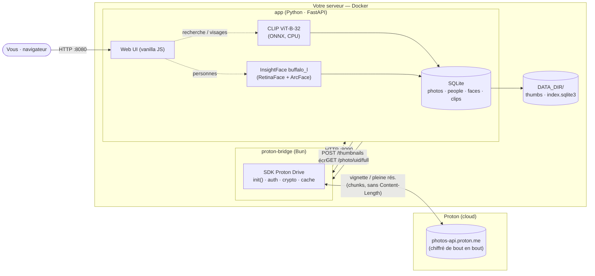
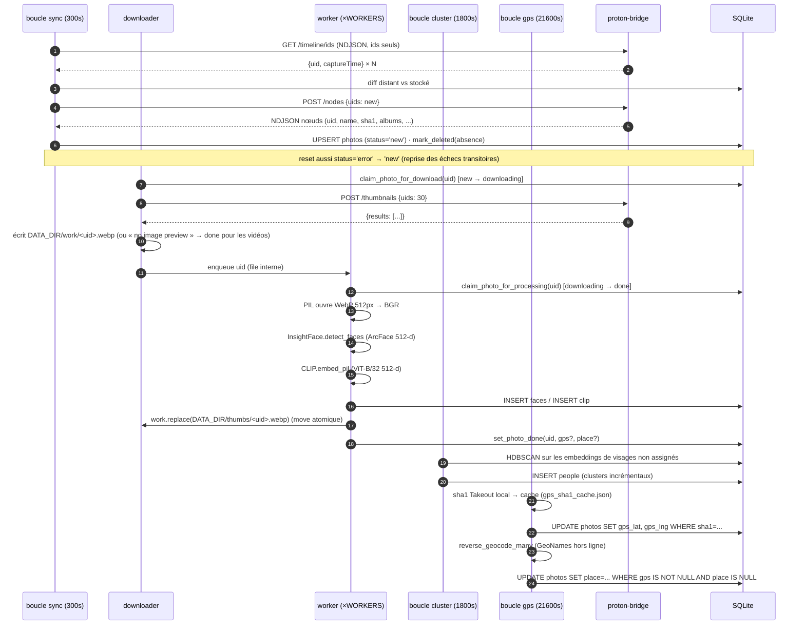

Il y a quelques semaines, j'écrivais sur la [migration de 354 Go de Google Photos vers Proton](/how-i-built-gphoto2proton-to-migrate-354gb-of-google-photos-to-proton/). La migration a fonctionné, ma bibliothèque est en sécurité, les albums sont intacts. Mais en m'installant dans Proton Photos, une absence discrète n'a cessé de me tarauder : **la recherche**.

Pas la recherche « trier par date ». Celle de Google. Tapez « chien » et obtenez toutes les photos avec un chien. Tapez « plage » et revivez chaque plage où vous êtes allé. Touchez un visage et regardez toutes les photos de cette personne s'aligner. Cette magie n'est pas une fonctionnalité de Proton, et elle ne le sera jamais — pour une très bonne raison.

Alors je l'ai construite moi-même. Voici [proton-faces](https://github.com/mmornati/proton-faces) : un moteur de recherche auto-hébergé et privé pour Proton Photos. Personnes, objets et lieux, entièrement sur mon propre matériel, en lecture seule vis-à-vis de Proton, avec zéro télémétrie.

## Le point douloureux

Proton Photos est chiffré de bout en bout. Chaque photo que vous uploadez est chiffrée côté client avec une clé que Proton ne détient pas. C'est tout l'intérêt du service — mais cela a une conséquence que la plupart des gens n'imaginent pas :

> **Proton ne peut littéralement pas rechercher vos photos, parce que Proton ne peut pas voir vos photos.**

La barre de recherche de Google Photos fonctionne parce que votre service « gratuit » est construit sur le scan de chaque pixel de chaque photo sur les serveurs de Google. Dès que vous migrez vers un fournisseur chiffré de bout en bout, cette fonctionnalité doit vivre ailleurs. Le seul endroit où elle peut vivre, c'est votre propre matériel.

Le cahier des charges était donc clair : une recherche inversée auto-hébergée sur ma bibliothèque Proton. Avec des contraintes fortes :

*   **Lecture seule vis-à-vis de Proton.** Rien n'est jamais uploadé, modifié ou supprimé. Ma bibliothèque chiffrée reste intacte.
*   **Pas de téléchargement complet de la bibliothèque.** Je ne vais pas rapatrier 354 Go localement juste pour l'indexer.
*   **Privé.** Pas d'API cloud, pas de télémétrie. Les seuls appels réseau doivent aller vers les serveurs de Proton.
*   **Une vraie UI de recherche.** Pas un script qui imprime des noms de fichiers.

## L'architecture : deux conteneurs, une règle

Le design a été dicté par le chiffrement de Proton et par son SDK. La règle qui façonne tout :

> **Un seul composant parle à Proton.**

J'ai divisé le système en deux conteneurs. `proton-bridge` est le seul à connaître vos identifiants Proton et à parler à l'API de Proton. `app` fait tout l'apprentissage machine, l'indexation, la recherche et l'interface web — et il ne parle jamais qu'au bridge, via HTTP sur un réseau Docker privé appelé `internal`.



| Conteneur      | Runtime                          | Rôle                                                                |
|----------------|----------------------------------|---------------------------------------------------------------------|
| `proton-bridge`| Bun + SDK Proton Drive (dans le dépôt) | Le **seul** composant qui parle à Proton (auth, vignettes)  |
| `app`          | Python 3.11 + FastAPI            | Tout le ML, l'indexation, l'API de recherche, l'interface web       |

Le bridge est volontairement idiot. Il s'authentifie avec votre session Proton existante, fait un diff de votre timeline photos, télécharge des vignettes de 512px, et diffuse les photos en pleine résolution à la demande. Rien d'autre. Toute l'intelligence vit côté Python, qui ne voit jamais d'identifiant Proton.

## Approche : pourquoi le bridge est compilé dans le dépôt de Proton lui-même

Voici le premier terrier de lapin. Le paquet npm publié `@protontech/drive-sdk` encapsule l'API chiffrée de Proton — mais il **ne peut pas fonctionner seul**, parce que son module d'authentification n'est pas publié sur npm. Vous obtenez la crypto, pas la connexion.

Le CLI Proton Drive (du monorepo [ProtonDriveApps/sdk](https://github.com/ProtonDriveApps/sdk)) possède cette mécanique. Le bridge fait donc quelque chose d'un peu inhabituel : au lieu de dépendre du paquet npm, il est **construit dans le monorepo du SDK au moment de la construction de l'image**, épinglé au tag git `cli/v0.8.0`, et compilé en binaire autonome avec `bun build --compile`. Le seul fichier que j'écris est `bridge/src/bridge.ts` — 278 lignes de points de terminaison HTTP qui réutilisent les mécanismes `init()`, d'authentification et de crypto du CLI. Le commentaire en tête du fichier expose l'intention :

> *« Compiled as the entry point of the Proton Drive CLI repository, so it reuses the CLI's own `init()` machinery (auth, crypto, cache, feature flags). »*

Concrètement, le bridge appelle `init({ clientUidPrefix: 'sdk-js-cli', appVersion: 'cli-drive@0.8.0', sdkVersion: 'js@0.21.0', enablePersistedEvents: false, enableMetrics: false, flags: { DriveCryptoEncryptBlocksWithPgpAead: true, DriveSmallFileUpload: true } })`. Notez le `enableMetrics: false` : même la télémétrie du SDK de Proton est désactivée. Votre session est chargée depuis `data/auth-session.json` via la variable d'environnement `PROTON_DRIVE_CREDENTIALS_STORE=unsafe_file` (le CLI la garde normalement dans votre trousseau système / store `pass` ; ici on monte directement le fichier). Au démarrage, le bridge appelle `ctx.auth.isLoggedIn()` et l'expose dans le corps de `/health`.

Le résultat : un binaire statique unique qui s'authentifie, déchiffre et diffuse — construit à partir du propre code de Proton, donc je ne réimplémente pas leur chiffrement, et stable face aux évolutions de l'API. Il expose une petite API HTTP délibérée :

*   `GET /health` — `{ ok, loggedIn }`
*   `GET /timeline` — flux NDJSON de **nœuds photo complets** (uid, name, captureTime, sha1, mediaType, albums)
*   `GET /timeline/ids` — flux NDJSON de **uid + captureTime uniquement** (le diff économique utilisé par l'indexeur)
*   `POST /nodes` — flux NDJSON des métadonnées complètes pour un lot d'uids
*   `POST /thumbnails` — corps `{"uids": [...]}` → télécharge par lot des vignettes WebP `Type1` de 512px dans `DATA_DIR/work/<uid>.webp`
*   `GET /photo/{uid}/full` — diffuse la photo en **pleine résolution, déchiffrée**, à la demande

### L'astuce NDJSON

La timeline d'une bibliothèque de 100 000 photos peut prendre longtemps à paginer — et les clés de nœud aussi à déchiffrer. Le serveur HTTP de Bun tue les connexions inactives au bout de 255 secondes ; si je mettais toute la bibliothèque en mémoire tampon avant de répondre, les clients verraient « serveur déconnecté » bien avant le premier octet. Le bridge diffuse donc la timeline en **NDJSON (JSON délimité par des sauts de ligne)**, une photo par ligne. Pour garder la connexion vivante pendant que la page suivante est récupérée, il émet des lignes de commentaire `#` toutes les 15 secondes avec un compteur de progression — le client traite les lignes `#` comme de la progression, pas comme des données. Les longues paginations diffusent indéfiniment, et le côté Python commence le diff avant même que le bridge ait fini de lister.

### La bizarrerie du streaming en pleine résolution

Diffuser la photo en pleine est plus difficile qu'il n'y paraît. Le `getSeekableStream()` du SDK renvoie un `BufferedSeekableStream` dont le constructeur se verrouille immédiatement (il s'empare du reader dans le constructeur), et ne peut donc pas être passé à `Response` / `Bun.serve()`. Je réutilise le pattern `downloadToPath` du CLI : `downloader.downloadToStream(writable)` dans un adaptateur `WritableStream` qui pousse les chunks dans un `ReadableStream` neuf, puis `await dlController.completion()` et on ferme le controller.

Une deuxième décision subtile : **la réponse omet délibérément `Content-Length`**. Le SDK expose `getClaimedSizeInBytes()` — mais cette valeur peut différer du nombre d'octets réellement déchiffrés (à cause de l'enveloppe crypto), et un `Content-Length` qui ne correspond pas fait croire au client que le flux a été tronqué. Le chunked transfer encoding contourne tout le problème. Les en-têtes de la réponse sont simplement `Content-Type: application/octet-stream`, `Cache-Control: no-store` et `X-Photo-Uid: <uid>`.

### La reprise côté bridge aussi

Le point de terminaison `thumbnails` saute tout uid dont `DATA_DIR/work/<uid>.webp` existe déjà (un simple `Bun.file(dest).exists()`). Donc si l'indexeur redémarre en plein milieu d'un lot, le bridge ne re-télécharge pas ce que l'exécution précédente avait déjà écrit.

## Le pipeline : cinq boucles et une machine à états

Tout tourne en boucles d'arrière-plan dans le processus FastAPI, chacune sur sa propre temporisation. La machine à états vit dans SQLite (mode WAL, `foreign_keys=ON`), une ligne par photo, avec les statuts persistés `new`, `downloading`, `done`, `error`, `deleted`. L'étape de reconnaissance elle-même est *transitoire* — un `threading.Lock` Python garde la transition `downloading → done` ; rien dans la base n'indique jamais `processing`. Parce que la progression est persistée dans SQLite, le tout est **entièrement reprenable** — redémarrez le conteneur et il reprend exactement là où il s'était arrêté, y compris toute photo dont la ligne `downloading` n'a plus de fichier de travail (le worker le re-téléchargera tout simplement).



Les cinq boucles :

1.  **Boucle de synchronisation** (toutes les 300 s) : interroge `/timeline/ids` (le listing économique d'uids), fait le diff avec `SELECT uid FROM photos`, marque les photos disparues en `deleted`, puis récupère les métadonnées complètes uniquement pour les nouveaux uids via `POST /nodes`. Comme auto-réparation pour les erreurs transitoires, elle réinitialise aussi chaque ligne `status='error'` en `status='new'` à chaque cycle.
2.  **Boucle de téléchargement** : réclame les photos en `new` (`UPDATE … WHERE status='new'` atomique), demande les vignettes au bridge par **lots de 30** — c'est la limite de taille de page de l'API Proton — et les écrit en WebP dans `DATA_DIR/work/`. Si le bridge renvoie `"no image preview"` (les vidéos n'ont pas d'aperçu), la photo est marquée `done` avec une vignette vide ; on a fait de notre mieux, et il n'y a rien à indexer sur une vidéo.
3.  **Travailleurs de reconnaissance** (`WORKERS=2` par défaut) : chacun tire un uid d'une `queue.Queue` interne. Au démarrage, ou quand la file est vide, un worker récupère aussi toute photo `'downloading'` restante d'une exécution précédente — c'est ainsi que la reprise fonctionne sans couche de persistance de file. Pour chaque photo : on ouvre le fichier de travail avec PIL, on convertit en RGB (InsightFace veut du BGR, d'où `arr[:, :, ::-1]`), on lance `embed_pil(rgb)` pour CLIP et `detect_faces(bgr)` pour InsightFace, on insère les visages et le vecteur CLIP, puis **`work.replace(final)`** — un renommage atomique dans le cache permanent `DATA_DIR/thumbs/` — et `set_photo_done`. La photo originale n'est jamais conservée.
4.  **Boucle de clustering** (toutes les 1800 s) : HDBSCAN (`sklearn.cluster`, métrique cosinus, `min_cluster_size=2`) sur les embeddings de visages non assignés, créant des lignes `people` de manière incrémentale.
5.  **Boucle GPS** (toutes les 21600 s) : `backfill_gps()` construit une table `sha1 → (lat,lng)` à partir des sidecars de votre export Google Takeout local (mise en cache dans `DATA_DIR/gps_sha1_cache.json` — coûteux à construire une fois, économique ensuite) et l'applique aux photos indexées ; puis `enrich_places()` fait un reverse-geocode de toute photo qui a un GPS mais pas encore de place.

Un second geocode, inline, se produit aussi dans le worker : si la photo a déjà `gps_lat/gps_lng` (parce qu'une boucle GPS précédente les a renseignés), le worker appelle `reverse_geocode(lat, lng)` et stocke la place en même temps que les visages / le CLIP, donc l'onglet Lieux se remplit au fil du traitement — pas seulement sur la boucle de 6 heures.

Le point de conception crucial : **chaque photo est traitée une seule fois**. Vignette téléchargée → reconnue → mise en cache → fichier de travail supprimé. Après cela, parcourir vos résultats ne touche plus jamais Proton.

## Le schéma SQLite

L'index tient dans un seul `index.sqlite3` (avec les fichiers latéraux WAL et SHM). Quatre tables, pas d'ORM :

```sql
photos (uid PK, name, media_type, capture_time, sha1,
        albums JSON, status, thumb_path,
        gps_lat, gps_lng, place, processed_at, error)
people (id PK, name, cover_uid, cover_face_id, created)
faces  (id PK, photo_uid FK→photos ON DELETE CASCADE,
        person_id FK→people ON DELETE SET NULL,
        confidence, bbox JSON [x,y,w,h] normalisé,
        embedding BLOB float32[512])
clips  (photo_uid PK FK→photos ON DELETE CASCADE,
        embedding BLOB float32[512])
```

Les embeddings de visages et CLIP sont stockés en BLOBs `float32[512]` bruts (~2 Ko chacun). `bbox` est `[x, y, w, h]` normalisé à `[0..1]` de la vignette de 512px — l'API s'en sert à la fois pour dessiner les surimpressions dans la vue détaillée et pour recadrer les couvertures en pur visage (avec un facteur de padding `pad = 0.25` pour le contexte, JPEG qualité 90). Les index sur `photos(status)`, `photos(place)`, `photos(capture_time)`, `faces(person_id)`, `faces(photo_uid)` maintiennent les boucles économiques.

## Les modèles : CLIP et InsightFace, sur CPU, dans Docker

Pour la recherche d'objets et de scènes, j'utilise **CLIP ViT-B-32** (pondérations OpenAI, `openai/clip-vit-base-patch32`). CLIP plonge images et textes dans le même espace vectoriel, donc une requête anglaise banale comme « dog » peut être transformée en vecteur et comparée aux vecteurs d'images — zero-shot, aucun entraînement nécessaire.

La décision intéressante était de savoir comment l'exécuter. J'ai commencé avec PyTorch, puis **j'ai abandonné PyTorch au profit d'ONNX** sur le fournisseur d'exécution CPU d'`onnxruntime`. Les pondérations du modèle sont identiques (un export ONNX Xenova du checkpoint OpenAI), mais le runtime ONNX est nettement plus léger : pas d'arbre de dépendances torch, image plus petite, démarrage plus rapide, et honnêtement plus rapide sur CPU. Les encodeurs de vision et de texte (`vision_model.onnx`, `text_model.onnx`) ainsi que le tokenizer (`tokenizer.json`) sont **intégrés dans l'image du conteneur à la construction**, donc le conteneur **n'a aucune étape de téléchargement au moment de l'exécution** — il démarre entièrement hors ligne.

Pour les visages, j'utilise **InsightFace** `buffalo_l` : RetinaFace pour la détection, ArcFace pour la reconnaissance, produisant un embedding normalisé L2 de 512 dimensions par visage. InsightFace 0.7.3 a une contrainte amusante qui a épinglé toute ma pile : il repose sur les alias `np.bool` / `np.float` supprimés dans numpy 1.24+, donc l'application tourne sur **Python 3.11 avec `numpy<1.24`** — pas les versions les plus récentes, mais une combinaison parfaitement stable.


La recherche est une simple **similarité cosinus par force brute sur des tableaux numpy** : on empile tous les embeddings CLIP dans une matrice `X`, on calcule `X @ query_vec` (un seul matmul — les embeddings sont normalisés L2 donc produit scalaire = cosinus), `np.argsort(-sims)[:limit]`. Pas de base de données vectorielle. Pour quelques dizaines de milliers de photos, c'est quelques centaines de millisecondes — une base vectorielle serait purement cérémonielle à cette échelle, et un service de moins à opérer.

Pour les personnes, **HDBSCAN** (métrique cosinus, `min_cluster_size=2`) regroupe de manière incrémentale les embeddings de visages non assignés en personnes. Une fois une personne nommée, une passe de propagation de similarité balaie tous les visages non assignés dont la similarité cosinus à un visage de cette personne est `>= FACE_SIM_THRESHOLD` (par défaut `0.45`) et les étiquette automatiquement — plafonnée à 500 sosies par assignation manuelle pour qu'un clic ne puisse pas silencieusement ré-attribuer toute votre bibliothèque.


## Capacités de recherche

| Ce que vous tapez / faites | Appuyé par                       | Remarques                                          |
|----------------------------|----------------------------------|----------------------------------------------------|
| « Lille », « Paris »       | Reverse-geocoding GPS            | Uniquement pour les photos avec métadonnées GPS    |
| « chien », « voiture »     | Similarité CLIP texte–image      | Zero-shot, aucun entraînement nécessaire           |
| Une photo de visage (upload)| Embeddings ArcFace               | Renvoie les photos de la même personne             |
| Un nom de personne (onglet) | Clusters HDBSCAN + vos étiquettes| Clusters construits de manière incrémentale        |

L'interface web est une page unique vanilla-JS en thème sombre : une barre de recherche, des onglets **Photos / Personnes / Lieux / Non assignés**, un champ d'upload pour la recherche par visage, une visionneuse, et des cadres superposés sur les visages dans la vue détaillée. Cliquez sur un résultat et la photo en pleine résolution est diffusée depuis Proton **uniquement à ce moment-là** — elle n'est jamais stockée localement.


## Le problème GPS : Proton n'expose pas la localisation

Voici une limite dure de l'API Proton : **elle n'expose pas les données GPS ou de localisation du tout.** Alors, comment fonctionne la recherche de lieux ?

À partir de votre export Google Takeout. Chaque photo d'un export Takeout a un sidecar `*.supplemental-metadata.json` contenant les coordonnées GPS d'origine. Si vous avez encore cet export sur disque (vous l'avez — c'est votre seule copie des métadonnées), pointez `PHOTOS_MOUNT` dessus. L'application :

1.  **Calcule le sha1 de vos fichiers photo Takeout locaux** et les fait correspondre à la timeline Proton **par hash de contenu** — donc aucun téléchargement en pleine résolution n'est jamais nécessaire pour les retrouver.
2.  **Reverse-geocode** chaque photo qui a un GPS mais pas encore de nom de lieu, en utilisant le paquet `reverse_geocoder` — qui intègre la base GeoNames `cities1000`, donc le geocoding est **entièrement hors ligne**, sans appel réseau.

La première passe de hachage sur ~136 000 fichiers est coûteuse (un SHA-1 Python mono-processus lit à la vitesse du disque), donc la table hash → GPS vit dans `DATA_DIR/gps_sha1_cache.json` ; les passes suivantes sont bon marché. Vous pouvez aussi la déclencher manuellement :

```bash
docker compose exec app python main.py --backfill-gps
docker compose exec app python main.py --backfill-gps --rebuild-cache
```

Une réserve honnête : les photos ajoutées directement à Proton après la migration (sans export Takeout derrière elles) n'ont pas de sidecar ni de GPS exposé par l'API, donc elles restent sans étiquette de lieu. C'est une limite de l'API Proton, pas un choix de conception.

Une seconde réserve honnête, issue de mon installation en cours : la boucle GPS dort `GPS_INTERVAL` secondes (par défaut **6 heures**) avant son premier passage, et le geocode inline ne se déclenche que pour les photos qui ont déjà `gps_lat/gps_lng`. Tant que cette première boucle n'a pas terminé, l'onglet Lieux est vide même si votre Takeout est monté — patience.

Une fois le géocodeur passé, l'onglet Lieux peint tout sur une carte. L'interface web utilise **Leaflet** (1.9.4) plus **leaflet.markercluster** (1.5.3) pour les marqueurs, et **OpenStreetMap** pour les tuiles — *pas* Google Maps. Un thème de tuiles sombres s'accorde au reste de l'interface, et les marqueurs qui se chevauchent **se regroupent automatiquement** quand on dézoome. Les marqueurs viennent d'une seule requête SQL `GROUP BY place` sur les photos `done` qui ont GPS+place (`AVG(lat/lng)` pour la position, nombre de photos, et la vignette en cache de la photo la plus récente comme couverture du groupe) ; chaque popup affiche la **vignette cachée de 512px**, la ville, le compte, et un bouton « Voir les photos » qui plonge dans la grille filtrée par lieu.


Une note de transparence sur cette carte : ouvrir l'onglet Lieux fait que votre **navigateur** récupère Leaflet depuis le CDN jsDelivr et les tuiles cartographiques depuis `tile.openstreetmap.org`. **Aucune donnée photo n'est envoyée** — seules les tuiles entrent, exactement comme n'importe quel site web avec une carte intégrée — mais cela signifie que la promesse côté serveur « les seuls appels réseau vont à Proton » s'applique aux conteneurs, pas à l'onglet Lieux lui-même.

## Disque, RAM et CPU : chiffres réels de mon installation

Je fais tourner proton-faces sur un mini-PC N100 avec un disque de 11 To, 16 Go de RAM et 4 cœurs. Voici à quoi ressemble une bibliothèque d'environ 79 000 photos en régime établi et pendant l'indexation. Les chiffres ci-dessous viennent de l'installation live sur cette machine — `du`, `docker stats` et l'index `sqlite3`.

| Composant                                | Taille sur disque (live)         | Notes                                                                                                    |
|------------------------------------------|----------------------------------|----------------------------------------------------------------------------------------------------------|
| `DATA_DIR` total                         | **~3,8 Go**                      | pendant l'indexation (beaucoup de `work/`) ; se réduit une fois la file vidée                            |
| `DATA_DIR/thumbs/` (permanent)           | 114 Mo / 2 876 fichiers          | moy. **~38 Ko / photo** (WebP 512px), conforme à l'estimation 30–60 Ko du README                         |
| `DATA_DIR/work/` (file transitoire)      | **2,7 Go** / 70 700 fichiers     | les workers de reconnaissance sont le goulot d'étranglement (`WORKERS=2`), donc le downloader remplit plus vite que les workers ne vident |
| `DATA_DIR/index.sqlite3`                 | **~95 Mo**                       | `journal_mode=WAL`, 4 tables, BLOBs pour les deux embeddings 512-d (visages et CLIP, ~2 Ko chacun)       |
| `DATA_DIR/index.sqlite3-wal`             | ~4,5 Mo                          | fichier WAL                                                                                              |
| Caches SDK du bridge (dans `/data` du bridge) | **~910 Mo** total            | `cache-crypto.sqlite` (~344 Mo, clés nœud/partage) + `cache-entities.sqlite` (~565 Mo, métadonnées volume/partage/photo) — ce sont les caches du SDK de Proton, régénérés au premier déchiffrement |
| `auth-session.json` du bridge            | 292 o                            | minuscule ; juste vos jetons de session                                                                  |
| Images Docker (tirées, sur disque)       | **app 2,59 Go · bridge 190 Mo**  | l'app est volumineuse car InsightFace `buffalo_l` + les deux modèles ONNX CLIP sont intégrés au build    |

Mémoire et CPU au runtime (`docker stats` live, l'indexeur est en plein travail) :

| Conteneur                          | CPU                   | RAM (RSS)        | Notes                                                                                       |
|------------------------------------|-----------------------|------------------|---------------------------------------------------------------------------------------------|
| `proton-faces-app-1`               | ~340 % (≈3,4 cœurs)   | **~2,2 Go**      | pic à ~5,3 Go au premier chargement (warm-up ONNX) ; limite du conteneur 15,4 Go             |
| `proton-faces-proton-bridge-1`     | ~0 % (inactif)        | **~1,4 Go**      | principalement les deux SQLite de cache du SDK mappés en mémoire                            |

Règle simple pour dimensionner :

*   **Disque en régime établi** (post-indexation) : `~38 Ko × nombre de photos` pour les vignettes + ~100 Mo fixes pour l'index SQLite + ~1 Go pour les caches SDK du bridge. Ma **bibliothèque de 79 000 photos devrait se stabiliser à environ 3–4 Go au total** une fois l'indexation terminée.
*   **RAM en régime établi** : ~2,5 Go pour l'app + ~1,5 Go pour le bridge = **~4 Go minimum**, largement en dessous de mes 16 Go.
*   **CPU pendant l'indexation** : la reconnaissance est le goulot d'étranglement ; avec `WORKERS=2` je vois ~3,4 cœurs occupés. Plus de `WORKERS` = indexation plus rapide, aucun changement en régime établi. Les **1–2 s/photo** et **~1 jour pour 100 000 photos** du README se confirment ; mes 79 000 devraient finir dans les ~24 h suivant le démarrage à froid.
*   **Le downloader est rarement le goulot d'étranglement** — il remplit `work/` bien plus vite que les workers ne le vident. Prévoyez que `work/` atteigne environ **2× la taille du cache des vignettes** pendant une indexation à froid, puis redescende à mesure que les workers rattrapent.

## Performances et déploiement

Le déploiement est un simple `docker compose` :

```bash
docker compose pull && docker compose up -d
```

Des images pré-construites sont publiées sur GitHub Container Registry (`ghcr.io/mmornati/proton-faces-{bridge,app}`) par un workflow GitHub Actions, donc le serveur ne compile jamais rien. La configuration unique consiste à exporter votre session CLI Proton existante depuis votre store `pass` vers `data/auth-session.json` (`scripts/export-session.sh` le fait). La sauvegarde est tout aussi ennuyeuse : `scripts/backup.sh` copie l'index SQLite ; les vignettes peuvent toujours être régénérées depuis Proton.

## Confidentialité

L'histoire de confidentialité est tout l'intérêt, donc soyons explicites :

*   **Pas de télémétrie, pas d'API cloud.** Les **conteneurs serveur** ne parlent qu'à Proton — et le seul composant qui parle à Proton est le bridge, strictement en lecture seule. Les métriques du SDK de Proton lui-même sont désactivées (`enableMetrics: false`) par-dessus le marché. L'onglet Lieux est la seule exception : l'ouvrir fait que votre navigateur récupère Leaflet depuis un CDN (jsDelivr) et les tuiles cartographiques depuis **OpenStreetMap**, comme toute carte web intégrée — aucune donnée photo n'est envoyée.
*   **Rien n'est jamais réécrit.** Pas d'uploads, pas d'écritures, pas de suppressions. Proton voit quelques lectures par photo, une fois.
*   **Tout le ML tourne en local.** CPU, ONNX + InsightFace, modèles intégrés dans l'image.
*   **Les seuls fichiers conservés** sont les petites vignettes et l'index SQLite dans `DATA_DIR`. Les originaux restent chiffrés sur Proton.

Vous obtenez la barre de recherche de Google Photos — « trouve maman », « plage en Corse », « toutes les photos de ce chien » — avec la garantie que rien de tout cela ne quitte jamais votre maison.

## Leçons apprises

1.  **Le chiffrement de bout en bout a un prix, et c'est la recherche.** Proton ne peut pas indexer vos photos parce que Proton ne peut pas les voir. Tout service photo chiffré poussera cette fonctionnalité vers votre matériel. Prévoyez-le.
2.  **Le SDK de Proton n'est pas une dépendance clé en main.** Le paquet npm publié ne peut pas s'authentifier seul. Construire le bridge dans le monorepo du SDK de Proton lui-même — en réutilisant l'authentification et la crypto de leur CLI — était plus pérenne que de réimplémenter leur chiffrement.
3.  **Streamer en NDJSON avec lignes de commentaire keep-alive** est la façon la plus simple de servir une longue pagination HTTP sur un serveur qui a un timeout d'inactivité. Cinq lignes de code, et ça marche.
4.  **Méfiez-vous du `Content-Length` sur des flux déchiffrés.** Quand la taille annoncée peut diverger de la taille réellement déchiffrée, le chunked transfer encoding vous évite des bugs de type « flux tronqué ».
5.  **ONNX bat PyTorch pour l'inférence CPU auto-hébergée.** Mêmes pondérations, une fraction de l'empreinte, aucun téléchargement au runtime. Si votre modèle s'exporte en ONNX, c'est souvent le bon choix pour une charge Docker.
6.  **N'ajoutez pas de base de données vectorielle avant d'en avoir besoin.** La similarité cosinus par force brute en numpy sur des vecteurs à 512 dimensions est assez rapide à l'échelle d'une bibliothèque, et c'est un service de moins à opérer.
7.  **Les machines à états battent les scripts.** Persister le statut des photos dans SQLite rend tout le pipeline reprenable, redémarrable et observable gratuitement.
8.  **Les métadonnées sont le véritable actif de la migration.** Votre export Takeout n'est pas que des photos — c'est le seul endroit où vivent vos données GPS. Gardez-le.

Le code est sur [github.com/mmornati/proton-faces](https://github.com/mmornati/proton-faces), sous licence MIT. Si vous avez fait la [migration](/how-i-built-gphoto2proton-to-migrate-354gb-of-google-photos-to-proton/) et que la barre de recherche vous manque, ce projet comble le fossé. Vos photos restent chiffrées, votre recherche reste locale, et « où est cette photo du chien » a de nouveau une réponse.