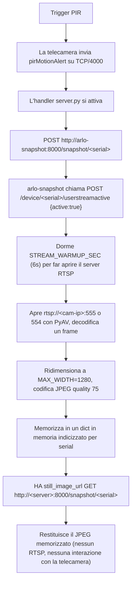

Questo è il Post 2 di una serie di tre articoli sulla sostituzione della stazione base Arlo proprietaria con uno stack auto-ospitato. Nel [Post 1 di questa serie](/it/sostituire-la-stazione-base-arlo-con-un-router-netgear-orbi/) ho coperto il livello di rete — come fare in modo che un Netgear Orbi RBR760 si spacci sufficientemente bene per la stazione base Arlo da far connettere, registrare e streamare le telecamere. In questo post copro il livello *server*: lo stack Docker che effettivamente gira sul mini PC, il sidecar Flask personalizzato che cattura snapshot attivati dal movimento, il relay RTSP on-demand che rende lo streaming live rispettoso della batteria, e le tre pull request upstream che ho inviate per correggere bug incontrati strada facendo.

Il terzo e ultimo post coprirà Home Assistant — sensori REST, card picture-glance, arm/disarm, webhook di movimento — una volta che il resto dello stack sarà solido. Il repository di accompagnamento su [github.com/mmornati/arlo-base-station](https://github.com/mmornati/arlo-base-station) contiene tutti i file di configurazione menzionati qui.

> **Una nota sulla redazione.** In tutto questo post, i veri numeri di serie delle telecamere, gli indirizzi MAC, e l'IP LAN di produzione del server sono stati sostituiti da placeholder di tipo `XXXXXXXXXXXX` e `192.168.1.X`. Il valore ben noto `172.14.1.1` del gateway Arlo è mantenuto perché fa parte del protocollo wire. La sottorete guest `192.168.2.x` (dove vivono le telecamere sull'Orbi) è lasciata così com'è perché è il valore predefinito standard dell'Orbi e non rivela nulla di specifico.

## Perché `arlo-cam-api` (e non il Cloud Arlo Ufficiale)

Il cloud Arlo funziona. L'app Arlo funziona. L'abbonamento Arlo sblocca CVR, alert intelligenti, zone di attività, e una UI mobile rifinita che ha richiesto anni a un vero team di prodotto. C'è in realtà pochissimo di sbagliato nell'acquistare un abbonamento Arlo e fermarsi lì.

Il motivo per cui ho finito per auto-ospitare è un insieme di vincoli molto più ristretto:

- **Nessun abbonamento.** Le telecamere sono VMC4040P (Arlo Pro 3), quindi continuano a funzionare senza abbonamento — ma il livello gratuito è limitato: le zone di attività (restringere il rilevamento del movimento a una parte del campo visivo) sono riservate all'abbonamento, quindi quando armate una telecamera, il movimento viene rilevato su tutto il fotogramma. Le registrazioni sono solo locali (serve una chiave USB nella stazione base) e non potete facilmente controllare cosa è successo mentre eravate via. E il giorno in cui Arlo deciderà di ritirare il livello gratuito, le telecamere diventeranno costosi fermacarte. Il local-only elimina quel rischio.
- **RTSP completo.** Il supporto RTSP di Arlo è opt-in e per telecamera. L'emulazione locale vi dà un URL RTSP per ogni telecamera senza condizioni.
- **Nessun rischio di disattivazione remota.** Arlo può, a livello cloud, deprecare un modello o bloccare un seriale. Se avete mai avuto una stampante diventata inutilizzabile perché HP ha deciso che era obsoleta, capite.
- **È, francamente, divertente.** Far girare il proprio emulatore di stazione base su un Raspberry Pi e guardare quattro telecamere registrarsi su di esso è uno di quei progetti che vi ricordano perché vi ci siete messi all'inizio.

Il lavoro iniziale di reverse-engineering è [Meatballs1/arlo-cam-api](https://github.com/Meatballs1/arlo-cam-api). Non è stato attivamente mantenuto per un po'. Il fork attivamente mantenuto è [brianschrameck/arlo-cam-api](https://github.com/brianschrameck/arlo-cam-api), che pubblica un'immagine Docker (`bschrameck/arlo-cam-api:latest`) che uso come base per tutto in questo post. Tutte le patch di produzione che descrivo sotto sono state inviate come PR a quel fork.

## Lo Stack Docker `arlo-cam-api`

Tutto il lato server vive in tre container, più alcuni file di configurazione bind-mountati. Ecco il `docker-compose.yaml` di produzione dal repository di accompagnamento:

```yaml
services:
  arlo-cam-api:
    image: bschrameck/arlo-cam-api:latest
    container_name: arlo-cam-api
    restart: unless-stopped
    ports:
      - "4000:4000"   # Protocollo di registrazione telecamere (DNAT RBR760 -> qui)
      - "5000:5000"   # API REST (usata da Home Assistant)
    volumes:
      - arlo-recordings:/recordings
      - ./server.py:/opt/arlo-cam-api/server.py:ro
      - ./api/api.py:/opt/arlo-cam-api/api/api.py:ro
      - ./config.yaml:/opt/arlo-cam-api/config.yaml:ro
    environment:
      - HOST=0.0.0.0
      - PORT=4000
      - API_PORT=5000
      - RECORDINGS_PATH=/recordings

  arlo-snapshot:
    build: ./arlo-snapshot
    image: arlo-snapshot:local
    container_name: arlo-snapshot
    restart: unless-stopped
    depends_on:
      - arlo-cam-api
    ports:
      - "8000:8000"
    environment:
      - ARLO_API=http://arlo-cam-api:5000
      - USERSTREAM_TTL=60
      - STREAM_WARMUP_SEC=6
      - RTSP_RETRIES=3
      - RTSP_RETRY_DELAY=2
      - MAX_WIDTH=1280
      - JPEG_QUALITY=75

  mediamtx:
    image: bluenviron/mediamtx:latest
    container_name: mediamtx
    restart: unless-stopped
    ports:
      - "8554:8554"
    volumes:
      - ./mediamtx.yml:/mediamtx.yml:ro

volumes:
  arlo-recordings:
```

Tre servizi, tre lavori diversi:

- **`arlo-cam-api`** — l'emulatore di stazione base. Ascolta su `4000` (il protocollo di registrazione che parlano le telecamere) e su `5000` (una piccola API REST Flask che Home Assistant e il servizio snapshot consumano). Questo è l'unico container a cui parlano le telecamere.
- **`arlo-snapshot`** — il proxy di immagini fisse on-demand. Ascolta su `8000`. È una minuscola app Flask il cui compito è prendere un JPEG dal flusso RTSP di una telecamera, memorizzarlo in memoria, e restituirlo su un successivo `GET`. Nessun polling, nessuna TTL di cache.
- **`mediamtx`** — il relay RTSP on-demand. Ascolta su `8554`. Traduce `rtsp://192.168.1.X:8554/cam1` in `rtsp://192.168.2.x:554/live` per Home Assistant. Si connette a una telecamera solo quando un client sta effettivamente guardando.

Notate le righe di bind-mount su `arlo-cam-api` che caricano `./server.py`, `./api/api.py`, e `./config.yaml` sopra le copie dell'immagine upstream — più il modulo `device_db_patched.py` e il file di database `arlo.db`. Il database sqlite `DeviceDB` vive *dentro* il container per impostazione predefinita e viene cancellato a ogni ricreazione del container, il che azzera le registrazioni e rimuove tutte le telecamere da `known_devices`. Il bind-mount di `arlo.db` fa sopravvivere l'elenco dei dispositivi ai riavvii. Questo è il workaround delle patch di produzione che mi permette di rilasciare i fix delle PR #29, #30, e #31 senza dover forkare l'immagine. Tornerò su questo nella sezione "Patch di produzione" più sotto.

Lato rete, le telecamere sono sulla WiFi guest Orbi (`192.168.2.x`, isolata dalla LAN) e il server è sulla LAN (`192.168.1.x`). Il RBR760 fa DNAT del traffico telecamera-verso-server su TCP/4000 attraverso. MediaMTX vive sul server perché il server può raggiungere *entrambe* le reti; HA su `192.168.1.Y` non può raggiungere le telecamere direttamente.

## `arlo-snapshot` — Il Proxy di Immagini Fisse On-Demand

Out of the box, `arlo-cam-api` espone `GET /snapshot/<serial>`, ma con un caveat fatale: l'endpoint restituisce 200 solo se uno snapshot è stato *spinto* su di esso dalla telecamera — e le telecamere VMC4040P **non spingono mai**. Chiamare l'URL `snapshot_request()` della telecamera tramite il protocollo della stazione base restituisce un ACK dalla telecamera, poi chiude la connessione in modo pulito senza caricare un singolo byte. Quindi `SnapshotCount` resta a 0 per sempre e Home Assistant mostra una card telecamera vuota.

Il fix è prendere il JPEG dal flusso RTSP invece. È esattamente ciò che fa `arlo-snapshot`.

### Il flusso



Lo split in due endpoint è deliberato. `POST /snapshot/<serial>` fa il lavoro costoso (svegliare la telecamera, aprire un socket TCP verso la sua porta RTSP, decodificare un frame H.264). `GET /snapshot/<serial>` è una lookup di dict più una Flask `Response`. HA può martellare `GET` da una card Lovelace senza mai svegliare la telecamera.

### I bit interessanti

Variabili d'ambiente (tutte impostate in `docker-compose.yaml`):

```python
ARLO_API          = os.environ.get("ARLO_API", "http://arlo-cam-api:5000")
SNAPSHOT_PORT     = int(os.environ.get("SNAPSHOT_PORT", "8000"))
RTSP_TIMEOUT_US   = int(os.environ.get("RTSP_TIMEOUT_US", "8000000"))  # 8s
DEVICE_CACHE_TTL  = int(os.environ.get("DEVICE_CACHE_TTL", "60"))      # mette in cache la lista /device per 60s
MAX_WIDTH         = int(os.environ.get("MAX_WIDTH", "1280"))
JPEG_QUALITY      = int(os.environ.get("JPEG_QUALITY", "75"))
USERSTREAM_TTL    = int(os.environ.get("USERSTREAM_TTL", "30"))        # ri-sveglia ogni 30s
STREAM_WARMUP_SEC = float(os.environ.get("STREAM_WARMUP_SEC", "6"))    # attesa porta RTSP
RTSP_RETRIES      = int(os.environ.get("RTSP_RETRIES", "3"))
RTSP_RETRY_DELAY  = float(os.environ.get("RTSP_RETRY_DELAY", "2"))
```

L'helper `activate_stream` è ciò che chiama l'emulatore di stazione base per svegliare la telecamera:

```python
def activate_stream(serial):
    try:
        r = requests.post(
            f"{ARLO_API}/device/{serial}/userstreamactive",
            json={"active": True},
            timeout=5,
        )
        return r.json().get("result", False)
    except Exception as e:
        log.error(f"Failed to activate stream for {serial}: {e}")
        return False
```

Ecco perché il fix "restore `userstreamactive`" della PR #31 è importante: l'`arlo-cam-api` stock accetta il POST ma il corpo del suo handler è commentato e restituisce sempre `{"result": true}` senza fare nulla. La porta RTSP non si apre mai, la cattura dello snapshot va in timeout, e lo snapshot non viene mai memorizzato. La PR #31 fa sì che `userstreamactive` chiami effettivamente `device.set_user_stream_active(int(active))`. Senza questo, l'intero servizio non funziona.

L'helper `grab_frame` è l'unico pezzo di codice RTSP del progetto:

```python
def grab_frame(ip):
    last_err = None
    for port in (555, 554):
        try:
            container = av.open(
                f"rtsp://{ip}:{port}/live",
                options={"rtsp_transport": "tcp", "stimeout": str(RTSP_TIMEOUT_US)},
            )
            for stream in container.streams:
                if stream.type != "video":
                    continue
                for frame in container.decode(stream):
                    container.close()
                    return frame.to_image()
            container.close()
        except Exception as e:
            last_err = e
            log.warning(f"[{ip}] RTSP :{port} failed: {e}")
            continue
    raise last_err or RuntimeError("no RTSP port worked")
```

Notate il fallback prova-555-poi-554. I modelli Arlo più vecchi espongono RTSP su TCP/555. Il VMC4040P lo espone su TCP/554. La documentazione della community si contraddice su quale sia quale, quindi il servizio prova entrambi con un timeout di 8 secondi per porta.

Il resizer `make_jpeg` limita l'immagine a `MAX_WIDTH=1280` (il flusso RTSP nativo del VMC4040P è 2560x1440 — molti più pixel di quelli di cui Home Assistant ha bisogno per una thumbnail di card 200x150) e usa `JPEG_QUALITY=75` che è il punto dolce tra dimensione del file e nitidezza per una thumbnail di telecamera di sicurezza.

Le route Flask sono minuscole:

```python
@app.route("/snapshot/<serial>", methods=["POST"])
def trigger_snapshot(serial):
    ok, result = grab_and_store(serial)
    if not ok:
        return jsonify({"ok": False, "error": result}), 502
    return jsonify({"ok": True, "serial": serial, "bytes": len(result)})

@app.route("/snapshot/<serial>", methods=["GET"])
def get_snapshot(serial):
    with store_lock:
        data = store.get(serial)
    if data is None:
        abort(404, description=f"No snapshot available for {serial}")
    return Response(data["data"], mimetype="image/jpeg")
```

`POST` fa il lavoro; `GET` serve il frame memorizzato. La contesa sul lock è un dict sotto un singolo `threading.Lock()` — l'intero servizio è Flask single-process con `threaded=True`, quindi non vi serve niente di più sofisticato per quattro telecamere.

### Il Dockerfile

Dodici righe, senza fronzoli:

```dockerfile
FROM python:3.12-slim

WORKDIR /app

COPY requirements.txt .
RUN pip install --no-cache-dir -r requirements.txt

COPY app.py .

EXPOSE 8000

CMD ["python", "app.py"]
```

`requirements.txt`:

```text
flask==3.0.3
av==18.0.0
pillow==12.3.0
requests==2.32.3
```

Questo è tutto il sidecar. La dimensione totale dell'immagine su disco è circa 200 MB (PyAV porta con sé una libav bundled). Il cold start è sotto un secondo.

## MediaMTX — Relay RTSP On-Demand

Le telecamere stanno su `192.168.2.x` (rete guest, isolata dalla LAN). Home Assistant sta su `192.168.1.Y` (LAN). HA non può raggiungere le telecamere direttamente. Il server sta su entrambe e fa girare MediaMTX come relay RTSP on-demand: quando HA apre `rtsp://192.168.1.X:8554/cam1`, MediaMTX apre `rtsp://192.168.2.x:554/live` a monte. Quando HA chiude la connessione, MediaMTX chiude il monte dopo una grazia di 1 secondo.

Questo è il singolo pezzo più importante per la durata della batteria. Con il relaying on-demand, il flusso RTSP gira solo quando qualcuno sta effettivamente guardando la telecamera.

### `mediamtx.yml`

```yaml
logLevel: info
api: yes
apiAddress: 0.0.0.0:9997

rtspAddress: :8554
rtspTransports: [tcp]

paths:
  cam1:
    source: rtsp://192.168.2.3:554/live
    sourceOnDemand: yes
    sourceOnDemandStartTimeout: 30s
    sourceOnDemandCloseAfter: 1s
    maxReaders: 5

  cam2:
    source: rtsp://192.168.2.2:554/live
    sourceOnDemand: yes
    sourceOnDemandStartTimeout: 30s
    sourceOnDemandCloseAfter: 1s
    maxReaders: 5

  cam3:
    source: rtsp://192.168.2.103:554/live
    sourceOnDemand: yes
    sourceOnDemandStartTimeout: 30s
    sourceOnDemandCloseAfter: 1s
    maxReaders: 5

  cam4:
    source: rtsp://192.168.2.4:554/live
    sourceOnDemand: yes
    sourceOnDemandStartTimeout: 30s
    sourceOnDemandCloseAfter: 1s
    maxReaders: 5
```

Alcune scelte che vale la pena spiegare:

- **`rtspTransports: [tcp]`** — UDP non è affidabile sul WiFi, specialmente su reti guest 2.4 GHz dietro un mesh. TCP scambia un po' di latenza in cambio del non dover gestire un constant jitter buffering. Le telecamere di sicurezza non sono giochi twitch.
- **`sourceOnDemand: yes`** — la porta RTSP della telecamera si apre solo quando un client si connette. Dopo `sourceOnDemandCloseAfter: 1s` senza client, MediaMTX chiude il monte e la telecamera torna a dormire.
- **`sourceOnDemandStartTimeout: 30s`** — dà alla telecamera fino a 30 secondi per svegliarsi e aprire la sua porta RTSP. Il VMC4040P impiega 10-14 secondi per alzarsi dopo una chiamata `userstreamactive`, più c'è il costo di ristabilire il WiFi dal deep sleep, quindi 30s è il tetto giusto.
- **`maxReaders: 5`** — Home Assistant apre multiple connessioni RTSP per telecamera (preview + flusso principale + rilevatore Frigate se capita di usarlo). Il default di MediaMTX è 2, troppo basso e si ottengono errori `maximum reader count reached`. Cinque è comodo per HA + uno o due viewer esterni.

Non impostate hook `runOnInit` o `runOnDemand`. L'immagine `bluenviron/mediamtx` è basata su scratch senza shell, senza `curl`, senza `wget`. Gli hook sono documentati come eseguibili ma in pratica non possono eseguire nulla su questa immagine. Il risveglio della telecamera è gestito interamente da `arlo-snapshot` tramite il suo POST `userstreamactive`.

## Le Tre PR Upstream

Questo è il cuore del post. Dopo aver distribuito `arlo-cam-api` contro le telecamere reali, tre bug distinti sono apparsi in meno di una settimana. Tutti e tre sono ora pull request upstream contro [brianschrameck/arlo-cam-api](https://github.com/brianschrameck/arlo-cam-api):

> Se volete semplicemente una copia funzionante con tutte e tre le patch applicate, il codice completo corretto è nel mio fork [github.com/mmornati/arlo-cam-api](https://github.com/mmornati/arlo-cam-api) — costruite la vostra immagine da quel repository invece di assemblare le patch a mano. Il fork porta anche la configurazione di produzione che è l'oggetto del resto di questa serie — in particolare `DefaultPIRTargetState`, l'interruttore che imposta la *politica di risposta* di una telecamera quando il suo PIR rileva un movimento (armata = svegliarsi e trasmettere circa 10 secondi di video ; disarmata = ignorare l'evento). L'elemento PIR stesso è un rilevatore IR passivo, sempre acceso in entrambi gli stati — quindi è molto più delle tre PR upstream.

- [PR #29](https://github.com/brianschrameck/arlo-cam-api/pull/29) — `fix(api): do not evaluate app.run eagerly when constructing Flask thread`
- [PR #30](https://github.com/brianschrameck/arlo-cam-api/pull/30) — `feat(server): add periodic keepalive beacon to prevent camera WiFi drops`
- [PR #31](https://github.com/brianschrameck/arlo-cam-api/pull/31) — `feat: auto-register cameras on status, restore userstreamactive, snapshot-on-motion`

Le patch per tutte e tre sono anche nel repository di accompagnamento sotto `server/patches/`:
- [pr-29-api-thread-fix.patch](https://github.com/mmornati/arlo-base-station/blob/main/server/patches/pr-29-api-thread-fix.patch)
- [pr-30-beacon-keepalive.patch](https://github.com/mmornati/arlo-base-station/blob/main/server/patches/pr-30-beacon-keepalive.patch)
- [pr-31-auto-register-snapshot.patch](https://github.com/mmornati/arlo-base-station/blob/main/server/patches/pr-31-auto-register-snapshot.patch)

Trattatele in ordine. PR #29 è un prerequisito per #30. PR #31 è indipendente ma risolve tre problemi che quasi certamente incontrerete il primo giorno.

### PR #29: Non Valutare `app.run` Eagerly in `Thread(target=…)`

#### Problema

`api.api.get_thread()` restituiva:

```python
return threading.Thread(target=app.run(host='0.0.0.0'))
```

In Python, l'argomento `target=` viene valutato prima di essere passato a `Thread`. Quindi `app.run(host='0.0.0.0')` viene eseguito sul **thread chiamante** (il thread principale di `server.py`) — il werkzeug di Flask si avvia, si lega alla porta 5000, e si blocca nel suo loop `select()`. Qualsiasi cosa segua la chiamata a `get_thread()` è irraggiungibile, incluso qualsiasi futuro `flask_thread.start()` o `beacon_thread.start()`.

Perché questo non ha rotto nulla per nessuno fino ad ora? Perché nulla nel blocco principale esistente avvia un secondo thread dopo `flask_thread = api.api.get_thread()`. Il bug era *latente* — presente nel codice, innocuo in pratica, e sarebbe rimasto tale per sempre senza PR #30, che aggiunge un secondo thread.

#### Fix

Una riga:

```diff
--- a/api/api.py
+++ b/api/api.py
@@ -224,4 +224,4 @@ def register_set(serial, req_body, device: Device):
-    return threading.Thread(target=app.run(host='0.0.0.0'))
+    return threading.Thread(target=app.run, kwargs={'host': '0.0.0.0'})
```

Passate `app.run` stesso (un callable) più `kwargs={'host': '0.0.0.0'}`. Il thread avvia il server solo quando `.start()` viene chiamato.

#### Evidenza in produzione

Ho incontrato questo immediatamente dopo aver rebasato PR #30 sullo stock `arlo-cam-api`. Il container si avviava, la porta 5000 era raggiungibile, e il blocco principale si bloccava prima di raggiungere `beacon_thread.start()`. Con il fix, il blocco principale scorre pulito, Flask gira sul suo thread, il thread beacon si avvia su un terzo thread, e potete verificare con `docker exec arlo-cam-api ps -eLf` che avete tre thread Python attivi (main, Flask, beacon) più un thread per connessione telecamera attiva.

Il diff di una riga è fuorviante — senza di esso, non potete impilare alcun nuovo thread accanto a Flask, che è esattamente il cambiamento strutturale che PR #30 introduce.

### PR #30: `BeaconThread` Periodico per Prevenire i Drop WiFi delle Telecamere

#### Problema

Le telecamere Arlo contano il numero di beacon che hanno perso dalla stazione base. La soglia è il valore `MaxMissedBeaconTime` inviato nella risposta `registerSet` iniziale (default 30). Quando il conteggio supera la soglia, la telecamera presume che la stazione base sia sparita e si stacca completamente dal WiFi — ibernazione completa. La telecamera poi resta in ibernazione fino a quando il suo stesso ciclo firmware decide di riprovare, cosa che può richiedere ore o giorni.

`arlo-cam-api` non invia nulla di periodico. Dopo l'handshake iniziale, la connessione diventa silenziosa dal lato stazione base fino a quando la telecamera invia qualcosa (un aggiornamento di stato, un alert di movimento) o la stazione base prova a spingere qualcosa. Durante i lunghi periodi di inattività della telecamera, nulla fluisce.

Il sintomo visibile all'utente:

> *Le telecamere funzionano bene per 1–2 ore dopo un risveglio manuale. Poi si staccano dal WiFi. L'unica cosa che le riporta è il ciclo di riconnessione del firmware della telecamera stessa, che è imprevedibile — a volte 30 minuti, a volte la mattina dopo.*

Questo è un bug davvero brutto da debuggare perché le telecamere *sembrano* funzionare, l'emulatore di stazione base non ha errori nei suoi log, e non c'è nessun evento su nessuno dei due lati che indichi cosa è successo. Vi accorgete solo a un certo punto che `curl http://192.168.1.X:5000/device` restituisce tre telecamere invece di quattro.

#### Fix

Un nuovo `BeaconThread` che, ogni `BeaconIntervalSeconds` (default 60s), invia una leggera `statusRequest` a ogni telecamera vista tramite traffico in ingresso. La `statusRequest` restituisce un ACK + una risposta di stato, che funge anche da probe di liveness.

`config.yaml`:

```yaml
# Intervallo (secondi) tra i beacon statusRequest di keepalive inviati a ogni
# telecamera conosciuta. Imita il beacon della stazione base Arlo così che
# le telecamere non presumano che la stazione base sia sparita
# (MaxMissedBeaconTime) e molli il WiFi.
BeaconIntervalSeconds: 60
```

`server.py` — la nuova classe di thread:

```python
class BeaconThread(threading.Thread):
    """Invia periodicamente una statusRequest di keepalive a ogni telecamera conosciuta.

    Le telecamere Arlo tollerano solo un numero limitato di beacon persi dalla
    stazione base (MaxMissedBeaconTime nel registerSet iniziale) prima di
    presumere che la stazione base sia sparita e staccarsi dal WiFi (ibernazione).
    """

    def __init__(self):
        threading.Thread.__init__(self)
        self.daemon = True

    def run(self):
        s_print(f'[beacon] Started (interval={BEACON_INTERVAL_SECONDS}s)')
        while True:
            time.sleep(BEACON_INTERVAL_SECONDS)
            with devices_lock:
                devices = list(known_devices.values())
            for device in devices:
                try:
                    if device.status_request():
                        s_print(f'[beacon] {device.serial_number} OK')
                    else:
                        s_print(f'[beacon] {device.serial_number} no response (offline)')
                except Exception as e:
                    s_print(f'[beacon] {device.serial_number} error: {e}')
```

Più un dict `known_devices` popolato dagli handler in ingresso `registerSet` e `status`, e una guardia nell'handler di stato così che un serial sconosciuto non crasha più il `ConnectionThread` con `AttributeError` su `device.ip = ...`.

C'è un'altra fonte per `known_devices`, e conta più di quanto sembri. Dopo un riavvio del container il dict è vuoto finché ogni telecamera non invia un messaggio in ingresso — cosa che una telecamera addormentata non farà per ore. Il loop di beacon quindi non sonda *niente* in quella finestra, le telecamere continuano a cadere dal WiFi e si torna al punto di partenza. Il fork inizializza `known_devices` all'avvio dal `DeviceDB` persistito tramite un nuovo metodo `DeviceDB.get_all_devices()`, saltando le righe con `ip = 'UNKNOWN'` (dispositivi persistiti alla registrazione prima che il loro indirizzo reale sia noto). Il beacon può così riprendere a sondare ogni telecamera conosciuta immediatamente dopo un riavvio, senza aspettare il traffico in ingresso.

La guardia merita di essere segnalata separatamente perché è il genere di bug che si manifesta solo sotto specifiche race condition:

```python
elif (msg['Type'] == "status"):
    s_print(f"<[{self.ip}][{msg['ID']}] Status from {msg['SystemSerialNumber']}")
    device = DeviceDB.from_db_serial(msg['SystemSerialNumber'])
    if device is None:
        s_print(f"<[{self.ip}][{msg['ID']}] Status from unknown device {msg['SystemSerialNumber']}, ignoring")
        self.connection.close()
        break
    device.ip = self.ip
    ...
```

Prima di questa guardia, un messaggio di stato da un serial sconosciuto crashava l'intero `ConnectionThread` con `AttributeError: 'NoneType' object has no attribute 'ip'`. Dopo un riavvio del container, quando le telecamere si riconnettono su un socket TCP sopravvissuto, a volte inviano uno `status` prima di un `registerSet` fresco. Il crash uccideva il thread, la connessione non veniva mai ripulita, e la telecamera restava registrata in `DeviceDB` ma irraggiungibile sul filo. Ve ne accorgevate solo quando `curl /device` mostrava la telecamera e `curl /device/<serial>` restituiva vuoto.

#### Evidenza in produzione

Prima della patch, le mie quattro telecamere VMC4040P mollavano il WiFi ogni 1-2 ore. Dopo la patch:

```
[beacon] Started (interval=60s)
[beacon] XXXXXXXXXXXX OK
[beacon] XXXXXXXXXXXX OK
[beacon] XXXXXXXXXXXX OK
[beacon] XXXXXXXXXXXX OK
```

`CameraOnline` si incrementa regolarmente. `CameraOffline` non si muove. Ho lasciato le telecamere girare per una settimana di fila e non si sono disconnesse una sola volta.

Il valore predefinito di 60 secondi è un buon punto di partenza, ma **non è gratis**. Un `statusRequest` TCP non è la stessa cosa di un vero beacon WiFi della stazione base: la vera stazione base Arlo tiene la CPU della telecamera addormentata in power-save 802.11 PS-Poll, mentre il nostro beacon forza un risveglio completo della CPU più un'elaborazione JSON su ogni telecamera, a ogni tick — 60 volte all'ora. Quello che mi ha sorpreso, però, è che il costo in batteria **non è** una funzione dell'intervallo del beacon. L'ho misurato in produzione: con un beacon a 60 s e le telecamere *disarmate*, il consumo era di **~2%/h**; con un beacon a 100 s e le telecamere *armate ma senza movimento nel campo visivo*, era **0%**; e con un beacon a 100 s e le telecamere *armate con movimento attivo*, arrivava a **~5,8%/h** (Jardin 1, 30 eventi di movimento in meno di 3 ore). In altre parole, il consumo segue la **frequenza dei movimenti nel campo visivo di ogni telecamera** — ogni evento PIR sveglia la telecamera e trasmette circa 10 secondi di video — e non l'intervallo del beacon. L'intervallo conta per una sola cosa: la **raggiungibilità**. Salendo a 200 s, le telecamere sono entrate in deep sleep (radio spenta, porta 4000 chiusa) e solo un ciclo firmware o la pressione fisica del pulsante di sincronizzazione le ha risvegliate. `BeaconIntervalSeconds` è quindi un quadrante di raggiungibilità, non di batteria: tenetelo a 60–100 s e non spingetelo mai a 200 s. La metodologia completa e le tabelle delle misurazioni sono nel capitolo sull'autonomia del [Post 3](/it/integrare-arlo-auto-ospitato-con-home-assistant/#autonomia-misurata--i-numeri-veri).

### PR #31: Auto-Register su Status, Restore `userstreamactive`, SnapshotOnMotion

Tre piccole funzionalità raggruppate perché toccano tutte la stessa area di codice (l'handler di messaggi in ingresso e un paio di endpoint REST). Ciascuna è indipendente; avevano semplicemente senso in una sola PR.

#### 6.3.1 — Auto-register su status

La stessa race condition della guardia dell'handler di status della PR #30, ma in una direzione diversa: le telecamere VMC4040P *a volte* inviano un messaggio di status prima di inviare un `registerSet` completo. L'handler stock chiamava `DeviceDB.from_db_serial(msg['SystemSerialNumber'])`, che restituiva `None`, poi provava `device.ip = self.ip` e crashava.

PR #31 aggiunge un percorso di auto-register: se il device non è in `DeviceDB`, crea una nuova istanza `Camera` al volo, di default `SystemModelNumber` a `'VMC4040P'` (il caso più comune) quando il messaggio di status non lo ha, e continua con il flusso originale persist + notify:

```python
if device is None:
    from arlo.camera import Camera
    cam_msg = dict(msg.dictionary)
    if 'SystemModelNumber' not in cam_msg:
        cam_msg['SystemModelNumber'] = 'VMC4040P'
    device = Camera(self.ip, Message(cam_msg))
    device.status = {}
    device.friendly_name = msg['SystemSerialNumber']
    s_print(f"<[{self.ip}][{msg['ID']}] Auto-registered {device.serial_number} on status (forced Camera)")
device.ip = self.ip
device.status = msg
DeviceDB.persist(device)
```

Il risultato: le telecamere che si risvegliano dal deep sleep e inviano immediatamente un messaggio di status (che fanno i VMC4040P) ora si registrano pulite e finiscono in `known_devices` così che il loop di beacon le veda al ciclo successivo. Prima crashavano il thread e sparivano dalla stazione base fino a un reboot manuale.

#### 6.3.2 — Restore `POST /device/{serial}/userstreamactive`

Il corpo dell'endpoint stock:

```python
@app.route('/device/<serial>/userstreamactive', methods=['POST'])
def userstream_active(serial, req_body, device: Device):
    # active = req_body["active"]
    # if active is None:
    #     flask.abort(400)
    #
    # result = device.set_user_stream_active(int(active))
    return flask.jsonify({"result": True})
```

Tutto commentato. Restituisce sempre `{"result": true}`. La porta RTSP della telecamera non si apre mai.

Il fix:

```python
@app.route('/device/<serial>/userstreamactive', methods=['POST'])
def userstream_active(serial, req_body, device: Device):
    active = req_body.get("active")
    if active is None:
        flask.abort(400)
    result = device.set_user_stream_active(int(active))
    return flask.jsonify({"result": result})
```

Questo è il fix che fa funzionare l'intero servizio `arlo-snapshot`. Senza di esso, la chiamata `activate_stream()` del sidecar restituisce `true` (una bugia), il server RTSP della telecamera resta chiuso, la cattura dello snapshot va in timeout 8 secondi dopo, e Home Assistant mostra una card telecamera vuota a ogni evento di movimento. Con esso, la telecamera apre effettivamente la sua porta RTSP in ~10 secondi, il sidecar cattura un frame, e Home Assistant vede una thumbnail fresca.

#### 6.3.3 — Nuova opzione di config `SnapshotOnMotion`

L'idea originale era dare a `arlo-cam-api` un modo di spingere snapshot attivati dal movimento out of the box, senza richiedere all'operatore di cablare il sidecar `arlo-snapshot`. PR #31 aggiunge un flag di config:

```yaml
# Quando true, gli alert di movimento PIR fanno POST al sidecar arlo-snapshot
# per attivare la cattura di un singolo frame. Rispettoso della batteria: nessun
# polling, nessun RTSP continuo.
# Disabilitato di default per i deployment senza il servizio sidecar.
SnapshotOnMotion: false
```

Quando abilitato, l'handler `pirMotionAlert` in `ConnectionThread.run()` fa POST al sidecar:

```python
if alert_type == "pirMotionAlert":
    if NOTIFY_ON_MOTION_ALERT:
        # ... fanout webhook esistente
    if SNAPSHOT_ON_MOTION:
        import requests
        try:
            snap_url = f"http://arlo-snapshot:8000/snapshot/{device.serial_number}"
            requests.post(snap_url, timeout=35)
            s_print(f"<[{self.ip}][{msg['ID']}] Triggered snapshot for {device.serial_number}")
        except Exception as e:
            s_print(f"<[{self.ip}][{msg['ID']}] Snapshot trigger failed: {e}")
```

Il valore predefinito è `false` così che i deployment senza `arlo-snapshot` che gira non siano influenzati. Sul mio deployment di produzione è `true`, e i trigger PIR risultano in un JPEG `<serial>` fresco che arriva nello store in memoria di `arlo-snapshot` in ~10 secondi.

Rispettoso della batteria è la proprietà chiave. L'alternativa — Home Assistant che fa polling RTSP ogni pochi secondi per mantenere fresca l'immagine fissa — scaricherebbe le telecamere in pochi giorni. `SnapshotOnMotion` è push-based: la telecamera si sveglia sul movimento, scatta l'alert, la stazione base attiva la cattura dello snapshot, la telecamera torna a dormire. L'intera pipeline usa zero banda RTSP eccetto che per la cattura di un singolo frame.

## Patch di Produzione: Rilasciare i Fix Prima che Vengano Mergeati

Ho distribuito questo stack in produzione a inizio agosto 2026. Nessuna delle tre PR è mergiata upstream al momento in cui scrivo. Mi servivano i fix *adesso*, non quando upstream avrà tempo di revisionarle.

Il workaround è il bind-mount. Il container `arlo-cam-api` espone `/opt/arlo-cam-api/` con i file sorgente. Alcune righe in `docker-compose.yaml` sovrappongono le mie copie patchate sopra l'immagine upstream — incluso il modulo `device_db.py` e il file di database `arlo.db`, così che l'elenco dei dispositivi sopravviva alle ricreazioni del container:

```yaml
volumes:
  - arlo-recordings:/recordings
  - ./server.py:/opt/arlo-cam-api/server.py:ro
  - ./api/api.py:/opt/arlo-cam-api/api/api.py:ro
  - ./config.yaml:/opt/arlo-cam-api/config.yaml:ro
  - ./device_db_patched.py:/opt/arlo-cam-api/arlo/device_db.py:ro
  - ./arlo.db:/opt/arlo-cam-api/arlo.db
```

Il repository di accompagnamento su [github.com/mmornati/arlo-base-station](https://github.com/mmornati/arlo-base-station) ha le copie di produzione sotto `server/server.py`, `server/api/api.py`, e `server/config.yaml`, più i file diff standalone sotto `server/patches/`:

```
server/
  patches/
    pr-29-api-thread-fix.patch
    pr-30-beacon-keepalive.patch
    pr-31-auto-register-snapshot.patch
  api/
    api.py            # patchata (PR #29 + #31)
  server.py           # patchato (PR #30 + #31)
  config.yaml         # patchato (BeaconIntervalSeconds, SnapshotOnMotion, DefaultPIRTargetState, soppressione webhook)
  mediamtx.yml
  arlo-snapshot/
    Dockerfile
    app.py
    requirements.txt
```

Una volta che le tre PR sono mergiate upstream, i bind mount spariscono e `bschrameck/arlo-cam-api:latest` funziona così com'è. Nel frattempo, i bind mount sono il deployment.

I file `.patch` sono il vero output di `git format-patch` contro l'HEAD upstream `brianschrameck/arlo-cam-api` al momento in cui ho iniziato il lavoro. Per rigenerarli:

```bash
git clone https://github.com/brianschrameck/arlo-cam-api.git
cd arlo-cam-api
git checkout <commit-al-momento-della-PR>
git am /percorso/a/server/patches/pr-*.patch
```

Per applicarli alle copie standalone in `server/server.py` e `server/api/api.py`:

```bash
cd server
for p in patches/pr-*.patch; do patch -p1 < "$p"; done
```

## Diagnostica e Riferimento Campi

Una volta che lo stack è in piedi, ogni telecamera espone un ricco documento di stato su `GET /device/<serial>` sulla porta 5000. I nomi dei campi *non* sono quelli che indovinereste — vengono direttamente dal protocollo wire Arlo, con la convenzione camel case originale preservata. Ecco la tabella canonica dei campi che tengo appuntata accanto al mio editor di template Home Assistant:

| Campo | Significato |
|---|---|
| `BatPercent` | Percentuale batteria (0–100) |
| `Bat1Volt` | Tensione batteria (V) |
| `ChargingState` | `"Off"` / `"On"` / `"Critical"` / `"Full"` |
| `ChargingMode` | `"Charging"` / `"NotCharging"` |
| `SignalStrengthIndicator` | Barre WiFi (0–5) |
| `WifiRSSI` | RSSI WiFi (dBm, negativo; es. `-46`) |
| `Temperature` | Temperatura telecamera (°C) |
| `ActiveState` | `"Active"` / `"Idle"` / `"Offline"` |
| `PIRTargetState` | `"Armed"` / `"Disarmed"` / `"NotSupported"` |
| `PIRLEDState` | `{ "enabled": bool, "sensitivity": 0–4 }` |
| `Uptime` | Secondi dall'ultima registrazione |
| `PIREvents` | Totale eventi PIR visti |
| `PIRTriggers` | Trigger PIR che hanno svegliato la telecamera |
| `MotionStreamed` | Stream RTSP attivati da movimento |
| `UserStreamed` | Stream RTSP richiesti dall'utente |
| `Streamed` | Totale stream RTSP |
| `FailedStreams` | Tentativi di stream RTSP falliti |
| `CameraOnline` | Tempo totale online (s) |
| `CameraOffline` | Tempo totale offline (s) |
| `IRLEDsOn` | Tempo con LED IR accesi (s) |
| `SpotlightEnabled` | Stato del faretto (`true` / `false`) |
| `WifiConnectionCount` | Riconnessioni WiFi |
| `WifiChannel` | Canale 2.4 GHz attuale |
| `SystemFirmwareVersion` | Versione firmware telecamera (string) |
| `HardwareRevision` | Stringa di revisione hardware (es. `"VMC4040P-XXXXX"`) |
| `PoweredOn` | Tempo accesa (s) |
| `CriticalBatStatus` | `0` = OK, `>0` = critico |
| `ChargerTech` | `"None"` / `"Solar"` / `"AC"` |
| `BatTech` | `"Rechargeable"` / `"NonRechargeable"` |
| `SMState` | Stato della macchina a stati (interno al vendor) |
| `PirMode` | Modalità PIR |
| `PirLedMode` | Modalità LED PIR |

Alcuni non sono ovvi:

- `BatPercent` (non `battery_level`), `SignalStrengthIndicator` (non `signal_strength`), `WifiRSSI` è in dBm. La casse è significativa — l'API li restituisce così come sono.
- `CameraOnline` e `CameraOffline` sono totali progressivi in secondi, *non* booleani di stato attuale. Per ottenere lo stato attuale online/offline, usate `ActiveState`.
- `Streamed` = `MotionStreamed` + `UserStreamed`. `FailedStreams` è il conteggio delle chiamate `userstreamactive` che non hanno portato a una sessione RTSP — utile per diagnosticare i fallimenti di `arlo-snapshot`.
- `HardwareRevision` per VMC4040P appare come `"VMC4040P-XXXXX"` dove `XXXXX` è un suffisso per unità; *non* è un seriale redatto.

Per ispezione ad-hoc, il repository `arlo-snapshot` distribuisce un helper `status.py` che stampa i campi canonici per ogni telecamera:

```python
import sys
import json
import urllib.request

for serial, ip in [("SERIAL_1", "192.168.2.x"), ("SERIAL_2", "192.168.2.x")]:
    print(f"=== {serial} @ {ip} ===")
    try:
        with urllib.request.urlopen(f"http://localhost:5000/device/{serial}", timeout=3) as r:
            d = json.loads(r.read())
            if not d:
                print("  (no status data)")
                continue
            keys = ["BatPercent", "Bat1Volt", "ChargingState", "ChargingMode",
                    "SignalStrengthIndicator", "WifiRSSI", "Temperature",
                    "PirMode", "PirLedMode", "SystemFirmwareVersion",
                    "HardwareRevision", "WifiChannel", "SMState"]
            for k in keys:
                if k in d:
                    v = d[k]
                    print(f"  {k}: {v}")
    except Exception as e:
        print(f"  ERROR: {e}")
    print()
```

Lo eseguo una volta a settimana per uno spot-check della salute di batteria e WiFi. Se `BatPercent` inizia a scendere su una telecamera che dovrebbe essere stabile, so che il pannello solare sta cedendo o che la telecamera si sta svegliando troppo spesso. Se `WifiRSSI` salta da `-46` a `-78`, so che il mesh Orbi è scontento.

## Cosa Costruirei dopo

Restano alcune asperità che vorrei affrontare ma per le quali non ho avuto tempo:

- **`userstreamactive` non persiste tra i riavvii della stazione base.** Quando `arlo-cam-api` si riavvia, lo stato in memoria di quali telecamere avevano un user stream attivo va perso. Le telecamere recuperano da sole (rilevano la disconnessione TCP e si re-registrano), ma la prima chiamata `userstreamactive` dopo un riavvio è più lenta perché il server RTSP deve alzarsi da zero.
- **Nessun proxy di thumbnail integrato per le registrazioni.** Le registrazioni sono salvate in `/recordings` come segmenti video grezzi; non c'è API per fare il fetch di una thumbnail a `t=10s` per una data registrazione. Per ora prendo semplicemente uno snapshot fresco via `arlo-snapshot` quando voglio un fermo immagine.
- **Nessuna configurazione di zona di movimento via API.** Le zone di attività sono una feature cloud-only sul firmware Arlo ufficiale. Configurarle richiede l'app Arlo, il che vanifica lo scopo dell'auto-hosting. Un'implementazione custom di stazione base potrebbe in principio spingere definizioni di zone verso la telecamera, ma il protocollo non è documentato.
- **Nessun supporto POST `device.snapshot_request()` su VMC4040P.** Questa è una limitazione firmware — la telecamera accetta il comando e fa ACK ma non carica mai. PR #31 lo aggira via la cattura del sidecar. Una PR futura potrebbe esporre un endpoint `/camera/<serial>/snapshot` su `arlo-cam-api` che avvolge il sidecar e restituisce il JPEG in modo sincrono, semplificando l'integrazione.

Nessuno di questi è bloccante. Sono nice-to-have a cui arriverò quando arriverò.

## Cosa Viene Dopo

Questo post ha coperto il livello server: lo stack Docker, il sidecar snapshot personalizzato, il relay RTSP on-demand, e le tre patch upstream. Il prossimo — e ultimo — post della serie copre il lato Home Assistant: sensori REST per batteria e segnale, card picture-glance per il dashboard, controlli di arm/disarm, webhook di movimento, e il layout Lovelace. Sarà nel [Post 3 di questa serie](/it/integrare-arlo-auto-ospitato-con-home-assistant/).

Per il lato networking, vedi il [Post 1 di questa serie](/it/sostituire-la-stazione-base-arlo-con-un-router-netgear-orbi/).

Il repository di accompagnamento è [github.com/mmornati/arlo-base-station](https://github.com/mmornati/arlo-base-station). Le PR upstream sono [PR #29](https://github.com/brianschrameck/arlo-cam-api/pull/29), [PR #30](https://github.com/brianschrameck/arlo-cam-api/pull/30), e [PR #31](https://github.com/brianschrameck/arlo-cam-api/pull/31).