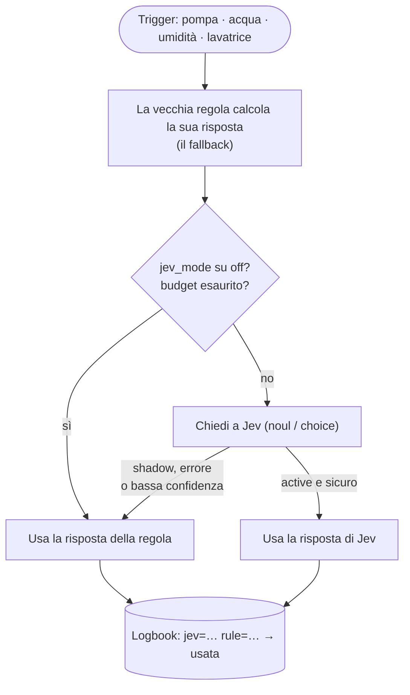
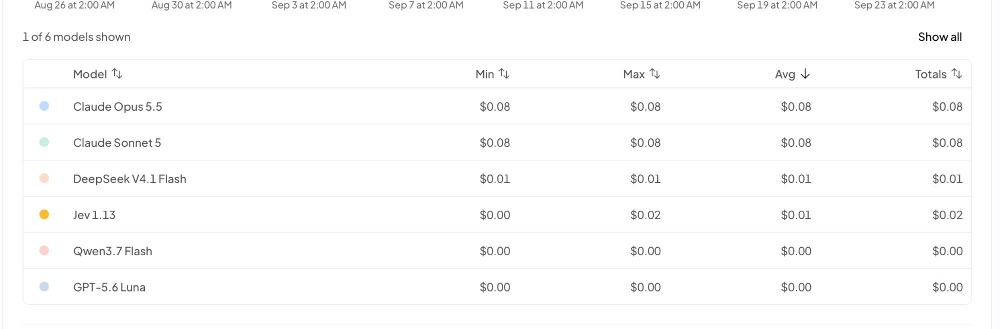

Tutte le installazioni di Home Assistant che conosco finiscono con lo stesso tipo di automazione: *"se il valore supera X per Y minuti, manda una notifica"*. Funziona, finché non funziona più. La pompa di sollevamento gira per due minuti dopo una notte di temporale: allarme. Qualcuno fa una doccia lunga: allarme "possibile perdita". La lavatrice si ferma per un ammollo: notifica "ciclo terminato", con venti minuti di anticipo. Dopo un po' si smette di leggere le notifiche, che è il risultato peggiore possibile per un allarme.

Il problema non è la soglia. Il problema è che la regola non ha idea del **contesto**: stanotte sono caduti 14 mm di pioggia, sono le 7 di un giorno feriale, finora la macchina ha consumato solo 0,3 kWh. Una persona guarderebbe questi fatti e direbbe "è normale". Una soglia no.

Nel mio [articolo precedente](/it/system-one-router-scegliere-llm-giusto-per-ogni-prompt/) ho usato **Jev**, un modello decisionale "System One", per smistare i prompt tra diversi LLM. Mentre lo costruivo continuavo a pensare: *è esattamente la domanda che la mia casa si fa tutto il giorno*. Così ho passato una serata con Claude Code sulla mia configurazione di Home Assistant, e ho affidato le decisioni a Jev. Questo articolo racconta cosa ne è venuto fuori.

## Jev in due minuti

[Jev](https://typesafe.ai/blog/introducing-system-one-models-and-jev) è un modello di **TypeSafe** che non scrive testo. Gli si dà uno *state* (qualche riga che descrive la situazione) e una domanda *tipizzata*, e risponde con una probabilità:

*   **`noul`**: sì o no, con la probabilità del "sì";
*   **`choice`**: una tra N opzioni che descrivi tu, con l'intera distribuzione;
*   **`score`**: un livello su una scala di cui descrivi ogni livello.

La versione attuale è la 1.13. È disponibile direttamente da TypeSafe o [tramite OpenRouter](https://openrouter.ai/typesafe/jev-1.13) a **0,042 $ per milione di token in input, output gratuito**, con una finestra di 32k token. La [guida di OpenRouter](https://openrouter.ai/docs/guides/community/jev) e la [documentazione di TypeSafe](https://docs.typesafe.ai) (c'è perfino una [demo per la smart home](https://docs.typesafe.ai/demos/smart-home)) sono i riferimenti ufficiali.

Perché conta per una casa: nel [benchmark del router](/it/system-one-router-scegliere-llm-giusto-per-ogni-prompt/), Jev era sicuro sull'82% delle risposte, e il 95% di queste era giusto. **La confidenza è reale.** È la proprietà che permette di metterlo in un'automazione senza rischi: quando non è sicuro lo dice, e si può ripiegare su qualcos'altro.

## Quale integrazione per Home Assistant?

Jev ha solo poche settimane e l'ecosistema cambia ogni giorno, quindi ho guardato tutto quello che esiste oggi (fine settembre 2026). In breve: **è tutto fatto dalla community, niente è ufficiale, e niente è ancora nella lista di default di HACS.** Si installa tramite un repository personalizzato di HACS.

| Progetto | Cosa offre | Note |
| --- | --- | --- |
| [**AboveColin/HA-Jev**](https://github.com/AboveColin/HA-Jev) | Azioni `jev.noul`, `jev.choice`, `jev.score`, `jev.ask`, `jev.calibrate`; sensori "domanda" creati dall'interfaccia; un `ai_task` e un agente di conversazione; sensori di token, costo e budget giornaliero | **Quella che uso io.** La più completa, molto attiva (1.18 al momento in cui scrivo). Dominio `jev`. |
| [AtHeartEngineer/HA-SystemOne](https://github.com/AtHeartEngineer/HA-SystemOne) | Le stesse azioni, sensori in YAML, un router per Assist, sensori di utilizzo; documenta i server `/v1/systemone` self-hosted | **Usa anche lei il dominio `jev`**: installatene una o l'altra, mai entrambe. |
| [JanOstrowka/typesafe-assist](https://github.com/JanOstrowka/typesafe-assist) | Solo un agente di conversazione, con un agente di fallback | Solo in inglese. |
| [minuteman3](https://github.com/minuteman3/home-assistant-typesafe) / [allenporter](https://github.com/allenporter/home-assistant-typesafe) home-assistant-typesafe | Un agente di conversazione con soglie di confidenza, può puntare a un server locale | Ancora acerba (0.1). |
| [ayali/node-red-contrib-jev](https://github.com/ayali/node-red-contrib-jev) | Un nodo `jev` per Node-RED | Se le vostre automazioni vivono in Node-RED. |

Una nota sulle "integrazioni OpenRouter": le integrazioni OpenRouter generiche per Home Assistant parlano il protocollo *chat completions*. Jev parla la sua API decisionale (`/v1/systemone`), quindi non possono usarlo. Serve uno dei progetti qui sopra.

### Installare HA-Jev

1.  **HACS → ⋮ → Repository personalizzati**, aggiungere `https://github.com/AboveColin/HA-Jev` come **Integrazione**.
2.  Cercare **Jev**, scaricarlo, riavviare Home Assistant.
3.  **Impostazioni → Dispositivi e servizi → Aggiungi integrazione → Jev (TypeSafe)**.
4.  Incollare una chiave API. Con una chiave TypeSafe si è già a posto. Io avevo già una chiave **OpenRouter** dal progetto del router, quindi ho aperto la sezione *Avanzate* e ho impostato:
    *   Indirizzo API: `https://openrouter.ai/api` (non `/api/v1`: l'integrazione aggiunge da sola `/v1/systemone`);
    *   Modello: `~typesafe/jev-latest` (la `~` fa parte dell'id).

La chiave viene verificata con una richiesta vera prima di creare la voce. Poi, nelle opzioni, conviene impostare un **budget giornaliero di token in input**. Di default è 0 (nessun limite). Quando il budget è raggiunto, l'integrazione smette di chiamare Jev e `binary_sensor.jev_daily_budget_exceeded` si accende. Uso questo sensore più avanti.

Si possono creare delle "domande" dall'interfaccia (un sensore che interroga di nuovo Jev ogni pochi minuti), ma io non l'ho fatto. **Volevo Jev dentro le mie automazioni esistenti, non accanto.**

## Lo schema: Jev consiglia, la regola resta

È la parte di cui sono più soddisfatto, e quella che copierei se fossi in voi. Jev non è mai l'unica cosa che sta tra una perdita d'acqua e una notifica. Ogni automazione che chiede qualcosa a Jev calcola anche **cosa avrebbe risposto la vecchia regola**, e lo passa come `fallback`. Poi un unico `input_select.jev_mode` decide chi vince:

*   **`shadow`** (il default): Jev viene interrogato e la sua risposta finisce nel log, ma si usa la risposta della regola. In casa non cambia niente.
*   **`active`**: si usa la risposta di Jev, *a meno che* la chiamata fallisca, il budget giornaliero sia esaurito, l'integrazione non sia caricata, o (per le scelte) la confidenza sia sotto un minimo. In quei casi vince la regola.
*   **`off`**: Jev non viene proprio chiamato.



Tutto passa da due script condivisi, `script.jev_yes_no` e `script.jev_choice`, in un file `packages/jev.yaml`. Ogni decisione scrive una riga nel logbook come `jev=True (p=0.93) rule=False -> False [rule, shadow]`. È quel logbook che leggo prima di passare `jev_mode` in `active` (è un unico interruttore per tutta la casa): le righe in cui Jev e la regola non sono d'accordo sono esattamente i casi che vale la pena guardare. Tutto è andato in produzione in modalità `shadow`, ed è lì che si trova ancora mentre scrivo. Il piano: una o due settimane in shadow, una revisione dei disaccordi, e solo dopo `active`.

Ecco il cuore dello script sì/no (accorciato):

```yaml
script:
  jev_yes_no:
    mode: parallel
    fields:
      decision: {required: true}      # short name for the logbook
      facts: {required: true}         # the situation, one fact per line
      instructions: {required: true}  # the yes/no question
      background: {}                  # standing facts about the house
      threshold: {default: 0.5}
      fallback: {required: true}      # what the old rule answers
    sequence:
    - variables:
        mode: "{{ states('input_select.jev_mode') }}"
        rule_result: {answer: "{{ fallback | bool }}", source: rule}
    # Jev off, not loaded or over budget: the rule answers, full stop.
    - if: "{{ mode not in ['shadow', 'active'] or not is_state('binary_sensor.jev_daily_budget_exceeded', 'off') }}"
      then:
      - stop: Jev not available
        response_variable: rule_result
    - action: jev.noul
      continue_on_error: true         # a Jev error must never break the automation
      response_variable: jev
      data:
        state: "{{ facts }}"
        instructions: "{{ instructions }}"
        background: "{{ background }}"
        threshold: "{{ threshold }}"
    - variables:
        ok: "{{ jev is defined and jev.noul is defined }}"
        use_jev: "{{ ok and mode == 'active' }}"
        result:
          answer: "{{ jev.is_true if use_jev else fallback | bool }}"
          source: "{{ 'jev' if use_jev else 'rule' }}"
    - action: logbook.log
      data:
        name: "Jev · {{ decision }}"
        entity_id: input_select.jev_mode
        message: >-
          jev={{ jev.is_true }} (p={{ jev.noul | round(2) }})jev=error
          rule={{ fallback }} -> {{ result.answer }} [{{ result.source }}, {{ mode }}]
    - stop: Decision taken
      response_variable: result
```

Due piccoli dettagli che contano:

*   `continue_on_error: true` sulla chiamata a Jev, e `verdict is not defined or not verdict.answer` nelle automazioni: **qualsiasi errore finisce dalla parte della notifica.** Jev può solo *togliere* un allarme quando è sicuro, mai creare silenzio per sbaglio.
*   Le domande sono sempre formulate come **"è normale?"**, con una soglia alta (0,8, o 0,9 per una possibile perdita). Jev deve essere *sicuro* che sia normale per restare zitto.

Sopra i due script generici c'è un piccolo script per ogni *tipo* di decisione (pompa, acqua, calo di temperatura, tapparelle, bucato). Ognuno contiene il prompt e raccoglie i fatti, così le automazioni devono solo dire *cosa è appena successo*.

## Sei automazioni diventate più intelligenti

Esistevano già tutte, e la maggior parte ha il suo articolo su questo blog. Quello che segue è ciò che aggiunge Jev. (I nomi delle entità sono semplificati, e ho lasciato fuori tutto quello che riguarda chi vive qui o quando la casa è vuota.)

### 1. La pompa di sollevamento: "piove, o il galleggiante è bloccato?"

Il [monitoraggio della pompa di sollevamento](/it/monitoring-the-sump-pump-with-home-assistant/) manda un avviso quando la pompa gira per 2 minuti, un allarme a 10 minuti, e un altro ancora quando non parte da 48 ore. Tutti e tre sono corretti *in una giornata asciutta*, e tutti e tre sono rumore dopo una pioggia forte (cicli lunghi) o in una settimana d'estate senza pioggia (nessun ciclo).

Ora ogni allarme prima chiede a Jev:

```yaml
- action: script.jev_pompe_cave_normale
  continue_on_error: true
  response_variable: verdict
  data:
    situation: The pump has been running for 2 minutes without stopping
- condition: template
  value_template: "{{ verdict is not defined or not verdict.answer }}"
- action: notify.persistent_notification
  # ... unchanged
```

Lo script invia il tempo di funzionamento attuale, quello di oggi e della settimana, l'ultimo avvio e l'ultimo arresto, i tentativi di riavvio, il pluviometro, il meteo, la temperatura esterna e l'umidità della cantina. Il background spiega a Jev come si comporta questa pompa ("un ciclo normale dura meno di 2 minuti; dopo una pioggia forte può partire molte volte al giorno; nei periodi secchi può restare ferma per giorni; il pluviometro a volte non è disponibile, in quel caso basati sul meteo"). La domanda: *"Questo comportamento della pompa si spiega con un funzionamento normale piuttosto che con un guasto?"*, soglia 0,8.

Quell'ultima indicazione sul pluviometro è il tipo di cosa che non si può mettere in una soglia, ed è esattamente quello che direi a una persona che tiene d'occhio la casa per me. E non è teoria: il giorno del deploy la batteria del pluviometro era al 6% e il sensore non era disponibile.

### 2. Acqua: una doccia lunga non è una perdita

Il contatore sull'ingresso principale dell'acqua misura la portata in L/min, e alimenta cinque allarmi: portata elevata (sopra 10 L/min per 2 minuti), possibile perdita (flusso continuo per 2 ore), consumo giornaliero eccessivo, e due per l'acqua che scorre mentre siamo in vacanza. Ognuno ora chiede *"Questo consumo d'acqua si spiega con una normale attività domestica piuttosto che con una perdita o un rubinetto rimasto aperto?"*, passando la portata, il consumo di oggi rispetto a un giorno tipo, lo stato della lavatrice, l'**umidità del bagno** (una doccia si vede lì nel giro di pochi minuti!), il meteo e la pioggia (irrigazione del giardino) e se la casa è in modalità vacanza.

Il trucco dell'umidità è il mio preferito: il contatore non sa *dove* va l'acqua, ma il sensore di umidità del bagno sì.

### 3. Cali di temperatura: finestra o ciclo della pompa di calore?

Un allarme di "calo rapido di temperatura" per ogni camera (−3,6 °C in 30 minuti quando fuori ci sono meno di 15 °C) è il classico rilevatore di *qualcuno ha lasciato la finestra aperta*. Jev riceve la temperatura della stanza, il calo, la temperatura esterna, lo stato e il setpoint dei termostati della stanza, i sensori delle finestre *quando la stanza ne ha uno*, e la velocità della ventilazione.

Collegare questa mi ha dato un bonus inaspettato. Per passare i sensori di tendenza a Jev, l'agente ha dovuto leggerli, e ha scoperto che **quattro su cinque puntavano a entità inesistenti** (mancava un suffisso `_2`). Quattro dei miei cinque allarmi di calo di temperatura erano bloccati su `unknown` e non potevano semplicemente mai scattare. Ora che sono corretti torneranno a scattare, ed è Jev che dovrebbe impedire che diventino rumore. Stessa storia per la pompa: la riattivazione dopo 24 ore in seguito a uno spegnimento forzato sottraeva un numero da una data, andava in errore ogni volta, e non veniva mai eseguita. Chiedere a un agente di collegare un nuovo modello a vecchie automazioni è anche un ottimo modo per fargliele rileggere.

### 4. Tapparelle contro il caldo

L'[automazione delle tapparelle](/homeassistant-close-cover-to-control-the-home-temperature-v2/) (in inglese) le abbassa al 40% quando il sole scalda le stanze. La regola confronta la temperatura della facciata con quella interna, e i sensori della facciata stanno al sole, quindi in una mattina fredda e soleggiata segnano diversi gradi di troppo.

Ora Jev riceve la temperatura interna, la temperatura *all'ombra* della stazione meteo, i sensori delle facciate al sole (con l'avvertenza che segnano più del reale), la massima prevista per oggi, la copertura nuvolosa, l'indice UV, l'elevazione e l'azimut del sole e le posizioni attuali. La domanda: *"Queste tapparelle vanno abbassate adesso per tenere fuori il calore del sole?"*, con il background: *"Nella stagione calda tenere fuori il caldo conta più della luce; nella stagione fredda il calore del sole è benvenuto."*

Una correzione collaterale: il blocco "una volta al giorno" usava il `last_triggered` dell'automazione, che ora cambia ogni 10 minuti, anche quando Jev dice "lasciale aperte". È passato a un `input_datetime` scritto solo quando le tapparelle si muovono davvero, così la riapertura serale continua a funzionare.

### 5. VMC: un `choice` al posto di quattro automazioni

La [VMC smart](/smart-vmc-mechanical-ventilation-system/) (in inglese) era fatta di quattro automazioni a regole, con soglie e isteresi. Ora ha anche un'automazione `vmc_jev_decision` che fa un **`choice`** ogni 5 minuti (e subito quando l'umidità sale in fretta):

```yaml
- action: script.jev_choice
  data:
    decision: VMC
    fallback: "{{ rule_speed }}"     # the four old automations, condensed in one template
    instructions: Which ventilation speed should the VMC run at right now?
    options:
      "Off": The air is dry enough everywhere, no ventilation needed
      Vitesse 1: Background ventilation for moderate humidity or stale air
      Vitesse 2: Extract steam fast after a shower, a bath or cooking (noisy)
    background: >-
      A wet room above about 70 % humidity usually means a shower or cooking.
      Speed 2 is noisy: avoid it at night or when the house is empty unless
      humidity is really high.
```

"La velocità 2 è rumorosa, evitala di notte a meno che non serva davvero" per Jev è una frase. Con le regole era una condizione in ogni automazione. In modalità `active` le quattro vecchie automazioni si fanno da parte, le loro soglie diventano il fallback, e una scelta con confidenza sotto 0,6 viene ignorata.

### 6. Bucato: pausa o fine del programma?

Il mio [rilevamento del ciclo della lavatrice](/homeassistant-detect-washing-machine-cycle-completion/) (in inglese) si basa sulla potenza: sotto i 10 W per 2 minuti vuol dire finito. Peccato che alcuni programmi facciano un ammollo, tengano l'acqua del risciacquo o facciano rotazioni antipiega a pochi watt per 5–30 minuti.

Ora, quando la potenza scende, Jev riceve il tempo trascorso, l'energia consumata dall'inizio, la potenza attuale e da quanto tempo la macchina è ferma, più un background che descrive come assorbono corrente una lavatrice e un'asciugatrice. Se Jev è **sicuro almeno al 75% che si tratti di una pausa**, l'automazione aspetta fino a 30 minuti che la macchina riparta. Se riparte, nessuna notifica, e il ciclo non viene azzerato (così l'ora di inizio e l'energia continuano a contare dal vero inizio). Se Jev va in errore o in timeout: notifica, come prima.

## Quanto costa?

Era la parte che mi incuriosiva di più. Ecco il log delle attività di OpenRouter per Jev, in una serata:

, 0,0000237 $ a chiamata.")

Ogni riga è il `choice` della VMC, uno ogni 5 minuti: **565 token in input, 50 in output, 0,0000237 $ a chiamata**. Il conto è semplice:

| | Chiamate | Costo |
| --- | --- | --- |
| Decisione VMC, ogni 5 minuti | 288 / giorno | ~0,0068 $ / giorno |
| Tapparelle, ogni 10 minuti nella loro fascia oraria, finché non si chiudono | fino a ~110 / giorno | ~0,003 $ / giorno |
| Pompa, acqua, temperatura, bucato (solo su eventi) | qualcuna / giorno | trascurabile |
| **Totale** | | **< 0,01 $ / giorno, circa 3 $ / anno** |

E la vista mensile, tutti i modelli insieme sul mio account:



Due centesimi per il mese, *compreso* il benchmark da 80 prompt dell'articolo precedente e i test dell'integrazione. Jev lavora per la casa solo da pochi giorni, quindi un mese intero di decisioni domestiche dovrebbe arrivare intorno ai 20 centesimi.

Qualche considerazione onesta:

*   **La VMC fa il 90% delle chiamate, ed è colpa mia, non di Jev.** Chiedere ogni 5 minuti quando non è cambiato niente è pigrizia. Un trigger sui cambiamenti di umidità, o saltare la chiamata quando i fatti sono identici agli ultimi, dividerebbe il conto per cinque. A 3 $ l'anno non me ne sono ancora preoccupato, ma è la prima cosa che sistemerei in una casa più grande.
*   **Circa metà di ogni chiamata è un costo fisso.** HA-Jev ha misurato circa 250 token fatturati per richiesta, qualunque sia la sua dimensione. Mandare 10 fatti o 15 cambia pochissimo il prezzo, quindi non affamate Jev di contesto per risparmiare token.
*   **Un LLM economico potrebbe farlo allo stesso prezzo?** Sulla carta sì: Qwen 3.7 flash costa più o meno lo stesso a chiamata, *se* non si mette a ragionare. Nell'articolo sul router ha speso 1.800 token di ragionamento per dire "ciao", il che lo rende dieci volte più caro. Sonnet 5 costerebbe circa 0,0016 $ a chiamata, cioè ~14 $ al mese solo per la VMC. Ma il prezzo non è l'argomento. L'argomento è che Jev restituisce una **risposta tipizzata con una probabilità calibrata**: niente JSON da interpretare, niente "Certo! Ecco la mia risposta", e un numero da confrontare con una soglia.
*   **Impostate comunque il budget.** Un trigger che oscilla in `mode: parallel` potrebbe andare in loop. Il budget giornaliero di token di HA-Jev lo trasforma in un `binary_sensor` che gli script controllano prima di ogni chiamata. Con ~170k token al giorno, un budget di 500k lascia un ampio margine.

### E la privacy?

È la parte a cui pensare prima di copiare. I fatti che invio includono se la casa è in modalità "fuori casa" o "vacanza" e se stiamo dormendo. È un contesto utile ("acqua che scorre mentre non c'è nessuno" è sospetto), ma significa che una terza parte riceve, ogni 5 minuti, una piccola descrizione di chi è presente in casa mia. TypeSafe e OpenRouter hanno le loro politiche sui dati: leggetele, e decidete quali fatti vale la pena inviare. Il che mi porta a Laya.

## Laya potrebbe farlo in locale?

Nell'articolo sul router ho confrontato Jev con [**Laya**](https://huggingface.co/convaiinnovations/laya), un modello open weights di Convai Innovations che risponde alle stesse domande `choice` / `score` / `noul` e gira su un portatile. Per una casa, "in locale" non è un dettaglio: elimina sia la questione della privacy sia la dipendenza da internet.

**Come collegarlo.** HA-Jev e HA-SystemOne accettano un indirizzo API personalizzato senza chiave, e chiamano `<indirizzo>/v1/systemone`. Quindi qualsiasi server locale che parla l'API di Jev può sostituirlo:

*   il [sidecar Laya di system-one-router](https://github.com/mmornati/system-one-router/tree/main/sidecar) parla già il formato di richiesta di Jev. Oggi risponde su `/decisions`, quindi gli serve una route in più (`/v1/systemone`) per essere usato da Home Assistant: una modifica di una riga;
*   esistono server della community come [stuntd](https://github.com/bladedevoff/stuntd) (prima Laya, Jev quando non è sicuro), ma non li ho provati;
*   [allenporter/home-assistant-laya](https://github.com/allenporter/home-assistant-laya) fa girare Laya *dentro* Home Assistant, ma solo come agente di conversazione, non per le azioni `noul` / `choice` che usano i miei script.

**Cosa aspettarsi, in base al benchmark.** Attenzione: il benchmark misurava *prompt da smistare*, non sensori di casa, quindi questa è un'estrapolazione.

| | Jev 1.13 | Laya inglese (zero-shot) |
| --- | --- | --- |
| Accuratezza | 89% | 59% |
| Risposte sicure (≥ 0,8) | 82%, il 95% giuste | **12%**, ma 10 su 10 giuste |
| Errore di calibrazione (più basso è meglio) | 0,080 | 0,171 |
| Finestra di contesto | 32k token | 512 token (1.024 multilingue) |
| Latenza | ~300 ms (rete) | 30–70 ms su GPU M4, ~0,5 s su CPU |
| Costo | ~3 $ / anno qui | 0 $ |

Cosa significa con i *miei* script:

*   **Laya sarebbe sicuro, ma poco utile così com'è.** La sua bassa confidenza finisce nei miei fallback: sotto 0,8 nessun allarme viene soppresso, e sotto 0,6 la VMC mantiene la velocità della regola. Quindi Laya zero-shot vi darebbe… più o meno le vostre vecchie regole, più qualche correzione sicura. Nessun danno, poco guadagno. È la stessa lezione del router: *un modello decisionale incerto è una macchina da fallback.*
*   **Quando è sicuro, ha ragione.** È la proprietà che conta prima di un fine-tuning, e il logbook della modalità shadow è già un dataset: ogni riga contiene i fatti, la risposta di Jev e quella della regola.
*   **Occhio alla finestra.** Le mie richieste sono intorno ai 300 token di testo reale, che stanno in 512, ma i prompt della pompa e delle tapparelle sono i più lunghi. Userei il checkpoint multilingue (1.024 token), che legge anche meglio i nomi francesi delle mie entità.
*   **Occhio all'hardware.** Su una GPU Apple, Laya risponde più in fretta di Jev. Su una CPU classe Raspberry, aspettatevi dei secondi (il README di home-assistant-laya stima 1,5–3 s per comando). Per allarmi che già aspettano 2 minuti va benissimo. Per la VMC ogni 5 minuti, anche. Solo, non dovrebbe girare sulla stessa piccola macchina di Home Assistant.

Il piano che seguirei: far girare Laya **in shadow accanto a Jev** (una terza colonna nel logbook), raccogliere qualche settimana di decisioni, e fare il fine-tuning sui dati della casa stessa. A quel punto i fatti sensibili per la privacy (fuori casa, vacanze, sonno) potrebbero andare solo a Laya, e il resto a Jev. È esattamente l'idea di `provider: auto` del router, applicata a una casa.

## Come è stato costruito

Come nei miei ultimi articoli: è stata un'unica sessione di Claude Code sul repository della mia configurazione di Home Assistant. Ho chiesto quali automazioni fossero "decisioni di giudizio" piuttosto che regole, l'agente ha proposto lo schema shadow/active e gli script condivisi, ha scritto i prompt per ogni ambito e li ha collegati. Il mio lavoro è stato decidere quali decisioni meritano Jev (non tutte: una luce che segue un sensore di movimento non ha bisogno di un modello), verificare i prompt con quello che so della casa, e rivedere il diff. I due bug trovati lungo la strada sono stati un bel bonus.

Prima che qualcosa arrivasse in casa, l'agente ha avviato Home Assistant 2026.9.3 in Docker con un'integrazione `jev` finta, e ha fatto passare gli script per tutti i percorsi: modalità shadow, active e off, budget superato, errore di Jev, bassa confidenza, scelta non valida, e per il bucato una pausa, una ripresa e una vera fine. Il lavoro è arrivato come due pull request sul repository della mia configurazione (lo strato decisionale, poi il bucato), entrambe rilasciate in modalità shadow.

## Lezioni imparate

1.  **Usa un modello per la domanda "è normale?", tieni le regole per il resto.** Le soglie sono ottime per rilevare *che* qualcosa succede; un modello decisionale è bravo a giudicare *se conta*.
2.  **Non lasciare mai che il modello sia l'ultima linea di difesa.** La risposta della regola viene sempre calcolata, è sempre il fallback, e ogni errore finisce dalla parte della notifica.
3.  **Parti in modalità shadow e leggi i disaccordi.** Sono le uniche righe interessanti del logbook.
4.  **Scrivi il background come se stessi dando istruzioni a chi ti guarda la casa.** "Il pluviometro a volte non è disponibile, in quel caso basati sul meteo" vale più di qualsiasi regolazione delle soglie.
5.  **È il trigger a decidere la bolletta.** Una decisione ogni 5 minuti costa 3 $ l'anno; resta comunque l'unica voce che valga la pena ottimizzare.
6.  **Pensa a cosa esce di casa.** La presenza in casa è un dato personale. I modelli locali come Laya sono il modo per tenerla in casa, quando saranno abbastanza sicuri di sé.

Se avete collegato Jev (o Laya) alla vostra casa, mi farebbe davvero piacere sapere quali decisioni gli avete affidato, e quali vi siete ripresi. Raccontatemelo nei commenti!
