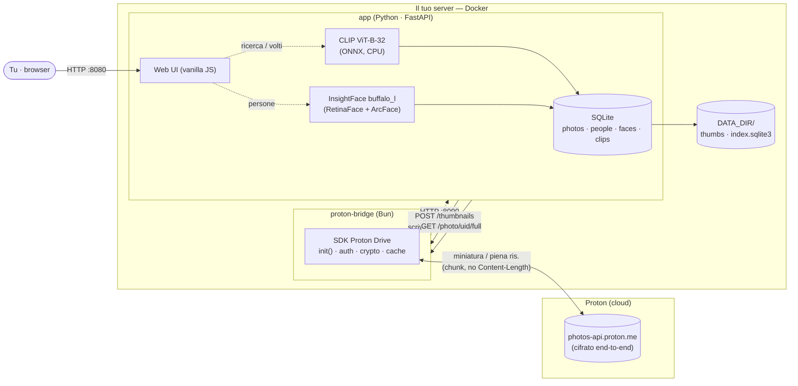
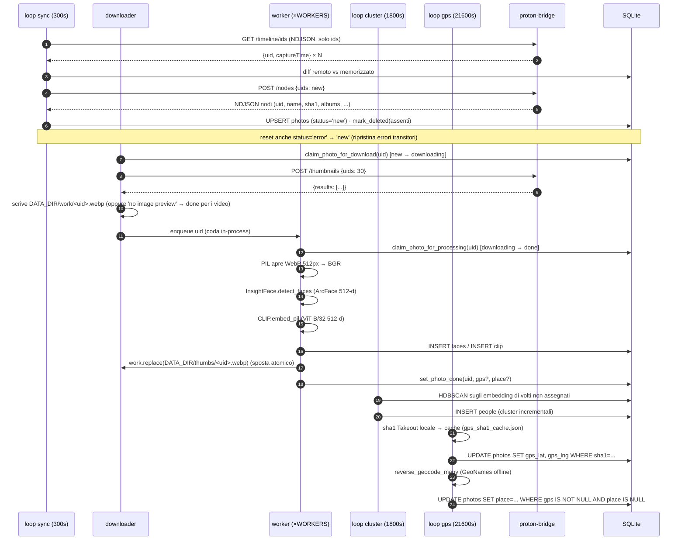

Poche settimane fa ho scritto della [migrazione di 354 GB di Google Photos verso Proton](/how-i-built-gphoto2proton-to-migrate-354gb-of-google-photos-to-proton/). La migrazione ha funzionato, la mia libreria è al sicuro, gli album sono intatti. Ma mentre mi sistemavo in Proton Photos, un'assenza discreta continuava a rosicchiarmi: **la ricerca**.

Non la ricerca "ordina per data". Quella di Google. Scrivi "cane" e ottieni ogni foto con un cane. Scrivi "spiaggia" e rivivi ogni spiaggia dove sei stato. Tocca un volto e guarda tutte le foto di quella persona allinearsi. Quella magia non è una funzionalità di Proton, e non lo sarà mai — per una ragione molto valida.

Così l'ho costruita io. Ecco [proton-faces](https://github.com/mmornati/proton-faces): un motore di ricerca auto-ospitato e privato per Proton Photos. Persone, oggetti e luoghi, interamente sul mio hardware, in sola lettura verso Proton, con zero telemetria.

## Il punto dolente

Proton Photos è cifrato end-to-end. Ogni foto che carichi viene cifrata lato client con una chiave che Proton non possiede. È tutto il senso del servizio — ma ha una conseguenza che la maggior parte delle persone non immagina:

> **Proton non può letteralmente cercare le tue foto, perché Proton non può vedere le tue foto.**

La barra di ricerca di Google Photos funziona perché il tuo servizio "gratuito" è costruito sulla scansione di ogni pixel di ogni foto sui server di Google. Nel momento in cui migri a un provider cifrato end-to-end, quella funzionalità deve vivere da un'altra parte. L'unico posto dove può vivere è il tuo hardware.

Il requisito era quindi chiaro: una ricerca inversa auto-ospitata sulla mia libreria Proton. Con vincoli severi:

*   **Sola lettura verso Proton.** Nulla viene mai caricato, modificato o cancellato. La mia libreria cifrata resta intatta.
*   **Nessun download completo della libreria.** Non ho intenzione di scaricare 354 GB in locale solo per indicizzarli.
*   **Privato.** Niente API cloud, niente telemetria. Le uniche chiamate di rete devono andare ai server di Proton.
*   **Una vera UI di ricerca.** Non uno script che stampa nomi di file.

## L'architettura: due container, una regola

Il design è stato dettato dalla cifratura di Proton e dal suo SDK. La regola che plasma tutto:

> **Un solo componente parla con Proton.**

Ho diviso il sistema in due container. `proton-bridge` è l'unico a conoscere le tue credenziali Proton e a parlare con l'API di Proton. `app` fa tutto il machine learning, l'indicizzazione, la ricerca e l'interfaccia web — e parla solo con il bridge, via HTTP su una rete Docker privata chiamata `internal`.



| Container      | Runtime                            | Ruolo                                                              |
|----------------|------------------------------------|--------------------------------------------------------------------|
| `proton-bridge`| Bun + SDK Proton Drive (nel repo)  | L'**unico** componente che parla con Proton (auth, miniature)      |
| `app`          | Python 3.11 + FastAPI              | Tutto il ML, l'indicizzazione, l'API di ricerca, la web UI         |

Il bridge è deliberatamente stupido. Si autentica con la tua sessione Proton esistente, fa un diff della tua timeline foto, scarica miniature da 512px e diffonde le foto in piena risoluzione on demand. Nient'altro. Tutta l'intelligenza vive sul lato Python, che non vede mai una credenziale Proton.

## Approccio: perché il bridge è compilato nel repository di Proton stesso

Ecco la prima tana del coniglio. Il pacchetto npm pubblicato `@protontech/drive-sdk` incapsula l'API cifrata di Proton — ma **non può funzionare da solo**, perché il suo modulo di autenticazione non è pubblicato su npm. Ottieni la crittografia, non il login.

Il CLI di Proton Drive (dal monorepo [ProtonDriveApps/sdk](https://github.com/ProtonDriveApps/sdk)) possiede quella meccanica. Il bridge fa quindi qualcosa di leggermente insolito: invece di dipendere dal pacchetto npm, viene **costruito dentro il monorepo dell'SDK al momento della build dell'immagine**, ancorato al tag git `cli/v0.8.0`, e compilato in un binario autonomo con `bun build --compile`. L'unico file che scrivo è `bridge/src/bridge.ts` — 278 righe di endpoint HTTP che riusano i meccanismi `init()`, di autenticazione e crittografici del CLI. Il commento in cima al file espone l'intento:

> *"Compiled as the entry point of the Proton Drive CLI repository, so it reuses the CLI's own `init()` machinery (auth, crypto, cache, feature flags)."*

In concreto, il bridge chiama `init({ clientUidPrefix: 'sdk-js-cli', appVersion: 'cli-drive@0.8.0', sdkVersion: 'js@0.21.0', enablePersistedEvents: false, enableMetrics: false, flags: { DriveCryptoEncryptBlocksWithPgpAead: true, DriveSmallFileUpload: true } })`. Nota il `enableMetrics: false`: anche la telemetria dell'SDK di Proton è disattivata. La tua sessione viene caricata da `data/auth-session.json` tramite la variabile d'ambiente `PROTON_DRIVE_CREDENTIALS_STORE=unsafe_file` (il CLI normalmente la tiene nel keyring di sistema / store `pass`; qui montiamo direttamente il file). All'avvio il bridge chiama `ctx.auth.isLoggedIn()` e lo espone nel body di `/health`.

Il risultato: un singolo binario statico che si autentica, decifra e diffonde — costruito dal codice stesso di Proton, quindi non reimplemento la loro crittografia, e stabile rispetto ai cambiamenti dell'API. Espone una piccola API HTTP deliberata:

*   `GET /health` — `{ ok, loggedIn }`
*   `GET /timeline` — flusso NDJSON di **nodi foto completi** (uid, name, captureTime, sha1, mediaType, albums)
*   `GET /timeline/ids` — flusso NDJSON di **uid + captureTime solo** (il diff economico usato dall'indicizzatore)
*   `POST /nodes` — flusso NDJSON dei metadati completi per un lotto di uid
*   `POST /thumbnails` — body `{"uids": [...]}` → scarica a lotti miniature WebP `Type1` da 512px in `DATA_DIR/work/<uid>.webp`
*   `GET /photo/{uid}/full` — diffonde la foto in **piena risoluzione, decifrata**, on demand

### Il trucco NDJSON

La timeline di una libreria da 100.000 foto può richiedere molto tempo per la paginazione — e le chiavi dei nodi anche per essere decifrate. Il server HTTP di Bun chiude le connessioni inattive a 255 secondi; se mettessi in buffer l'intera libreria prima di rispondere, i client vedrebbero "server disconnesso" ben prima del primo byte. Il bridge diffonde quindi la timeline come **NDJSON (JSON delimitato da a capo)**, una foto per riga. Per tenere viva la connessione mentre viene recuperata la pagina successiva, emette righe di commento `#` ogni 15 secondi con un contatore di avanzamento — il client tratta le righe `#` come progresso, non come dati. Le paginazioni lunghe vengono trasmesse indefinitamente, e il lato Python inizia il diff prima ancora che il bridge finisca di elencare.

### La stranezza dello streaming in piena risoluzione

Diffondere la foto in piena risoluzione è più difficile di quanto sembri. La `getSeekableStream()` dell'SDK restituisce un `BufferedSeekableStream` il cui costruttore si auto-blocca immediatamente (si prende il reader nel costruttore), quindi non può essere passata a `Response` / `Bun.serve()`. Riuso invece il pattern `downloadToPath` del CLI: `downloader.downloadToStream(writable)` in un adattatore `WritableStream` che spinge i chunk in un `ReadableStream` nuovo, poi `await dlController.completion()` e si chiude il controller.

Una seconda decisione sottile: **la risposta omette deliberatamente `Content-Length`**. L'SDK espone `getClaimedSizeInBytes()` — ma quel valore può differire dal numero di byte realmente decifrati (a causa dell'involucro crittografico), e un `Content-Length` che non corrisponde fa credere al client che il flusso sia stato troncato. Il chunked transfer encoding aggira del tutto il problema. Gli header della risposta sono semplicemente `Content-Type: application/octet-stream`, `Cache-Control: no-store` e `X-Photo-Uid: <uid>`.

### Ripristinabilità anche lato bridge

L'endpoint `thumbnails` salta qualsiasi uid il cui `DATA_DIR/work/<uid>.webp` esiste già (un semplice `Bun.file(dest).exists()`). Quindi se l'indicizzatore riparte a metà di un lotto, il bridge non riscarica ciò che l'esecuzione precedente aveva già scritto.

## La pipeline: cinque loop e una macchina a stati

Tutto gira in loop di background dentro il processo FastAPI, ciascuno con il proprio timer. La macchina a stati vive in SQLite (modalità WAL, `foreign_keys=ON`), una riga per foto, con gli stati persistiti `new`, `downloading`, `done`, `error`, `deleted`. Il passo di riconoscimento in sé è *transitorio* — un `threading.Lock` Python custodisce la transizione `downloading → done`; nulla nel DB dice mai `processing`. Poiché l'avanzamento è persistito in SQLite, il tutto è **completamente riprendibile** — riavvia il container e riparte esattamente da dove si era fermato, incluse eventuali foto la cui riga `downloading` non ha più il file di lavoro (il worker lo riscarica e basta).



I cinque loop:

1.  **Loop di sincronizzazione** (ogni 300 s): interroga `/timeline/ids` (il listing economico di uid), fa il diff con `SELECT uid FROM photos`, marca le foto scomparse come `deleted`, poi recupera i metadati completi solo per i nuovi uid via `POST /nodes`. Come auto-riparazione per gli errori transitori, ripristina anche ogni riga `status='error'` a `status='new'` a ogni ciclo.
2.  **Loop di download**: reclama le foto in `new` (un `UPDATE … WHERE status='new'` atomico), chiede al bridge le miniature in **lotti da 30** — è il limite di dimensione pagina dell'API Proton — e le scrive come WebP in `DATA_DIR/work/`. Se il bridge restituisce `"no image preview"` (i video non hanno anteprima), la foto viene marcata `done` con miniatura vuota; abbiamo fatto del nostro meglio, e non c'è nulla da indicizzare su un video.
3.  **Worker di riconoscimento** (`WORKERS=2` di default): ciascuno estrae un uid da una `queue.Queue` interna. All'avvio, o quando la coda è vuota, un worker raccoglie anche eventuali foto `'downloading'` rimaste da un'esecuzione precedente — ecco come funziona il ripristino senza uno strato di persistenza della coda. Per ogni foto: si apre il file di lavoro con PIL, si converte in RGB (InsightFace vuole BGR, quindi `arr[:, :, ::-1]`), si lancia `embed_pil(rgb)` per CLIP e `detect_faces(bgr)` per InsightFace, si inseriscono i volti e il vettore CLIP, poi **`work.replace(final)`** — una rinominazione atomica nella cache permanente `DATA_DIR/thumbs/` — e `set_photo_done`. La foto originale non viene mai conservata.
4.  **Loop di clustering** (ogni 1800 s): HDBSCAN (`sklearn.cluster`, metrica coseno, `min_cluster_size=2`) sugli embedding di volti non assegnati, creando righe `people` in modo incrementale.
5.  **Loop GPS** (ogni 21600 s): `backfill_gps()` costruisce una mappa `sha1 → (lat,lng)` dai sidecar del tuo export Google Takeout locale (messa in cache in `DATA_DIR/gps_sha1_cache.json` — costoso da costruire una volta, economico dopo) e la applica alle foto indicizzate; poi `enrich_places()` fa il reverse-geocode di ogni foto che ha GPS ma non ancora un luogo.

Un secondo geocode, inline, avviene anche dentro il worker: se la foto ha già `gps_lat/gps_lng` (perché un loop GPS precedente li ha popolati), il worker chiama `reverse_geocode(lat, lng)` e memorizza il luogo insieme ai volti / al CLIP, quindi la scheda Luoghi si riempie man mano che le foto vengono elaborate — non solo sul loop da 6 ore.

Il punto di design cruciale: **ogni foto viene elaborata una sola volta**. Miniatura scaricata → riconosciuta → messa in cache → file di lavoro cancellato. Dopo di che, sfogliare i risultati non tocca mai più Proton.

## Lo schema SQLite

L'intero indice sta in un singolo `index.sqlite3` (con i file accessori WAL e SHM). Quattro tabelle, nessun ORM:

```sql
photos (uid PK, name, media_type, capture_time, sha1,
        albums JSON, status, thumb_path,
        gps_lat, gps_lng, place, processed_at, error)
people (id PK, name, cover_uid, cover_face_id, created)
faces  (id PK, photo_uid FK→photos ON DELETE CASCADE,
        person_id FK→people ON DELETE SET NULL,
        confidence, bbox JSON [x,y,w,h] normalizzato,
        embedding BLOB float32[512])
clips  (photo_uid PK FK→photos ON DELETE CASCADE,
        embedding BLOB float32[512])
```

Gli embedding di volti e CLIP sono memorizzati come BLOB `float32[512]` grezzi (~2 KB ciascuno). `bbox` è `[x, y, w, h]` normalizzato a `[0..1]` della miniatura da 512px — l'API lo usa sia per disegnare le sovrapposizioni nella vista dettagliata sia per ritagliare copertine in puro volto (con un fattore di padding `pad = 0.25` per il contesto, JPEG qualità 90). Indici su `photos(status)`, `photos(place)`, `photos(capture_time)`, `faces(person_id)`, `faces(photo_uid)` mantengono i loop economici.

## I modelli: CLIP e InsightFace, su CPU, in Docker

Per la ricerca di oggetti e scene uso **CLIP ViT-B-32** (pesi OpenAI, `openai/clip-vit-base-patch32`). CLIP immerge immagini e testi nello stesso spazio vettoriale, quindi una query in inglese banale come "dog" può essere trasformata in un vettore e confrontata con i vettori delle immagini — zero-shot, nessun addestramento necessario.

La decisione interessante è stata come eseguirlo. Ho iniziato con PyTorch, poi **ho abbandonato PyTorch a favore di ONNX** sul provider di esecuzione CPU di `onnxruntime`. I pesi del modello sono identici (un export ONNX Xenova del checkpoint OpenAI), ma il runtime ONNX è drasticamente più leggero: niente albero di dipendenze torch, immagine più piccola, avvio più rapido e, onestamente, più veloce su CPU. Gli encoder di visione e di testo (`vision_model.onnx`, `text_model.onnx`) e il tokenizer (`tokenizer.json`) sono **integrati nell'immagine del container al momento della build**, quindi il container **non ha alcun passaggio di download a runtime** — si avvia completamente offline.

Per i volti uso **InsightFace** `buffalo_l`: RetinaFace per il rilevamento, ArcFace per il riconoscimento, producendo un embedding normalizzato L2 a 512 dimensioni per volto. InsightFace 0.7.3 ha un vincolo divertente che ha inchiodato l'intera mia stack: si basa sugli alias `np.bool` / `np.float` rimossi in numpy 1.24+, quindi l'app gira su **Python 3.11 con `numpy<1.24`** — non le versioni più recenti, ma una combinazione perfettamente stabile.


La ricerca è una semplice **similarità coseno a forza bruta su array numpy**: si impilano tutti gli embedding CLIP in una matrice `X`, si calcola `X @ query_vec` (un solo matmul — gli embedding sono normalizzati L2 quindi il prodotto scalare è uguale al coseno), `np.argsort(-sims)[:limit]`. Nessun database vettoriale. Per decine di migliaia di foto sono poche centinaia di millisecondi — un database vettoriale sarebbe puramente cerimoniale a questa scala, e un servizio in meno da gestire.

Per le persone, **HDBSCAN** (metrica coseno, `min_cluster_size=2`) raggruppa in modo incrementale gli embedding di volti non assegnati in persone. Una volta nominata una persona, una passata di propagazione della similarità scansiona tutti i volti non assegnati la cui similarità coseno con un volto di quella persona è `>= FACE_SIM_THRESHOLD` (predefinito `0.45`) e li etichetta automaticamente — limitata a 500 sosia per assegnazione manuale, così un clic non può silenziosamente ri-assegnare l'intera libreria.


## Capacità di ricerca

| Cosa scrivi / fai            | Basato su                        | Note                                          |
|------------------------------|----------------------------------|-----------------------------------------------|
| "Torino", "Parigi"           | Reverse-geocoding GPS            | Solo per foto con metadati GPS                |
| "cane", "macchina", "spiaggia"| Similarità CLIP testo–immagine  | Zero-shot, nessun addestramento               |
| Una foto di volto (upload)   | Embedding ArcFace                | Restituisce le foto della stessa persona      |
| Un nome (scheda Persone)     | Cluster HDBSCAN + tue etichette  | Cluster costruiti in modo incrementale        |

L'interfaccia web è una single-page vanilla-JS a tema scuro: una barra di ricerca, schede **Foto / Persone / Luoghi / Non assegnate**, un campo di upload per la ricerca per volto, una lightbox per la visualizzazione e riquadri sovrapposti sui volti nella vista dettagliata. Clicca su un risultato e la foto in piena risoluzione viene trasmessa da Proton **solo in quel momento** — non viene mai salvata localmente.


## Il problema GPS: Proton non espone la posizione

Ecco un limite duro dell'API di Proton: **non espone affatto i dati GPS o di posizione.** Allora come funziona la ricerca per luogo?

Dal tuo export Google Takeout. Ogni foto di un export Takeout ha un sidecar `*.supplemental-metadata.json` contenente le coordinate GPS originali. Se hai ancora quell'export su disco (ce l'hai — è la tua unica copia dei metadati), punta `PHOTOS_MOUNT` lì. L'app:

1.  **Calcola lo sha1 dei tuoi file foto Takeout locali** e li abbina alla timeline Proton **per hash del contenuto** — quindi non è mai necessario un download in piena risoluzione per ritrovarli.
2.  **Reverse-geocodifica** ogni foto che ha GPS ma non ancora un nome di luogo, usando il pacchetto `reverse_geocoder` — che include il database GeoNames `cities1000`, quindi la geocodifica è **completamente offline**, senza chiamate di rete.

La prima passata di hash su ~136.000 file è costosa (un SHA-1 Python mono-processo legge alla velocità del disco), quindi la mappa hash → GPS vive in `DATA_DIR/gps_sha1_cache.json`; le passate successive sono economiche. Puoi anche attivarla manualmente:

```bash
docker compose exec app python main.py --backfill-gps
docker compose exec app python main.py --backfill-gps --rebuild-cache
```

Una riserva onesta: le foto aggiunte direttamente a Proton dopo la migrazione (senza un export Takeout dietro) non hanno sidecar né GPS esposto dall'API, quindi restano senza etichetta di luogo. È un limite dell'API di Proton, non una scelta di design.

Una seconda riserva onesta, dalla mia installazione live: il loop GPS dorme `GPS_INTERVAL` secondi (predefinito **6 ore**) prima della prima esecuzione, e il geocode inline si attiva solo per le foto che hanno già `gps_lat/gps_lng`. Finché quel primo loop non è completato, la scheda Luoghi è vuota anche se il tuo Takeout è montato — pazienza.

Una volta che il geocoder ha fatto il suo lavoro, la scheda Luoghi dipinge tutto su una mappa. L'interfaccia web usa **Leaflet** (1.9.4) più **leaflet.markercluster** (1.5.3) per i marcatori, e **OpenStreetMap** per le tile — *non* Google Maps. Un tema di tile scuro si abbina al resto dell'interfaccia, e i marcatori che si sovrappongono **si raggruppano automaticamente** quando si fa zoom out. I marcatori vengono da una singola query SQL `GROUP BY place` sulle foto `done` con GPS+place (`AVG(lat/lng)` per la posizione, conteggio foto, e la miniatura in cache della foto più recente come copertura del gruppo); ogni popup mostra la **miniatura cachata da 512px**, la città, il conteggio, e un pulsante "View photos" che apre la griglia filtrata per luogo.


Una nota di trasparenza su quella mappa: aprire la scheda Luoghi fa sì che il tuo **browser** recuperi Leaflet dal CDN jsDelivr e le tile cartografiche da `tile.openstreetmap.org`. **Nessun dato foto viene inviato** — entrano solo le tile, come per qualsiasi sito web con una mappa integrata — ma significa che la promessa lato server "le uniche chiamate di rete vanno a Proton" si applica ai container, non alla scheda Luoghi stessa.

## Disco, RAM e CPU: numeri reali dalla mia installazione

Faccio girare proton-faces su un mini-PC N100 con un disco da 11 TB, 16 GB di RAM e 4 core. Ecco come appare una libreria di circa 79.000 foto in stato stazionario e durante l'indicizzazione. I numeri sotto vengono dall'installazione live su questa macchina — `du`, `docker stats` e l'indice `sqlite3`.

| Componente                                       | Dimensione su disco (live)        | Note                                                                                                    |
|--------------------------------------------------|-----------------------------------|----------------------------------------------------------------------------------------------------------|
| `DATA_DIR` totale                                | **~3,8 GB**                       | durante l'indicizzazione (molto `work/`) ; si riduce una volta svuotata la coda                          |
| `DATA_DIR/thumbs/` (permanente)                  | 114 MB / 2.876 file               | media **~38 KB / foto** (WebP 512px), in linea con la stima 30–60 KB del README                          |
| `DATA_DIR/work/` (coda transitoria)              | **2,7 GB** / 70.700 file          | i worker di riconoscimento sono il collo di bottiglia (`WORKERS=2`), quindi il downloader riempie più velocemente di quanto i worker svuotino |
| `DATA_DIR/index.sqlite3`                         | **~95 MB**                        | `journal_mode=WAL`, 4 tabelle, BLOB per entrambi gli embedding a 512-d (volti e CLIP, ~2 KB ciascuno)     |
| `DATA_DIR/index.sqlite3-wal`                     | ~4,5 MB                           | file WAL                                                                                                  |
| Cache SDK del bridge (in `/data` del bridge)     | **~910 MB** totale                | `cache-crypto.sqlite` (~344 MB, chiavi nodo/share) + `cache-entities.sqlite` (~565 MB, metadati volume/share/foto) — sono le cache dell'SDK di Proton, rigenerate alla prima decifratura |
| `auth-session.json` del bridge                   | 292 B                             | minuscolo; solo i tuoi token di sessione                                                                 |
| Immagini Docker (scaricate, su disco)            | **app 2,59 GB · bridge 190 MB**   | l'app è grande perché InsightFace `buffalo_l` + i due modelli ONNX CLIP sono integrati al build           |

Memoria e CPU a runtime (`docker stats` live, l'indicizzatore è nel mezzo del lavoro):

| Container                            | CPU                   | RAM (RSS)        | Note                                                                                              |
|--------------------------------------|-----------------------|------------------|---------------------------------------------------------------------------------------------------|
| `proton-faces-app-1`                 | ~340 % (≈3,4 core)    | **~2,2 GB**      | picco a ~5,3 GB al primo caricamento (warm-up ONNX); limite del container 15,4 GB                 |
| `proton-faces-proton-bridge-1`       | ~0 % (inattivo)       | **~1,4 GB**      | principalmente i due SQLite di cache dell'SDK mappati in memoria                                   |

Regola semplice per il dimensionamento:

*   **Disco in stato stazionario** (post-indicizzazione): `~38 KB × numero di foto` per le miniature + ~100 MB fissi per l'indice SQLite + ~1 GB per le cache SDK del bridge. La mia **libreria di 79.000 foto dovrebbe assestarsi a circa 3–4 GB totali** una volta finita l'indicizzazione.
*   **RAM in stato stazionario**: ~2,5 GB per l'app + ~1,5 GB per il bridge = **~4 GB minimi**, comodamente sotto i miei 16 GB.
*   **CPU durante l'indicizzazione**: il riconoscimento è il collo di bottiglia; con `WORKERS=2` vedo ~3,4 core occupati. Più `WORKERS` = indicizzazione più veloce, nessun cambiamento a regime. I **1–2 s/foto** e **~1 giorno per 100.000 foto** del README si confermano; le mie 79.000 dovrebbero finire entro ~24 h dall'avvio a freddo.
*   **Il downloader è raramente il collo di bottiglia** — riempie `work/` molto più velocemente di quanto i worker lo svuotino. Pianifica che `work/` raggiunga circa **2× la cache delle miniature** durante un'indicizzazione a freddo, per poi scendere man mano che i worker recuperano.

## Prestazioni e deploy

Il deploy è un semplice `docker compose`:

```bash
docker compose pull && docker compose up -d
```

Immagini precompilate sono pubblicate su GitHub Container Registry (`ghcr.io/mmornati/proton-faces-{bridge,app}`) da un workflow GitHub Actions, quindi il server non compila mai nulla. La configurazione unica consiste nell'esportare la tua sessione CLI Proton esistente dal tuo store `pass` in `data/auth-session.json` (`scripts/export-session.sh` lo fa). Il backup è altrettanto noioso: `scripts/backup.sh` copia l'indice SQLite; le miniature possono sempre essere rigenerate da Proton.

## Privacy

La storia della privacy è tutto il senso, quindi sii esplicito:

*   **Niente telemetria, niente API cloud.** I **container server** parlano solo con Proton — e l'unico componente che parla con Proton è il bridge, rigorosamente in sola lettura. Le metriche dell'SDK di Proton stesso sono disattivate (`enableMetrics: false`) per giunta. La scheda Luoghi è l'unica eccezione: aprirla fa sì che il tuo browser recuperi Leaflet da un CDN (jsDelivr) e le tile cartografiche da **OpenStreetMap**, come qualsiasi mappa web integrata — nessun dato foto viene inviato.
*   **Nulla viene mai riscritto.** Niente upload, niente scritture, niente cancellazioni. Proton vede un paio di letture per foto, una volta.
*   **Tutto il ML gira in locale.** CPU, ONNX + InsightFace, modelli integrati nell'immagine.
*   **Gli unici file conservati** sono le miniature e l'indice SQLite in `DATA_DIR`. Gli originali restano cifrati su Proton.

Ottieni la barra di ricerca di Google Photos — "trova la mamma", "spiaggia in Corsica", "tutte le foto di quel cane" — con la garanzia che nulla di tutto ciò lasci mai la tua casa.

## Lezioni imparate

1.  **La cifratura end-to-end ha un prezzo, ed è la ricerca.** Proton non può indicizzare le tue foto perché Proton non può vederle. Qualsiasi servizio foto cifrato spingerà quella funzionalità verso il tuo hardware. Prevedilo.
2.  **L'SDK di Proton non è una dipendenza chiavi in mano.** Il pacchetto npm pubblicato non può autenticarsi da solo. Costruire il bridge dentro il monorepo dell'SDK di Proton stesso — riusando l'autenticazione e la crittografia del loro CLI — era più duraturo che reimplementare la loro crittografia.
3.  **Streaming in NDJSON con righe di commento keep-alive** è il modo più semplice per servire una paginazione lunga su un server HTTP con timeout di inattività. Cinque righe di codice, e funziona.
4.  **Fai attenzione al `Content-Length` su flussi decifrati.** Quando la dimensione dichiarata può divergere dalla dimensione realmente decifrata, il chunked transfer encoding ti salva da bug di tipo "flusso troncato".
5.  **ONNX batte PyTorch per l'inferenza CPU auto-ospitata.** Stessi pesi, una frazione dell'impronta, nessun download a runtime. Se il tuo modello si esporta in ONNX, di solito è la scelta giusta per un carico Docker.
6.  **Non aggiungere un database vettoriale finché non serve.** La similarità coseno a forza bruta in numpy su vettori a 512 dimensioni è abbastanza veloce a scala di libreria, ed è un servizio in meno da gestire.
7.  **Le macchine a stati battono gli script.** Persistere lo stato delle foto in SQLite rende l'intera pipeline riprendibile, riavviabile e osservabile gratis.
8.  **I metadati sono il vero asset della migrazione.** Il tuo export Takeout non è solo foto — è l'unico posto dove vivono i tuoi dati GPS. Conservalo.

Il codice è su [github.com/mmornati/proton-faces](https://github.com/mmornati/proton-faces), licenza MIT. Se hai fatto la [migrazione](/how-i-built-gphoto2proton-to-migrate-354gb-of-google-photos-to-proton/) e la barra di ricerca ti manca, questo progetto colma il divario. Le tue foto restano cifrate, la tua ricerca resta locale, e "dov'è quella foto del cane" ha di nuovo una risposta.